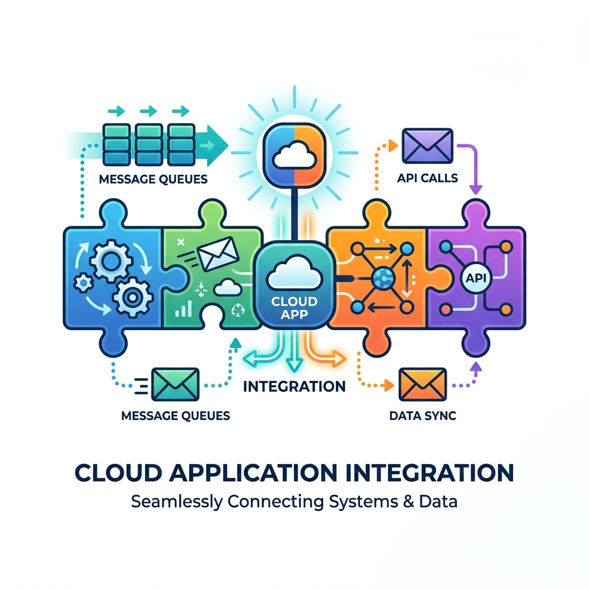
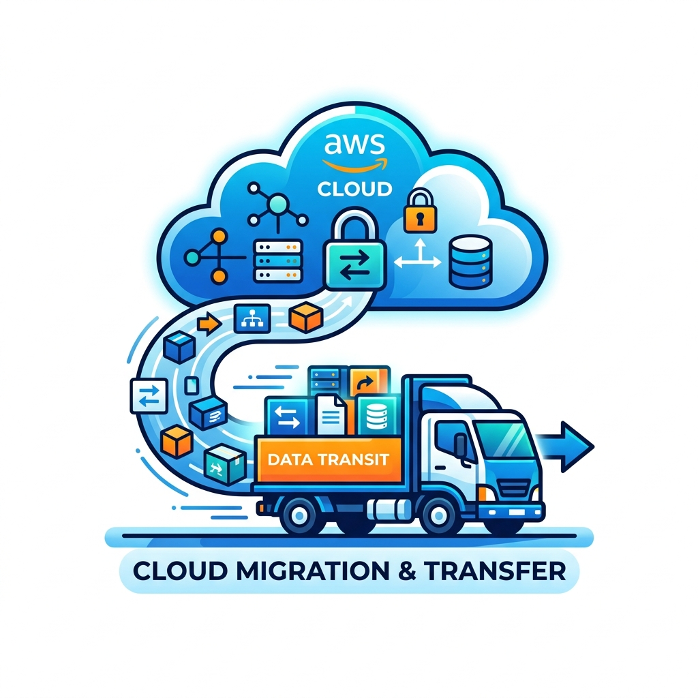
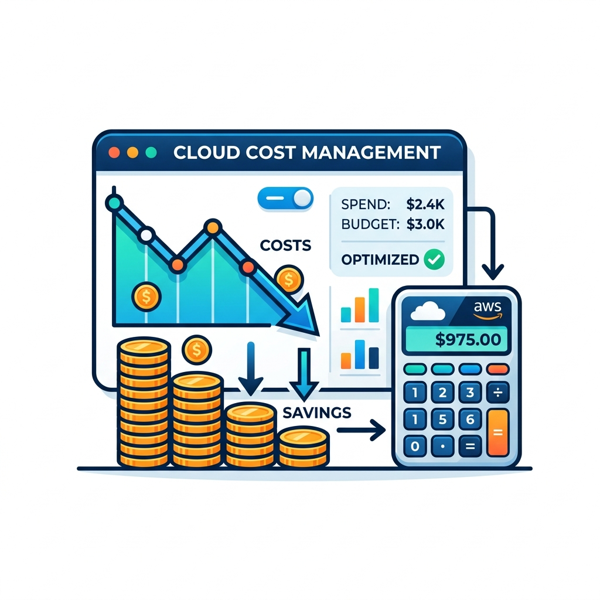

# 📖 AWS Handy Definitions: Reference Book


*A curated study and documentation notebook for AWS services, ordered from **Beginner** ➔ **Advanced** within each service category.*

Use this guide to master key cloud architectures, CLI commands, Infrastructure as Code configurations, and operational trade-offs for AWS certification exams (CLF-C02, SAA-C03) and practical projects.

<br clear="right" />

---

## 🧭 Table of Contents

### 💻 [Compute Services](#category-compute)
1. [EC2 (Elastic Compute Cloud) 🟢](#1-ec2-elastic-compute-cloud)
2. [Lightsail 🟢](#2-lightsail)
3. [Elastic Beanstalk 🟢](#3-elastic-beanstalk)
4. [Lambda 🟡](#4-lambda)
5. [ECS (Elastic Container Service) 🟡](#5-ecs-elastic-container-service)
6. [Fargate 🟡](#6-fargate)
7. [EKS (Elastic Kubernetes Service) 🔴](#7-eks-elastic-kubernetes-service)
8. [Batch 🔴](#8-batch)
9. [Outposts 🔴](#9-outposts)

### 💾 [Storage Services](#category-storage)
10. [S3 (Simple Storage Service) 🟢](#10-s3-simple-storage-service)
11. [EBS (Elastic Block Store) 🟢](#11-ebs-elastic-block-store)
12. [Glacier (S3 Glacier Storage Classes) 🟢](#12-glacier-s3-glacier-storage-classes)
13. [EFS (Elastic File System) 🟡](#13-efs-elastic-file-system)
14. [Storage Gateway 🔴](#14-storage-gateway)
15. [FSx 🔴](#15-fsx)

### 🗄️ [Database Services](#category-database)
16. [RDS (Relational Database Service) 🟢](#16-rds-relational-database-service)
17. [DynamoDB 🟡](#17-dynamodb)
18. [ElastiCache 🟡](#18-elasticache)
19. [DocumentDB 🔴](#19-documentdb)
20. [Aurora 🔴](#20-aurora)
21. [Redshift 🔴](#21-redshift)
22. [Neptune 🔴](#22-neptune)

### 🌐 [Networking & Content Delivery](#category-networking--content-delivery)
23. [VPC (Virtual Private Cloud) 🟢](#23-vpc-virtual-private-cloud)
24. [Elastic Load Balancing (ELB) 🟢](#24-elastic-load-balancing-elb)
25. [Route 53 🟢](#25-route-53)
26. [CloudFront 🟡](#26-cloudfront)
27. [API Gateway 🟡](#27-api-gateway)
28. [Direct Connect 🔴](#28-direct-connect)
29. [Transit Gateway 🔴](#29-transit-gateway)

### 🔐 [Security, Identity & Compliance](#category-security-identity--compliance)
30. [IAM (Identity and Access Management) 🟢](#30-iam-identity-and-access-management)
31. [Cognito 🟡](#31-cognito)
32. [KMS (Key Management Service) 🟡](#32-kms-key-management-service)
33. [Secrets Manager 🟡](#33-secrets-manager)
34. [WAF & Shield 🔴](#34-waf--shield)
35. [GuardDuty 🔴](#35-guardduty)
36. [Security Hub 🔴](#36-security-hub)
37. [AWS Organizations 🔴](#37-aws-organizations)

### 📊 [Management & Governance](#category-management--governance)
38. [CloudWatch 🟢](#38-cloudwatch)
39. [CloudTrail 🟢](#39-cloudtrail)
40. [Trusted Advisor 🟢](#40-trusted-advisor)
41. [Systems Manager (SSM) 🟡](#41-systems-manager-ssm)
42. [CloudFormation 🔴](#42-cloudformation)
43. [Config 🔴](#43-config)
44. [Control Tower 🔴](#44-control-tower)

### 🛠️ [Developer Tools & Containers](#category-developer-tools--containers)
45. [Cloud9 🟢](#45-cloud9)
46. [CodeCommit 🟢](#46-codecommit)
47. [ECR (Elastic Container Registry) 🟡](#47-ecr-elastic-container-registry)
48. [CodeBuild 🟡](#48-codebuild)
49. [CodeDeploy 🟡](#49-codedeploy)
50. [CodePipeline 🔴](#50-codepipeline)

### 📊 [Analytics](#category-analytics)
51. [Athena 🟢](#51-athena)
52. [QuickSight 🟡](#52-quicksight)

---

# Category: Compute

## 1. EC2 (Elastic Compute Cloud)
*   **Difficulty:** 🟢 Beginner
*   **Level Rationale:** Conceptually maps to a familiar idea (a virtual server) and requires no prior AWS-specific knowledge to start.

> 💡 **Definition:** EC2 provides resizable virtual servers (instances) in the cloud, giving full control over the operating system, software stack, and configuration.

### ⚙️ Core Capabilities & Uses
*   Launch virtual machines from preconfigured or custom Amazon Machine Images (AMIs).
*   Choose instance types optimized for compute, memory, storage, or GPU workloads.
*   Attach block storage (EBS) and configure networking (VPC, security groups).
*   Scale manually or automatically (with Auto Scaling Groups).
*   Pay per second/hour, or commit to Reserved/Savings Plans for discounts.

### 🎯 Common Scenarios
*   Hosting web applications or web APIs.
*   Running legacy or custom software requiring OS-level access.
*   Self-managed databases or application servers.
*   Dev/test sandboxes.

### 💻 Quick Examples
*   **AWS CLI command to launch a micro instance:**
    ```bash
    aws ec2 run-instances --image-id ami-0abcdef1234567890 --instance-type t3.micro --key-name MyKey
    ```
*   **Terraform configuration:**
    ```hcl
    resource "aws_instance" "web" {
      ami           = "ami-0abcdef1234567890"
      instance_type = "t3.micro"
    }
    ```

### ⚠️ Key Concepts & Considerations
*   Billing is per-second (Linux) based on instance type and uptime.
*   Security groups act as virtual firewalls (stateful, allow-rules only).
*   Instance store is ephemeral (loses data on stop); EBS volumes persist independently of instance lifecycle.
*   Patching, scaling, and OS management are the customer's responsibility.

### 🔗 Related Services / Prerequisites
*   **Related:** VPC (networking), EBS (storage), IAM (access control).
*   **Prerequisite:** Basic Linux/Windows administration knowledge is helpful.

### 🚀 Next Step
Launch a `t3.micro` (free-tier eligible) EC2 instance in the console and SSH/Connect into it.

---

## 2. Lightsail
*   **Difficulty:** 🟢 Beginner
*   **Level Rationale:** Designed explicitly to simplify EC2/VPC/ELB concepts into a single bundled, beginner-friendly product.

> 💡 **Definition:** Lightsail is a simplified compute service offering pre-bundled virtual private servers with networking, storage, and DNS included at predictable, fixed monthly pricing.

### ⚙️ Core Capabilities & Uses
*   Launch VPS instances with predictable, bundled pricing.
*   Built-in load balancing, DNS management, and managed databases.
*   Simple container service for small containerized apps.
*   One-click application stacks (WordPress, LAMP, Node.js, etc.).

### 🎯 Common Scenarios
*   Small business websites or blogs.
*   Simple web apps without complex scaling needs.
*   Learning cloud basics before moving to EC2/VPC.

### 💻 Quick Examples
*   **AWS CLI command to launch a WordPress blueprint instance:**
    ```bash
    aws lightsail create-instances --instance-names MyServer --availability-zone us-east-1a --blueprint-id wordpress --bundle-id nano_2_0
    ```
*   **Architecture Outline:** Single Lightsail instance + Lightsail-managed DNS, no separate VPC configuration needed.

### ⚠️ Key Concepts & Considerations
*   Fixed monthly pricing simplifies budgeting versus EC2's granular billing.
*   Less flexible than EC2; fewer instance types and customization options.
*   Can be "upgraded" by connecting to a full VPC, but this is uncommon.
*   Good on-ramp service, not typically used in production enterprise architectures.

### 🔗 Related Services / Prerequisites
*   **Related:** Conceptually related to EC2 and Route 53.
*   **Prerequisites:** None required; designed as an EC2 alternative for simpler use cases.

### 🚀 Next Step
Spin up a Lightsail WordPress blueprint instance and access it via the assigned static IP.

---

## 3. Elastic Beanstalk
*   **Difficulty:** 🟢 Beginner
*   **Level Rationale:** Abstracts away infrastructure decisions; developers upload code and Beanstalk provisions everything else.

> 💡 **Definition:** Elastic Beanstalk is a Platform-as-a-Service (PaaS) that automatically provisions and manages the underlying infrastructure (EC2, load balancer, scaling) needed to run an uploaded application.

### ⚙️ Core Capabilities & Uses
*   Deploy applications by uploading code/containers; infrastructure is auto-provisioned.
*   Supports multiple platforms (Java, .NET, Node.js, Python, Ruby, Go, Docker, etc.).
*   Built-in health monitoring and rolling deployments.
*   Underlying resources (EC2, ELB, Auto Scaling) remain visible/adjustable if needed.

### 🎯 Common Scenarios
*   Developers who want to deploy quickly without managing infrastructure directly.
*   Standard web applications with predictable architecture needs.
*   Teams transitioning from traditional hosting to AWS without learning full IaC first.

### 💻 Quick Examples
*   **AWS CLI command to create an application wrapper:**
    ```bash
    aws elasticbeanstalk create-application --application-name MyApp
    ```
*   **Architecture Outline:** Beanstalk environment = ALB + Auto Scaling Group of EC2 instances, managed as one unit.

### ⚠️ Key Concepts & Considerations
*   Less control than raw EC2/VPC setup; opinionated defaults.
*   No additional charge for Beanstalk itself — pay only for underlying resources (EC2, ELB, etc.).
*   Good stepping stone toward understanding what EC2 + ELB + Auto Scaling do together.
*   Configuration via `.ebextensions` files for customization.

### 🔗 Related Services / Prerequisites
*   **Related:** EC2, Elastic Load Balancing, Auto Scaling (all managed under the hood).
*   **Prerequisites:** Basic understanding of your application's runtime requirements.

### 🚀 Next Step
Deploy a sample Node.js or Python app via the Elastic Beanstalk console quick-start.

---

## 4. Lambda
*   **Difficulty:** 🟡 Intermediate
*   **Level Rationale:** Simple to invoke, but understanding event-driven design, cold starts, and IAM execution roles requires moving beyond basic VM thinking.

> 💡 **Definition:** Lambda is a serverless compute service that runs code in response to events without provisioning or managing servers, billing only for execution time.

### ⚙️ Core Capabilities & Uses
*   Run code triggered by events (S3 uploads, API Gateway calls, EventBridge schedule, SQS queues, etc.).
*   Automatic scaling — concurrent executions handled transparently.
*   Supports multiple runtimes (Node.js, Python, Java, Go, custom via Docker containers).
*   No server or OS management; pay only for compute time consumed.

### 🎯 Common Scenarios
*   Event-driven backends (e.g., image processing on S3 upload).
*   API backends paired with API Gateway.
*   Scheduled automation tasks (cron-like jobs via EventBridge).
*   Glue logic connecting other AWS services.

### 💻 Quick Examples
*   **AWS CLI command to invoke a function:**
    ```bash
    aws lambda invoke --function-name MyFunction output.json
    ```
*   **Terraform configuration:**
    ```hcl
    resource "aws_lambda_function" "example" {
      function_name = "my_function"
      handler       = "index.handler"
      runtime       = "nodejs18.x"
      role          = aws_iam_role.lambda_exec.arn
      filename      = "function.zip"
    }
    ```

### ⚠️ Key Concepts & Considerations
*   Execution timeout limit (max 15 minutes per invocation).
*   Cold starts can add latency for infrequently invoked functions.
*   Requires an IAM execution role granting the function specific permissions.
*   Billing based on number of requests and execution duration (ms-level granularity).
*   Concurrency limits exist per account/region (can be adjusted).

### 🔗 Related Services / Prerequisites
*   **Related:** IAM (execution roles), API Gateway, EventBridge, S3 (common event sources).
*   **Prerequisites:** Basic understanding of event-driven architecture recommended.

### 🚀 Next Step
Create a Lambda function triggered by an S3 upload event and log the event details to CloudWatch.

---

## 5. ECS (Elastic Container Service)
*   **Difficulty:** 🟡 Intermediate
*   **Level Rationale:** Requires understanding of containers and task/service definitions, though AWS abstracts orchestration complexity versus raw Kubernetes.

> 💡 **Definition:** ECS is a fully managed container orchestration service for running and scaling Docker containers using AWS-native task definitions and clusters.

### ⚙️ Core Capabilities & Uses
*   Define and run containerized applications via task definitions.
*   Choose EC2-backed or Fargate (serverless) launch types.
*   Service auto-scaling and integrated load balancing.
*   Native integration with IAM, CloudWatch, and VPC networking.

### 🎯 Common Scenarios
*   Microservices architectures using Docker containers.
*   Batch or scheduled containerized jobs.
*   Migrating containerized workloads to AWS without full Kubernetes complexity.

### 💻 Quick Examples
*   **AWS CLI command to create an ECS cluster:**
    ```bash
    aws ecs create-cluster --cluster-name MyCluster
    ```
*   **Terraform configuration:**
    ```hcl
    resource "aws_ecs_cluster" "main" {
      name = "my-cluster"
    }
    ```

### ⚠️ Key Concepts & Considerations
*   Task definitions specify container image, CPU/memory, and networking mode.
*   EC2 launch type requires managing underlying instances; Fargate removes that layer.
*   IAM task roles control what each container can access.
*   Service discovery and load balancing integrate with ALB/NLB.

### 🔗 Related Services / Prerequisites
*   **Related:** ECR (image registry), Fargate, VPC, IAM.
*   **Prerequisites:** Docker and container fundamentals required.

### 🚀 Next Step
Containerize a simple app, push it to ECR, and deploy it as an ECS Fargate service.

---

## 6. Fargate
*   **Difficulty:** 🟡 Intermediate
*   **Level Rationale:** Simplifies container infrastructure but still requires container and task-definition knowledge from ECS/EKS.

> 💡 **Definition:** Fargate is a serverless compute engine for containers, removing the need to provision or manage the underlying EC2 instances for ECS or EKS workloads.

### ⚙️ Core Capabilities & Uses
*   Run containers without managing servers or clusters of EC2 instances.
*   Works as a launch type within ECS or EKS.
*   Automatic scaling per-task based on defined CPU/memory.
*   Pay-per-task based on vCPU/memory allocated and runtime.

### 🎯 Common Scenarios
*   Teams wanting container benefits without infrastructure management overhead.
*   Variable or bursty containerized workloads.
*   Simplifying ECS/EKS operations for smaller teams.

### 💻 Quick Examples
*   **AWS CLI command to run a task on Fargate:**
    ```bash
    aws ecs run-task --cluster MyCluster --launch-type FARGATE --task-definition my-task
    ```
*   **Architecture Outline:** ECS Service (Fargate launch type) ➔ no EC2 instances visible or managed by user.

### ⚠️ Key Concepts & Considerations
*   Generally higher per-unit cost than self-managed EC2-backed clusters, trading cost for operational simplicity.
*   No SSH access to underlying infrastructure (fully abstracted).
*   Task-level resource limits (CPU/memory) must be defined explicitly.
*   Networking still requires VPC/subnet configuration (`awsvpc` network mode).

### 🔗 Related Services / Prerequisites
*   **Related:** ECR, VPC, IAM task roles.
*   **Prerequisites:** Requires ECS or EKS as the orchestration layer.

### 🚀 Next Step
Convert an existing ECS EC2-launch-type service to Fargate launch type and compare configuration differences.

---

## 7. EKS (Elastic Kubernetes Service)
*   **Difficulty:** 🔴 Advanced
*   **Level Rationale:** Requires solid Kubernetes knowledge on top of AWS-specific networking, IAM, and add-on configuration.

> 💡 **Definition:** EKS is a managed Kubernetes service that runs the Kubernetes control plane on AWS, letting users deploy standard Kubernetes workloads without self-managing master nodes.

### ⚙️ Core Capabilities & Uses
*   Fully managed Kubernetes control plane (highly available, patched by AWS).
*   Worker nodes run on EC2 or Fargate.
*   Native integration with IAM (via IRSA — IAM Roles for Service Accounts).
*   Supports standard Kubernetes tooling (`kubectl`, `Helm`, etc.).

### 🎯 Common Scenarios
*   Organizations standardized on Kubernetes across multi-cloud or hybrid environments.
*   Complex microservices requiring fine-grained orchestration control.
*   Teams with existing Kubernetes expertise migrating to AWS.

### 💻 Quick Examples
*   **AWS CLI command to create a cluster:**
    ```bash
    aws eks create-cluster --name MyCluster --role-arn arn:aws:iam::123456789012:role/EksRole --resources-vpc-config subnetIds=subnet-abc,subnet-def
    ```
*   **Kubernetes Manifest Execution:** Standard Kubernetes manifests work natively (`kubectl apply -f deployment.yaml`) against EKS clusters.

### ⚠️ Key Concepts & Considerations
*   Requires Kubernetes conceptual knowledge (pods, deployments, services, namespaces) independent of AWS.
*   Control plane has an hourly cost separate from worker node costs.
*   IAM-to-Kubernetes-RBAC mapping adds a security layer to learn.
*   Cluster upgrades and add-on management require ongoing operational attention.

### 🔗 Related Services / Prerequisites
*   **Related:** VPC (networking/CNI plugin), IAM (IRSA), ECR, Fargate (optional worker type).
*   **Prerequisites:** Strong Kubernetes fundamentals required.

### 🚀 Next Step
Deploy a managed EKS cluster using `eksctl` and run a sample deployment with `kubectl`.

---

## 8. Batch
*   **Difficulty:** 🔴 Advanced
*   **Level Rationale:** Requires combining compute provisioning, job queue design, and container/IAM configuration for non-trivial batch workloads.

> 💡 **Definition:** AWS Batch dynamically provisions compute resources to run batch computing jobs at scale, handling queuing, scheduling, and scaling automatically.

### ⚙️ Core Capabilities & Uses
*   Define job queues, compute environments, and job definitions.
*   Automatically provisions EC2 or Fargate compute based on job requirements.
*   Handles job retries, dependencies, and priority scheduling.
*   Scales compute environment to zero when idle.

### 🎯 Common Scenarios
*   Large-scale parallel data processing (genomics, simulations, rendering).
*   ETL or batch analytics jobs run on a schedule or event trigger.
*   Workloads with highly variable compute demand.

### 💻 Quick Examples
*   **AWS CLI command to submit a batch job:**
    ```bash
    aws batch submit-job --job-name MyJob --job-queue MyQueue --job-definition MyJobDef
    ```
*   **Architecture Outline:** Job Queue ➔ Compute Environment (EC2/Fargate) ➔ Job Definition (container image + resource requirements).

### ⚠️ Key Concepts & Considerations
*   Requires defining compute environments (managed or unmanaged) correctly sized for job needs.
*   Jobs run as containers, so container/Docker knowledge is required.
*   Integrates with Spot Instances for cost optimization, requiring interruption-handling awareness.
*   IAM roles needed for both the Batch service and job execution.

### 🔗 Related Services / Prerequisites
*   **Related:** ECS (Batch uses ECS under the hood), EC2, IAM, ECR.
*   **Prerequisites:** Container fundamentals and job-scheduling concepts.

### 🚀 Next Step
Set up a basic compute environment and job queue, then submit a sample containerized batch job.

---

## 9. Outposts
*   **Difficulty:** 🔴 Advanced
*   **Level Rationale:** Involves hybrid infrastructure planning, physical hardware logistics, and enterprise networking — well beyond typical cloud-only setups.

> 💡 **Definition:** AWS Outposts extends AWS infrastructure and services to on-premises data centers, delivering a consistent hybrid cloud experience using AWS-managed hardware installed on-site.

### ⚙️ Core Capabilities & Uses
*   Run select AWS services (EC2, EBS, ECS/EKS, RDS) locally on-premises.
*   Physical AWS rack hardware delivered, installed, and maintained by AWS.
*   Consistent APIs/tools as the AWS cloud, extended to local infrastructure.
*   Connects back to a parent AWS Region for management and additional services.

### 🎯 Common Scenarios
*   Low-latency workloads requiring on-premises processing (manufacturing floors, hospitals).
*   Data residency requirements where data cannot leave a specific physical location.
*   Hybrid architectures migrating gradually to full cloud.

### 💻 Quick Examples
*   **AWS CLI command to list Outposts associated with your account:**
    ```bash
    aws outposts list-outposts
    ```
*   **Architecture Outline:** On-prem Outposts rack ↔ VPN/Direct Connect ↔ parent AWS Region, running EC2 instances locally with cloud-style APIs.

### ⚠️ Key Concepts & Considerations
*   Requires physical site prep (power, space, cooling) and a contractual capacity commitment.
*   Network connectivity back to AWS Region is required for control plane operations.
*   Pricing involves both upfront and ongoing infrastructure costs (not purely consumption-based).
*   Service availability on Outposts is a subset of full AWS Region service availability.

### 🔗 Related Services / Prerequisites
*   **Related:** EC2, EBS, ECS/EKS, RDS (subset of services deployable on Outposts).
*   **Prerequisites:** Solid understanding of VPC, Direct Connect/VPN, and hybrid network architecture required.

### 🚀 Next Step
Review AWS's Outposts site requirements documentation to understand physical and network prerequisites before any deployment planning.

---

# Category: Storage

## 10. S3 (Simple Storage Service)
*   **Difficulty:** 🟢 Beginner
*   **Level Rationale:** Conceptually simple (upload/download files via API or console) with no infrastructure to provision.

> 💡 **Definition:** S3 is an object storage service for storing and retrieving any amount of data — files, backups, static assets — accessed via a simple HTTP-based API.

### ⚙️ Core Capabilities & Uses
*   Store objects (files) in buckets, organized by key (path-like naming).
*   Multiple storage classes for different access patterns and cost (Standard, Infrequent Access, Glacier).
*   Versioning, lifecycle policies, and cross-region replication.
*   Static website hosting and event notifications (e.g., trigger Lambda on upload).

### 🎯 Common Scenarios
*   Backup and archival storage.
*   Hosting static website assets (HTML, CSS, images).
*   Data lake storage for analytics pipelines.
*   Storing application file uploads (images, documents).

### 💻 Quick Examples
*   **AWS CLI command to copy a local file to S3:**
    ```bash
    aws s3 cp myfile.txt s3://my-bucket/myfile.txt
    ```
*   **Terraform configuration:**
    ```hcl
    resource "aws_s3_bucket" "data" {
      bucket = "my-unique-bucket-name"
    }
    ```

### ⚠️ Key Concepts & Considerations
*   Bucket names must be globally unique across all AWS accounts.
*   Default access is private; public access requires explicit bucket policy/ACL changes (and removal of Block Public Access settings).
*   Pricing based on storage volume, requests, and data transfer out.
*   99.999999999% (11 nines) durability design target; not the same as availability.
*   Lifecycle rules can auto-transition or expire objects to reduce cost.

### 🔗 Related Services / Prerequisites
*   **Related:** IAM (bucket policies/permissions), CloudFront (CDN in front of S3), Lambda (event triggers).
*   **Prerequisites:** No major prerequisites; good first AWS storage service to learn.

### 🚀 Next Step
Create a bucket, upload a file via CLI, and try generating a pre-signed URL for temporary access.

---

## 11. EBS (Elastic Block Store)
*   **Difficulty:** 🟢 Beginner
*   **Level Rationale:** Conceptually maps to a familiar idea (a hard drive attached to a server) and is typically learned alongside EC2.

> 💡 **Definition:** EBS provides persistent block-level storage volumes that attach to EC2 instances, functioning like a virtual hard drive.

### ⚙️ Core Capabilities & Uses
*   Create volumes of various types (SSD, HDD) optimized for IOPS or throughput.
*   Attach/detach volumes to EC2 instances within the same Availability Zone.
*   Take point-in-time snapshots stored in S3 for backup/recovery.
*   Resize volumes and change types without downtime (in most cases).

### 🎯 Common Scenarios
*   Boot volumes for EC2 instances.
*   Database storage requiring consistent, low-latency disk performance.
*   Application data requiring persistence independent of instance lifecycle.

### 💻 Quick Examples
*   **AWS CLI command to create an EBS volume:**
    ```bash
    aws ec2 create-volume --availability-zone us-east-1a --size 20 --volume-type gp3
    ```
*   **Terraform configuration:**
    ```hcl
    resource "aws_ebs_volume" "data" {
      availability_zone = "us-east-1a"
      size              = 20
      type              = "gp3"
    }
    ```

### ⚠️ Key Concepts & Considerations
*   Volumes are zonal — must reside in the same AZ as the attached EC2 instance.
*   Snapshots are incremental and stored in S3, billed separately from volume storage.
*   Volume types (gp3, io2, st1, sc1) differ significantly in cost and performance characteristics.
*   Deleting an instance does not automatically delete attached EBS volumes unless configured to do so ("delete on termination").

### 🔗 Related Services / Prerequisites
*   **Related:** EC2 (volumes attach to instances), S3 (snapshot storage backend).
*   **Prerequisites:** Basic EC2 knowledge recommended before learning EBS in depth.

### 🚀 Next Step
Attach an additional EBS volume to a running EC2 instance and mount/format it within the OS.

---

## 12. Glacier (S3 Glacier Storage Classes)
*   **Difficulty:** 🟢 Beginner
*   **Level Rationale:** Functionally an extension of S3 (same API, different storage class), so it adds minimal new conceptual overhead once S3 is understood.

> 💡 **Definition:** S3 Glacier refers to a set of low-cost S3 storage classes designed for data archiving, with retrieval times ranging from minutes to hours depending on the tier chosen.

### ⚙️ Core Capabilities & Uses
*   Significantly lower per-GB storage cost than S3 Standard.
*   Multiple tiers: Instant Retrieval, Flexible Retrieval, and Deep Archive (slowest, cheapest).
*   Managed via standard S3 API and lifecycle policies.
*   Configurable retrieval speed vs. cost tradeoffs.

### 🎯 Common Scenarios
*   Long-term compliance/regulatory data retention.
*   Backup archives rarely accessed.
*   Media archives (old footage, logs) kept for historical reference.

### 💻 Quick Examples
*   **AWS CLI command to copy a file directly to Glacier class:**
    ```bash
    aws s3 cp myfile.txt s3://my-bucket/myfile.txt --storage-class GLACIER
    ```
*   **Architecture Outline:** S3 lifecycle rule auto-transitions objects from Standard ➔ Glacier after 90 days.

### ⚠️ Key Concepts & Considerations
*   Retrieval from Glacier (non-instant tiers) is not immediate — ranges from minutes (Expedited) to ~12 hours (Deep Archive).
*   Early-deletion fees apply if objects are removed before minimum storage duration (varies by tier).
*   Retrieval requests incur additional cost beyond storage pricing.
*   Best used via S3 Lifecycle policies rather than manual class assignment for large-scale archiving.

### 🔗 Related Services / Prerequisites
*   **Related:** Requires S3 fundamentals; Glacier is accessed through the S3 API/console.

### 🚀 Next Step
Set up an S3 lifecycle rule that transitions objects to Glacier Deep Archive after a defined period.

---

## 13. EFS (Elastic File System)
*   **Difficulty:** 🟡 Intermediate
*   **Level Rationale:** Requires understanding NFS concepts and how shared, multi-instance file access differs from block storage (EBS).

> 💡 **Definition:** EFS is a managed, scalable NFS file system that can be mounted concurrently by multiple EC2 instances or containers across Availability Zones.

### ⚙️ Core Capabilities & Uses
*   Shared file storage accessible by multiple compute resources simultaneously.
*   Automatically scales storage capacity up/down as files are added/removed.
*   Multiple performance modes (General Purpose, Max I/O) and throughput modes.
*   Mountable from EC2, ECS, Lambda, and on-premises servers (via Direct Connect/VPN).

### 🎯 Common Scenarios
*   Shared content directories across a fleet of web servers.
*   Container workloads needing persistent, shared storage.
*   Lift-and-shift of applications relying on traditional NFS file shares.

### 💻 Quick Examples
*   **AWS CLI command to create an EFS file system:**
    ```bash
    aws efs create-file-system --performance-mode generalPurpose
    ```
*   **Architecture Outline:** EFS mount targets in multiple AZs ↔ mounted by EC2 instances in an Auto Scaling Group, all sharing the same file data.

### ⚠️ Key Concepts & Considerations
*   Pricing is based on storage used (pay-as-you-grow), unlike pre-provisioned EBS volume sizing.
*   Requires mount targets configured per-AZ for multi-AZ access.
*   Performance scales with storage size in General Purpose mode (or provisioned throughput for predictable performance).
*   Security via VPC security groups on mount targets and optional IAM-based access points.

### 🔗 Related Services / Prerequisites
*   **Related:** EC2/ECS (compute that mounts EFS), VPC (networking/mount targets), IAM (access points).
*   **Prerequisites:** Basic NFS/Linux file-sharing concepts helpful.

### 🚀 Next Step
Create an EFS file system, mount it on two separate EC2 instances, and verify shared file visibility.

---

## 14. Storage Gateway
*   **Difficulty:** 🔴 Advanced
*   **Level Rationale:** Involves hybrid architecture design, on-premises hardware/VM setup, and understanding of multiple gateway types and caching behavior.

> 💡 **Definition:** Storage Gateway is a hybrid storage service connecting on-premises environments to AWS cloud storage, presenting cloud storage through standard on-premises protocols (NFS, SMB, iSCSI).

### ⚙️ Core Capabilities & Uses
*   **File Gateway:** presents S3 as an NFS/SMB file share.
*   **Volume Gateway:** presents iSCSI block storage backed by S3, with local caching.
*   **Tape Gateway:** virtual tape library backed by S3/Glacier, for backup software compatibility.
*   Local caching of frequently accessed data for low-latency on-premises access.

### 🎯 Common Scenarios
*   Extending on-premises storage capacity into the cloud without app changes.
*   Cloud-based backup/disaster recovery for on-premises systems.
*   Replacing physical tape backup infrastructure with cloud-backed virtual tapes.

### 💻 Quick Examples
*   **AWS CLI command to list gateways:**
    ```bash
    aws storagegateway list-gateways
    ```
*   **Architecture Outline:** On-prem application ↔ Storage Gateway appliance (VM or hardware) ↔ S3/Glacier in AWS, with local cache for hot data.

### ⚠️ Key Concepts & Considerations
*   Requires deploying a gateway appliance (VM image or physical hardware) on-premises.
*   Network bandwidth to AWS affects sync performance and cache miss latency.
*   Different gateway types solve different problems — choosing the wrong type leads to poor fit.
*   Billing combines gateway usage, S3/Glacier storage, and data transfer costs.

### 🔗 Related Services / Prerequisites
*   **Related:** S3, Glacier (backing storage).
*   **Prerequisites:** Solid on-premises networking and storage protocol knowledge (NFS/SMB/iSCSI). VPN or Direct Connect typically recommended for production use.

### 🚀 Next Step
Review AWS's gateway-type decision guide (File vs Volume vs Tape) to map it against a specific hybrid use case before deploying.

---

## 15. FSx
*   **Difficulty:** 🔴 Advanced
*   **Level Rationale:** Requires knowledge of specific third-party file system protocols (Windows, Lustre, NetApp ONTAP, OpenZFS) and workload-specific tuning.

> 💡 **Definition:** FSx provides fully managed file systems built on popular third-party file system technologies — Windows File Server, Lustre, NetApp ONTAP, and OpenZFS — each optimized for specific workloads.

### ⚙️ Core Capabilities & Uses
*   **FSx for Windows File Server:** SMB-based file shares with Active Directory integration.
*   **FSx for Lustre:** high-performance file system for HPC and machine learning workloads.
*   **FSx for NetApp ONTAP:** enterprise NAS features (snapshots, cloning, replication) familiar to NetApp users.
*   **FSx for OpenZFS:** high-performance file storage with ZFS features (snapshots, compression).

### 🎯 Common Scenarios
*   Windows-based enterprise applications requiring native SMB file shares.
*   High-performance computing and ML training requiring fast, parallel file access (Lustre).
*   Enterprises migrating existing NetApp-based workflows to AWS.

### 💻 Quick Examples
*   **AWS CLI command to create a Windows FSx file system:**
    ```bash
    aws fsx create-file-system --file-system-type WINDOWS --storage-capacity 300 --subnet-ids subnet-abc123
    ```
*   **Architecture Outline:** FSx for Lustre file system ↔ linked to an S3 bucket as the data repository, accessed by EC2-based HPC cluster nodes.

### ⚠️ Key Concepts & Considerations
*   Choosing the right FSx variant depends heavily on workload type and existing technology stack.
*   FSx for Windows requires AWS Managed Microsoft AD or self-managed AD integration for full feature use.
*   Pricing varies significantly by variant and provisioned throughput/IOPS.
*   Not a one-size-fits-all service — requires understanding workload requirements before provisioning.

### 🔗 Related Services / Prerequisites
*   **Related:** Directory Service / Active Directory (for Windows variant), VPC, S3 (Lustre data repository integration).
*   **Prerequisites:** Familiarity with the specific underlying file system technology (SMB, Lustre, ZFS, ONTAP) is valuable.

### 🚀 Next Step
Identify which FSx variant matches a specific workload (e.g., Windows file shares vs. HPC) and review its dedicated getting-started guide.

---

# Category: Database

## 16. RDS (Relational Database Service)
*   **Difficulty:** 🟢 Beginner
*   **Level Rationale:** Builds on familiar relational database concepts (SQL, schemas) and removes most infrastructure management from day one.

> 💡 **Definition:** RDS is a managed relational database service supporting multiple engines (MySQL, PostgreSQL, MariaDB, SQL Server, Oracle), automating provisioning, patching, and backups.

### ⚙️ Core Capabilities & Uses
*   Launch managed instances of common relational database engines.
*   Automated backups, snapshots, and point-in-time recovery.
*   Multi-AZ deployments for high availability (synchronous standby replica).
*   Read replicas for scaling read-heavy workloads.

### 🎯 Common Scenarios
*   Standard transactional applications (e-commerce, CRM, internal tools).
*   Migrating on-premises relational databases to a managed cloud service.
*   Applications requiring SQL compatibility with minimal database administration overhead.

### 💻 Quick Examples
*   **AWS CLI command to create a DB instance:**
    ```bash
    aws rds create-db-instance --db-instance-identifier mydb --db-instance-class db.t3.micro --engine mysql --master-username admin --master-user-password mypassword --allocated-storage 20
    ```
*   **Terraform configuration:**
    ```hcl
    resource "aws_db_instance" "default" {
      engine            = "mysql"
      instance_class    = "db.t3.micro"
      allocated_storage = 20
      username          = "admin"
      password          = "changeme123"
    }
    ```

### ⚠️ Key Concepts & Considerations
*   Multi-AZ improves availability but does not by itself scale read performance (use read replicas for that).
*   Patching and maintenance windows are managed by AWS but still require scheduling awareness.
*   Storage auto-scaling avoids manual resizing but adds cost as data grows.
*   No OS-level access — AWS manages the underlying instance.

### 🔗 Related Services / Prerequisites
*   **Related:** VPC (networking/subnet groups), IAM (database authentication option), CloudWatch (monitoring).
*   **Prerequisites:** Basic SQL and relational database concepts recommended.

### 🚀 Next Step
Launch a free-tier RDS MySQL instance and connect to it using a standard SQL client.

---

## 17. DynamoDB
*   **Difficulty:** 🟡 Intermediate
*   **Level Rationale:** Requires a shift in thinking from relational schema design to NoSQL access-pattern-driven data modeling.

> 💡 **Definition:** DynamoDB is a fully managed, serverless NoSQL key-value and document database designed for high-throughput, low-latency applications at any scale.

### ⚙️ Core Capabilities & Uses
*   Stores data as items in tables, identified by a primary key (partition key, optional sort key).
*   Single-digit millisecond performance at virtually unlimited scale.
*   On-demand or provisioned capacity modes for cost/performance tuning.
*   Supports global tables (multi-region replication), streams, and TTL (automatic item expiration).

### 🎯 Common Scenarios
*   High-traffic web/mobile application backends.
*   Session storage, shopping carts, real-time leaderboards.
*   Event-driven architectures using DynamoDB Streams to trigger Lambda.

### 💻 Quick Examples
*   **AWS CLI command to create a table:**
    ```bash
    aws dynamodb create-table --table-name Users --attribute-definitions AttributeName=UserId,AttributeType=S --key-schema AttributeName=UserId,KeyType=HASH --billing-mode PAY_PER_REQUEST
    ```
*   **Terraform configuration:**
    ```hcl
    resource "aws_dynamodb_table" "users" {
      name         = "Users"
      billing_mode = "PAY_PER_REQUEST"
      hash_key     = "UserId"
      attribute {
        name = "UserId"
        type = "S"
      }
    }
    ```

### ⚠️ Key Concepts & Considerations
*   Data modeling must be designed around known access patterns upfront (unlike flexible relational queries).
*   Secondary indexes (GSI/LSI) are needed to query on non-key attributes efficiently.
*   On-demand billing simplifies cost management; provisioned mode is cheaper for predictable, steady traffic.
*   No native JOIN support — denormalization is a common design pattern.

### 🔗 Related Services / Prerequisites
*   **Related:** IAM (table access policies), Lambda (common compute pairing via Streams), API Gateway.
*   **Prerequisites:** NoSQL data modeling concepts strongly recommended before designing tables.

### 🚀 Next Step
Create a simple DynamoDB table and practice writing/querying items using the AWS CLI or SDK.

---

## 18. ElastiCache
*   **Difficulty:** 🟡 Intermediate
*   **Level Rationale:** Requires understanding caching strategy (cache-aside, TTLs, invalidation) on top of basic Redis/Memcached knowledge.

> 💡 **Definition:** ElastiCache is a managed in-memory data store service supporting Redis and Memcached engines, used to cache data and reduce latency for read-heavy applications.

### ⚙️ Core Capabilities & Uses
*   Deploy managed Redis or Memcached clusters.
*   Sub-millisecond read/write latency for cached data.
*   Redis supports persistence, replication, and pub/sub messaging; Memcached is simpler, multi-threaded caching only.
*   Automatic failover (Redis with Multi-AZ) for high availability.

### 🎯 Common Scenarios
*   Caching frequent database query results to reduce load on RDS/DynamoDB.
*   Session storage for web applications.
*   Real-time leaderboards, counters, or pub/sub messaging (Redis-specific features).

### 💻 Quick Examples
*   **AWS CLI command to create a cache cluster:**
    ```bash
    aws elasticache create-cache-cluster --cache-cluster-id my-cache --engine redis --cache-node-type cache.t3.micro --num-cache-nodes 1
    ```
*   **Architecture Outline:** Application ➔ check ElastiCache (cache-aside pattern) ➔ on cache miss, query RDS ➔ write result back to cache.

### ⚠️ Key Concepts & Considerations
*   Choosing Redis vs. Memcached depends on feature needs (persistence, data structures vs. simple key-value speed).
*   Cache invalidation strategy is a real design challenge — stale data risk if not handled properly.
*   In-memory storage means data loss risk on node failure (mitigated by Redis replication/persistence options).
*   Pricing is based on node type and number of nodes, similar to EC2 instance billing.

### 🔗 Related Services / Prerequisites
*   **Related:** Typically paired with RDS or DynamoDB as the source-of-truth database.
*   **Prerequisites:** Basic Redis or Memcached familiarity helpful.

### 🚀 Next Step
Set up a small Redis cluster and implement a basic cache-aside pattern in front of an existing database query.

---

## 19. DocumentDB
*   **Difficulty:** 🔴 Advanced
*   **Level Rationale:** Requires MongoDB/document-database expertise plus awareness of DocumentDB's compatibility nuances versus native MongoDB.

> 💡 **Definition:** DocumentDB is a managed document database service that is compatible with MongoDB APIs, designed for storing and querying JSON-like documents at scale.

### ⚙️ Core Capabilities & Uses
*   MongoDB-compatible API (3.6, 4.0, 5.0 compatibility depending on version).
*   Automatic storage scaling and replication across multiple AZs.
*   Up to 15 read replicas for read-heavy scaling.
*   Continuous backup with point-in-time restore.

### 🎯 Common Scenarios
*   Migrating existing MongoDB workloads to a managed AWS service.
*   Content management systems or catalogs using flexible document schemas.
*   Applications requiring JSON document storage with MongoDB driver compatibility.

### 💻 Quick Examples
*   **AWS CLI command to create a DB cluster:**
    ```bash
    aws docdb create-db-cluster --db-cluster-identifier my-docdb --engine docdb --master-username admin --master-user-password mypassword
    ```
*   **Architecture Outline:** Application using a MongoDB driver ↔ DocumentDB cluster endpoint (drop-in compatible connection string in many cases).

### ⚠️ Key Concepts & Considerations
*   Not a 100% feature match with native MongoDB — some MongoDB features/versions are unsupported, requiring compatibility testing.
*   Storage auto-scales in increments; compute (instance) sizing must still be managed manually.
*   Always encrypted at rest; cannot be disabled.
*   Pricing involves instance cost, storage, I/O, and backup — more complex than single EC2-hosted MongoDB.

### 🔗 Related Services / Prerequisites
*   **Related:** VPC, IAM, CloudWatch for networking, access, and monitoring.
*   **Prerequisites:** MongoDB/document database concepts and query language required.

### 🚀 Next Step
Review AWS's MongoDB-to-DocumentDB compatibility documentation before migrating an existing collection.

---

## 20. Aurora
*   **Difficulty:** 🔴 Advanced
*   **Level Rationale:** Builds on RDS knowledge but adds Aurora-specific architecture (distributed storage, cluster endpoints, Aurora Serverless) that requires deeper understanding to use effectively.

> 💡 **Definition:** Aurora is AWS's proprietary relational database engine, compatible with MySQL and PostgreSQL, offering higher performance and availability than standard RDS through a distributed, cloud-native storage architecture.

### ⚙️ Core Capabilities & Uses
*   MySQL- and PostgreSQL-compatible engines with significantly higher throughput claims than standard RDS.
*   Storage automatically scales up to 128 TB, decoupled from compute.
*   Aurora Serverless: automatically scales compute capacity based on demand.
*   Up to 15 low-latency read replicas sharing the same underlying storage.

### 🎯 Common Scenarios
*   High-throughput production applications needing relational database performance at scale.
*   Applications with unpredictable or spiky traffic (using Aurora Serverless).
*   Multi-region applications using Aurora Global Database for low-latency global reads.

### 💻 Quick Examples
*   **AWS CLI command to create an Aurora cluster:**
    ```bash
    aws rds create-db-cluster --db-cluster-identifier my-aurora-cluster --engine aurora-mysql --master-username admin --master-user-password mypassword
    ```
*   **Terraform configuration:**
    ```hcl
    resource "aws_rds_cluster" "aurora" {
      engine          = "aurora-mysql"
      master_username = "admin"
      master_password = "changeme123"
    }
    ```

### ⚠️ Key Concepts & Considerations
*   Cluster architecture (writer + reader endpoints) differs conceptually from single-instance RDS.
*   Aurora Serverless v2 scales capacity in fine-grained increments but still requires understanding scaling units (ACUs).
*   Generally costs more per hour than equivalent standard RDS instances, justified by performance/availability gains.
*   Global Database adds cross-region replication complexity for disaster recovery or global read scaling.

### 🔗 Related Services / Prerequisites
*   **Related:** VPC, IAM, CloudWatch; understanding of read/write splitting at the application layer.
*   **Prerequisites:** Solid RDS and relational database fundamentals required first.

### 🚀 Next Step
Compare a standard RDS MySQL instance against an Aurora MySQL cluster's reader/writer endpoint structure in the console.

---

## 21. Redshift
*   **Difficulty:** 🔴 Advanced
*   **Level Rationale:** Requires data warehousing concepts (columnar storage, distribution keys, query optimization) distinct from typical transactional database knowledge.

> 💡 **Definition:** Redshift is a managed data warehouse service designed for large-scale analytical queries (OLAP) across structured and semi-structured data using columnar storage and massively parallel processing.

### ⚙️ Core Capabilities & Uses
*   Columnar storage and parallel query execution optimized for analytical workloads.
*   Redshift Spectrum: query data directly in S3 without loading it into the warehouse.
*   Integrates with BI tools (QuickSight, Tableau) via standard SQL/JDBC/ODBC.
*   Concurrency scaling and Redshift Serverless for variable workloads.

### 🎯 Common Scenarios
*   Business intelligence and reporting across large historical datasets.
*   Combining data from multiple sources (S3, RDS, etc.) for analytics.
*   Running complex aggregate queries that would be slow on transactional databases.

### 💻 Quick Examples
*   **AWS CLI command to create a cluster:**
    ```bash
    aws redshift create-cluster --cluster-identifier my-cluster --node-type dc2.large --master-username admin --master-user-password mypassword --number-of-nodes 2
    ```
*   **Architecture Outline:** S3 data lake ➔ Glue ETL job ➔ Redshift cluster ➔ QuickSight dashboard.

### ⚠️ Key Concepts & Considerations
*   Distribution keys and sort keys significantly affect query performance — require deliberate schema design.
*   Not designed for high-frequency transactional (OLTP) workloads — optimized for large batch reads/aggregations.
*   Pricing based on node type/count (or Redshift Serverless capacity units for on-demand usage).
*   Vacuum/analyze maintenance operations may be needed to sustain query performance over time.

### 🔗 Related Services / Prerequisites
*   **Related:** S3 (data source), Glue (ETL), QuickSight (visualization).
*   **Prerequisites:** Strong SQL and data warehousing concepts required.

### 🚀 Next Step
Load a sample dataset into a small Redshift cluster and compare query performance with and without a properly chosen sort key.

---

## 22. Neptune
*   **Difficulty:** 🔴 Advanced
*   **Level Rationale:** Requires graph database theory (nodes, edges, traversal query languages) that most engineers haven't encountered in typical relational/NoSQL work.

> 💡 **Definition:** Neptune is a managed graph database service optimized for storing and querying highly connected data using graph models (property graph or RDF) and query languages like Gremlin, openCypher, or SPARQL.

### ⚙️ Core Capabilities & Uses
*   Stores data as nodes, edges, and properties optimized for relationship-heavy queries.
*   Supports multiple graph query languages (Gremlin, openCypher, SPARQL).
*   High availability with up to 15 read replicas across AZs.
*   Designed for billions of relationships with millisecond-latency traversal queries.

### 🎯 Common Scenarios
*   Social networking applications (friend/follower graphs).
*   Fraud detection systems analyzing transaction relationship patterns.
*   Knowledge graphs and recommendation engines.

### 💻 Quick Examples
*   **AWS CLI command to create a cluster:**
    ```bash
    aws neptune create-db-cluster --db-cluster-identifier my-neptune-cluster --engine neptune
    ```
*   **Gremlin Query Example (Pseudocode):**
    ```javascript
    g.V().has('name','Alice').out('friends').values('name')
    ```

### ⚠️ Key Concepts & Considerations
*   Requires graph data modeling skills — fundamentally different from relational normalization or NoSQL document design.
*   Choice of query language (Gremlin vs. SPARQL) depends on use case (property graph vs. RDF/semantic web).
*   Not suited for simple key-value or tabular data — graph databases solve specific relationship-heavy problems.
*   Cluster architecture and read replica scaling resemble Aurora's distributed storage model.

### 🔗 Related Services / Prerequisites
*   **Related:** VPC, IAM for networking and access control.
*   **Prerequisites:** Graph theory and a graph query language (Gremlin, SPARQL, or Cypher) required beforehand.

### 🚀 Next Step
Work through AWS's Neptune Gremlin tutorial to model a small social graph and run basic traversal queries.

---

# Category: Networking & Content Delivery

## 23. VPC (Virtual Private Cloud)
*   **Difficulty:** 🟢 Beginner
*   **Level Rationale:** Every AWS resource lives inside a VPC, making it an early, unavoidable concept, though deeper routing/peering topics grow more advanced.

> 💡 **Definition:** VPC is an isolated virtual network within AWS where resources are launched, allowing full control over IP addressing, subnets, routing, and connectivity.

### ⚙️ Core Capabilities & Uses
*   Define IP address ranges (CIDR blocks) and subnets (public/private).
*   Configure route tables, internet gateways, and NAT gateways for connectivity.
*   Security groups (instance-level) and network ACLs (subnet-level) for traffic control.
*   VPC peering and endpoints for connecting to other VPCs or AWS services privately.

### 🎯 Common Scenarios
*   Isolating application tiers (web, application, database) into separate subnets.
*   Controlling inbound/outbound internet access for resources.
*   Establishing private connectivity between AWS resources and on-premises networks.

### 💻 Quick Examples
*   **AWS CLI command to create a VPC:**
    ```bash
    aws ec2 create-vpc --cidr-block 10.0.0.0/16
    ```
*   **Terraform configuration:**
    ```hcl
    resource "aws_vpc" "main" {
      cidr_block = "10.0.0.0/16"
    }
    ```

### ⚠️ Key Concepts & Considerations
*   A default VPC exists in every account/region; production setups typically use custom VPCs.
*   Public subnets route through an Internet Gateway; private subnets typically use a NAT Gateway for outbound-only access.
*   Security groups are stateful (return traffic auto-allowed); NACLs are stateless (must allow both directions).
*   CIDR block planning matters — overlapping ranges block VPC peering.

### 🔗 Related Services / Prerequisites
*   **Related:** EC2, RDS, and nearly all AWS services rely on VPC for networking.
*   **Prerequisites:** Basic networking knowledge (IP addressing, subnets, routing) strongly recommended.

### 🚀 Next Step
Create a custom VPC with one public and one private subnet, and launch an EC2 instance into the public subnet.

---

## 24. Elastic Load Balancing (ELB)
*   **Difficulty:** 🟢 Beginner
*   **Level Rationale:** Conceptually maps to a familiar idea (distributing traffic across servers) and is commonly learned alongside EC2/Auto Scaling.

> 💡 **Definition:** ELB automatically distributes incoming application traffic across multiple targets (EC2 instances, containers, IP addresses) to improve availability and fault tolerance.

### ⚙️ Core Capabilities & Uses
*   Application Load Balancer (ALB): Layer 7, supports HTTP/HTTPS routing rules, path/host-based routing.
*   Network Load Balancer (NLB): Layer 4, ultra-low latency, handles millions of requests/sec.
*   Gateway Load Balancer (GWLB): for deploying third-party virtual appliances transparently.
*   Health checks automatically remove unhealthy targets from rotation.

### 🎯 Common Scenarios
*   Distributing web traffic across an Auto Scaling Group of EC2 instances.
*   Routing API traffic to different backend services based on URL path.
*   High-throughput, low-latency TCP/UDP workloads (NLB).

### 💻 Quick Examples
*   **AWS CLI command to create an ALB:**
    ```bash
    aws elbv2 create-load-balancer --name my-alb --subnets subnet-abc subnet-def --type application
    ```
*   **Terraform configuration:**
    ```hcl
    resource "aws_lb" "app" {
      name               = "my-alb"
      load_balancer_type = "application"
      subnets            = [aws_subnet.public_a.id, aws_subnet.public_b.id]
    }
    ```

### ⚠️ Key Concepts & Considerations
*   Choosing ALB vs. NLB depends on protocol needs (HTTP-aware routing vs. raw TCP/UDP performance).
*   Health check configuration directly affects failover behavior and availability.
*   Pricing includes hourly cost plus Load Balancer Capacity Units (LCUs) based on traffic processed.
*   Must span at least two AZs for high availability.

### 🔗 Related Services / Prerequisites
*   **Related:** EC2 (or ECS/Lambda) as targets, VPC (subnets), Auto Scaling.
*   **Prerequisites:** Basic understanding of HTTP and TCP/IP helpful.

### 🚀 Next Step
Create an Application Load Balancer in front of two EC2 instances and verify traffic distribution.

---

## 25. Route 53
*   **Difficulty:** 🟢 Beginner
*   **Level Rationale:** DNS is a widely understood concept, and basic record management requires minimal AWS-specific knowledge.

> 💡 **Definition:** Route 53 is a scalable DNS and domain registration service that routes end-user requests to AWS or external resources based on configurable routing policies.

### ⚙️ Core Capabilities & Uses
*   Domain registration and DNS record management (A, CNAME, MX, etc.).
*   Health checks and DNS failover for high availability.
*   Routing policies: simple, weighted, latency-based, geolocation, failover.
*   Private hosted zones for internal DNS resolution within a VPC.

### 🎯 Common Scenarios
*   Pointing a custom domain to a website or application (e.g., to CloudFront or an ALB).
*   Implementing DNS-based failover between primary and backup environments.
*   Routing users to the lowest-latency regional endpoint of a multi-region application.

### 💻 Quick Examples
*   **AWS CLI command to create a hosted zone:**
    ```bash
    aws route53 create-hosted-zone --name example.com --caller-reference 2026-01-01-001
    ```
*   **Architecture Outline:** User ➔ Route 53 (DNS lookup) ➔ CloudFront distribution ➔ S3/ALB origin.

### ⚠️ Key Concepts & Considerations
*   Hosted zones incur a small monthly cost regardless of query volume.
*   Alias records (AWS-specific) allow pointing directly to AWS resources without an extra DNS lookup, unlike standard CNAMEs.
*   Routing policies (latency, geolocation, weighted) require multiple records configured deliberately.
*   DNS propagation/TTL settings affect how quickly changes take effect globally.

### 🔗 Related Services / Prerequisites
*   **Related:** CloudFront, ELB, S3 (common routing targets).
*   **Prerequisites:** Basic DNS knowledge (A/CNAME records, TTL) recommended.

### 🚀 Next Step
Register or use an existing domain, create a hosted zone, and point an A record (alias) to an S3 static website or ALB.

---

## 26. CloudFront
*   **Difficulty:** 🟡 Intermediate
*   **Level Rationale:** Requires understanding CDN caching behavior, origin configuration, and cache invalidation — concepts beyond basic service provisioning.

> 💡 **Definition:** CloudFront is a content delivery network (CDN) that caches and delivers content from edge locations close to end users, reducing latency for static and dynamic content.

### ⚙️ Core Capabilities & Uses
*   Caches content at globally distributed edge locations.
*   Supports static (S3) and dynamic (ALB, custom origin) content origins.
*   Integrates with AWS WAF for edge-level security filtering.
*   Signed URLs/cookies for restricting access to private content.

### 🎯 Common Scenarios
*   Accelerating delivery of static website assets (images, JS, CSS).
*   Video/media streaming distribution.
*   Reducing load on origin servers by caching API or dynamic content where appropriate.

### 💻 Quick Examples
*   **AWS CLI command to create a distribution:**
    ```bash
    aws cloudfront create-distribution --origin-domain-name my-bucket.s3.amazonaws.com
    ```
*   **Terraform configuration:**
    ```hcl
    resource "aws_cloudfront_distribution" "cdn" {
      origin {
        domain_name = aws_s3_bucket.data.bucket_regional_domain_name
        origin_id   = "s3-origin"
      }
      enabled = true
    }
    ```

### ⚠️ Key Concepts & Considerations
*   Cache behavior settings (TTL, cache keys) directly affect how fresh vs. stale content appears to users.
*   Cache invalidation requests have associated costs beyond a free monthly allowance.
*   Origin Access Control (OAC) should be used to restrict S3 origins to CloudFront-only access.
*   Pricing varies by edge location/region (data transfer costs differ globally).

### 🔗 Related Services / Prerequisites
*   **Related:** S3 or ALB (origins), Route 53 (DNS), WAF (security), ACM (SSL certificates).
*   **Prerequisites:** Basic CDN/caching concepts helpful.

### 🚀 Next Step
Create a CloudFront distribution in front of an S3 bucket and test cache behavior with repeated requests.

---

## 27. API Gateway
*   **Difficulty:** 🟡 Intermediate
*   **Level Rationale:** Requires understanding API design (REST/HTTP/WebSocket), integration types, and how it connects to backend compute like Lambda.

> 💡 **Definition:** API Gateway is a managed service for creating, publishing, securing, and monitoring APIs that act as a front door for backend services like Lambda, EC2, or other HTTP endpoints.

### ⚙️ Core Capabilities & Uses
*   Create REST, HTTP, or WebSocket APIs.
*   Request/response transformation, validation, and throttling.
*   Native integration with Lambda (serverless backends) or any HTTP endpoint.
*   Built-in authorization (IAM, Cognito, Lambda authorizers) and API key management.

### 🎯 Common Scenarios
*   Exposing Lambda functions as RESTful or HTTP APIs.
*   Building public-facing APIs with rate limiting and usage plans.
*   Real-time applications using WebSocket APIs (chat, live updates).

### 💻 Quick Examples
*   **AWS CLI command to create an HTTP API:**
    ```bash
    aws apigatewayv2 create-api --name my-api --protocol-type HTTP
    ```
*   **Terraform configuration:**
    ```hcl
    resource "aws_apigatewayv2_api" "http_api" {
      name          = "my-api"
      protocol_type = "HTTP"
    }
    ```

### ⚠️ Key Concepts & Considerations
*   HTTP APIs are cheaper and simpler than REST APIs but offer fewer features (e.g., limited request validation).
*   Throttling and usage plans help control cost and protect backend services from abuse.
*   Custom domain names require an SSL certificate via ACM.
*   Pricing based on number of API calls plus data transfer.

### 🔗 Related Services / Prerequisites
*   **Related:** Lambda (most common backend), IAM/Cognito (auth), ACM (custom domains).
*   **Prerequisites:** Basic REST/HTTP API design concepts recommended.

### 🚀 Next Step
Build a simple HTTP API in API Gateway that triggers a Lambda function and returns a JSON response.

---

## 28. Direct Connect
*   **Difficulty:** 🔴 Advanced
*   **Level Rationale:** Involves physical network circuits, BGP routing, and coordination with telecom/network providers — well beyond software-only configuration.

> 💡 **Definition:** Direct Connect establishes a dedicated, private network connection between an on-premises data center and AWS, bypassing the public internet for more consistent performance and security.

### ⚙️ Core Capabilities & Uses
*   Dedicated physical fiber connection to an AWS Direct Connect location.
*   Consistent network performance (lower latency, reduced jitter versus internet-based VPN).
*   Supports both public (AWS service) and private (VPC) virtual interfaces (VIFs).
*   Can be combined with VPN for encrypted backup connectivity.

### 🎯 Common Scenarios
*   Enterprises with consistent, high-volume data transfer between on-premises and AWS.
*   Hybrid cloud architectures requiring predictable network performance.
*   Compliance-sensitive workloads avoiding public internet transit.

### 💻 Quick Examples
*   **AWS CLI command to describe connections:**
    ```bash
    aws directconnect describe-connections
    ```
*   **Architecture Outline:** On-premises router ↔ dedicated fiber circuit ↔ AWS Direct Connect location ↔ Virtual Interface ↔ VPC.

### ⚠️ Key Concepts & Considerations
*   Requires working with a telecom/network provider to physically provision the circuit (can take weeks).
*   Uses BGP (Border Gateway Protocol) for dynamic routing — requires networking expertise.
*   Not inherently encrypted — VPN or application-layer encryption needed for sensitive data over Direct Connect.
*   Pricing includes port-hour charges plus data transfer, generally cost-effective at high volume versus internet egress.

### 🔗 Related Services / Prerequisites
*   **Related:** Often paired with Transit Gateway for connecting multiple VPCs.
*   **Prerequisites:** VPC (private VIF target), strong networking fundamentals (BGP, routing, VLANs) required.

### 🚀 Next Step
Review AWS's Direct Connect partner/location list and the public vs. private VIF decision guide before initiating a circuit request.

---

## 29. Transit Gateway
*   **Difficulty:** 🔴 Advanced
*   **Level Rationale:** Requires understanding multi-VPC network topology design and routing at scale, typically relevant only after VPC fundamentals are solid.

> 💡 **Definition:** Transit Gateway acts as a central hub that connects multiple VPCs and on-premises networks through a single, scalable gateway, simplifying complex network topologies.

### ⚙️ Core Capabilities & Uses
*   Connects many VPCs (and on-premises networks via VPN/Direct Connect) through one gateway.
*   Centralized route table management across attached networks.
*   Supports inter-region peering for global network architectures.
*   Scales to thousands of VPC attachments, replacing complex full-mesh peering.

### 🎯 Common Scenarios
*   Large organizations with many VPCs needing centralized connectivity.
*   Hub-and-spoke network architectures replacing unwieldy VPC peering meshes.
*   Connecting multiple on-premises sites to multiple VPCs through a single gateway.

### 💻 Quick Examples
*   **AWS CLI command to create a Transit Gateway:**
    ```bash
    aws ec2 create-transit-gateway --description "Central hub TGW"
    ```
*   **Architecture Outline:** VPC-A, VPC-B, VPC-C, and an on-premises VPN connection all attached to one Transit Gateway, with route tables controlling inter-VPC traffic.

### ⚠️ Key Concepts & Considerations
*   Route table design determines which attachments can communicate with each other (segmentation).
*   Replaces VPC peering at scale, since peering does not support transitive routing (A↔B↔C requires direct A↔C peering, while TGW does not).
*   Pricing includes per-attachment hourly cost plus data processing charges.
*   Requires careful CIDR planning across all attached VPCs to avoid overlaps.

### 🔗 Related Services / Prerequisites
*   **Related:** VPC, Direct Connect, VPN — solid understanding of all three needed first.
*   **Prerequisites:** Network architecture/routing design experience strongly recommended.

### 🚀 Next Step
Diagram a hub-and-spoke topology for 3+ VPCs and build it using Transit Gateway attachments and route tables in a sandbox account.

# Category: Security, Identity & Compliance

## 30. IAM (Identity and Access Management)
*   **Difficulty:** 🟢 Beginner
*   **Level Rationale:** Every AWS account requires basic IAM setup from day one, making it an unavoidable early concept, though advanced policy design grows complex.

> 💡 **Definition:** IAM manages authentication and authorization for AWS resources, controlling who (users, roles, services) can do what within an account through policies.

### ⚙️ Core Capabilities & Uses
*   Create users, groups, and roles with attached permission policies.
*   Define fine-grained, JSON-based permission policies (allow/deny actions on resources).
*   Roles allow temporary, assumable permissions (e.g., for EC2 instances or cross-account access).
*   Multi-factor authentication (MFA) and access key management.

### 🎯 Common Scenarios
*   Granting individual team members least-privilege access to specific AWS resources.
*   Assigning roles to EC2/Lambda so applications can access other AWS services securely.
*   Cross-account access between separate AWS accounts (e.g., dev vs. prod).

### 💻 Quick Examples
*   **CLI Command / Command Line:**
    ```bash
    aws iam create-user --user-name jdoe
    ```
*   **Terraform configuration:**
    ```hcl
    resource "aws_iam_role" "lambda_exec" {
      name = "lambda_exec_role"
      assume_role_policy = jsonencode({
        Version = "2012-10-17"
        Statement = [{
          Action = "sts:AssumeRole"
          Effect = "Allow"
          Principal = {
            Service = "lambda.amazonaws.com"
          }
        }]
      })
    }
    ```

### ⚠️ Key Concepts & Considerations
*   Follow least-privilege principle — grant only the permissions actually needed.
*   Roles (not long-lived access keys) are the recommended way to grant AWS services access to other services.
*   IAM is a global service — not tied to a specific Region.
*   Policy evaluation logic: explicit deny always overrides any allow.

### 🔗 Related Services / Prerequisites
*   **Related:** Underpins every other AWS service's access control — typically the first service learned.
*   **Prerequisite:** No major prerequisites beyond basic security/access-control concepts.

### 🚀 Next Step
Create an IAM user with a custom least-privilege policy and test it against a denied vs. allowed action.

---

## 31. Cognito
*   **Difficulty:** 🟡 Intermediate
*   **Level Rationale:** Requires understanding authentication flows (OAuth/OIDC, tokens, user pools vs. identity pools) beyond basic IAM.

> 💡 **Definition:** Cognito provides user authentication, authorization, and user management for web and mobile applications, separate from AWS account-level IAM.

### ⚙️ Core Capabilities & Uses
*   User Pools: managed user directories with sign-up/sign-in, MFA, and social/enterprise identity federation.
*   Identity Pools: grant temporary AWS credentials to authenticated (or guest) users for direct AWS resource access.
*   Supports OAuth 2.0, OpenID Connect, and SAML federation.
*   Integrates with API Gateway and ALB for securing application endpoints.

### 🎯 Common Scenarios
*   Adding sign-up/sign-in functionality to web or mobile applications.
*   Federating logins through Google, Facebook, or corporate identity providers.
*   Granting mobile app users temporary, scoped access to S3 or other AWS resources.

### 💻 Quick Examples
*   **CLI Command / Command Line:**
    ```bash
    aws cognito-idp create-user-pool --pool-name MyUserPool
    ```
*   **Architecture / Workflow Outline:**
    Mobile app ➔ Cognito User Pool (authentication) ➔ JWT token ➔ API Gateway authorizer validates token before invoking Lambda.

### ⚠️ Key Concepts & Considerations
*   User Pools and Identity Pools solve different problems and are often used together, which confuses newcomers.
*   Token expiration and refresh flows must be handled correctly in client applications.
*   Customizing UI/branding (Hosted UI) has different levels of flexibility versus building a fully custom auth UI.
*   Pricing based on Monthly Active Users (MAUs) beyond a free tier.

### 🔗 Related Services / Prerequisites
*   **Related:** API Gateway, ALB (auth integration), IAM (Identity Pool credential mapping).
*   **Prerequisite:** Basic OAuth/OIDC concepts recommended.

### 🚀 Next Step
Create a Cognito User Pool, register a test user, and authenticate via the Hosted UI to retrieve a JWT.

---

## 32. KMS (Key Management Service)
*   **Difficulty:** 🟡 Intermediate
*   **Level Rationale:** Requires understanding encryption concepts (envelope encryption, key policies) beyond simply enabling a checkbox.

> 💡 **Definition:** KMS is a managed service for creating and controlling cryptographic keys used to encrypt data across AWS services and custom applications.

### ⚙️ Core Capabilities & Uses
*   Create and manage symmetric and asymmetric encryption keys (Customer Managed Keys).
*   Integrates natively with most AWS services (S3, EBS, RDS, etc.) for encryption-at-rest.
*   Key policies and grants control who/what can use a key.
*   Automatic key rotation and detailed audit logging (via CloudTrail).

### 🎯 Common Scenarios
*   Encrypting data at rest in S3, EBS, RDS, and other services with customer-controlled keys.
*   Application-level encryption/decryption via SDK calls.
*   Meeting compliance requirements for key management and rotation.

### 💻 Quick Examples
*   **CLI Command / Command Line:**
    ```bash
    aws kms create-key --description "My application key"
    ```
*   **Terraform configuration:**
    ```hcl
    resource "aws_kms_key" "app_key" {
      description = "App encryption key"
    }
    ```

### ⚠️ Key Concepts & Considerations
*   Distinguish AWS-managed keys (free, less control) from Customer Managed Keys (more control, per-key monthly cost).
*   Key policies are separate from IAM policies and must both allow access (combined evaluation).
*   Envelope encryption (data key encrypted by a master key) is the underlying pattern used by most integrations.
*   Deleting a key is intentionally slow (7–30 day waiting period) to prevent accidental data loss.

### 🔗 Related Services / Prerequisites
*   **Related:** IAM (key policies), CloudTrail (key usage auditing).
*   **Prerequisite:** Basic encryption concepts (symmetric vs. asymmetric, envelope encryption) helpful.

### 🚀 Next Step
Create a Customer Managed Key and use it to encrypt a new S3 bucket or EBS volume.

---

## 33. Secrets Manager
*   **Difficulty:** 🟡 Intermediate
*   **Level Rationale:** Conceptually simple, but proper use requires integrating rotation logic and application-level secret retrieval patterns.

> 💡 **Definition:** Secrets Manager securely stores, retrieves, and automatically rotates secrets such as database credentials, API keys, and other sensitive configuration values.

### ⚙️ Core Capabilities & Uses
*   Securely store secrets, encrypted using KMS.
*   Automatic rotation for supported services (RDS, Redshift, DocumentDB) on a defined schedule.
*   Fine-grained access control via IAM policies and resource policies.
*   Versioning of secret values for safe rotation and rollback.

### 🎯 Common Scenarios
*   Storing and rotating database credentials used by applications.
*   Centralizing API keys and third-party service credentials.
*   Replacing hardcoded secrets in application code or config files.

### 💻 Quick Examples
*   **CLI Command / Command Line:**
    ```bash
    aws secretsmanager create-secret --name MyDbSecret --secret-string '{"username":"admin","password":"changeme123"}'
    ```
*   **Terraform configuration:**
    ```hcl
    resource "aws_secretsmanager_secret" "db" {
      name = "my-db-secret"
    }
    ```

### ⚠️ Key Concepts & Considerations
*   More expensive per-secret than the alternative (Systems Manager Parameter Store), but offers built-in rotation.
*   Automatic rotation requires a Lambda function (AWS-provided templates exist for common databases).
*   Secrets should be fetched at runtime by applications, never hardcoded or baked into images.
*   Access is governed by both IAM policy and the secret's resource policy.

### 🔗 Related Services / Prerequisites
*   **Related:** KMS (encryption), IAM (access policies), Lambda (rotation function), RDS (common rotation target).

### 🚀 Next Step
Store a database credential in Secrets Manager and retrieve it programmatically via the SDK instead of hardcoding it.

---

## 34. WAF & Shield
*   **Difficulty:** 🔴 Advanced
*   **Level Rationale:** Requires understanding web application attack patterns (SQLi, XSS, DDoS) and how to write/tune effective rule sets without blocking legitimate traffic.

> 💡 **Definition:** AWS WAF is a web application firewall that filters malicious HTTP/S traffic using configurable rules; AWS Shield provides DDoS protection at the network and application layers.

### ⚙️ Core Capabilities & Uses
*   WAF: Define rules to block common attack patterns (SQL injection, XSS) and rate-based rules.
*   WAF integrates with CloudFront, ALB, API Gateway, and AppSync.
*   Shield Standard: automatic, free DDoS protection for all AWS customers.
*   Shield Advanced: enhanced DDoS protection, cost protection, and 24/7 access to the AWS DDoS Response Team (paid tier).

### 🎯 Common Scenarios
*   Protecting public-facing web applications from common exploits and bot traffic.
*   Rate limiting to prevent abuse or credential-stuffing attacks.
*   Mitigating large-scale DDoS attacks on critical, internet-facing applications (Shield Advanced).

### 💻 Quick Examples
*   **CLI Command / Command Line:**
    ```bash
    aws wafv2 create-web-acl --name MyWebACL --scope CLOUDFRONT --default-action Allow={} --visibility-config SampledRequestsEnabled=true,CloudWatchMetricsEnabled=true,MetricName=MyWebACL
    ```
*   **Architecture / Workflow Outline:**
    Internet traffic ➔ CloudFront/ALB with WAF Web ACL attached ➔ filtered traffic reaches application.

### ⚠️ Key Concepts & Considerations
*   Rule tuning requires balancing security against false positives that block legitimate users.
*   Managed Rule Groups (AWS or Marketplace) provide a starting point versus writing custom rules from scratch.
*   Shield Standard is automatic/free; Shield Advanced requires a subscription and is typically used for high-value, high-risk applications.
*   WAF logging (via Kinesis Data Firehose) is needed for visibility into blocked/allowed requests.

### 🔗 Related Services / Prerequisites
*   **Related:** CloudFront, ALB, API Gateway (attachment points).
*   **Prerequisite:** Web application security fundamentals (OWASP Top 10) strongly recommended.

### 🚀 Next Step
Attach a WAF Web ACL with an AWS Managed Rule Group to an existing CloudFront distribution or ALB and review sampled request logs.

---

## 35. GuardDuty
*   **Difficulty:** 🔴 Advanced
*   **Level Rationale:** Requires interpreting threat intelligence findings and integrating them into a broader incident response process.

> 💡 **Definition:** GuardDuty is a managed threat detection service that continuously monitors AWS accounts and workloads for malicious activity using machine learning, anomaly detection, and threat intelligence feeds.

### ⚙️ Core Capabilities & Uses
*   Analyzes VPC Flow Logs, DNS logs, and CloudTrail events for suspicious activity.
*   Detects threats like compromised credentials, crypto-mining, and reconnaissance activity.
*   Extended detection for EKS, S3, RDS, and Lambda workloads.
*   Findings can trigger automated remediation via EventBridge and Lambda.

### 🎯 Common Scenarios
*   Continuous security monitoring across one or many AWS accounts.
*   Detecting compromised credentials or unusual API activity.
*   Automated incident response pipelines (finding ➔ alert ➔ remediation).

### 💻 Quick Examples
*   **CLI Command / Command Line:**
    ```bash
    aws guardduty create-detector --enable
    ```
*   **Architecture / Workflow Outline:**
    GuardDuty finding ➔ EventBridge rule ➔ Lambda function (auto-remediation, e.g., isolate a compromised instance) ➔ SNS notification to security team.

### ⚠️ Key Concepts & Considerations
*   No agents to install — operates by analyzing existing AWS log sources.
*   Findings have severity levels (Low/Medium/High) requiring triage processes.
*   Multi-account setups benefit from a delegated administrator account aggregating findings.
*   Pricing based on volume of logs analyzed (CloudTrail events, VPC Flow Logs, DNS queries).

### 🔗 Related Services / Prerequisites
*   **Related:** CloudTrail, VPC Flow Logs (data sources), EventBridge, Lambda (response automation), Security Hub (aggregation).
*   **Prerequisite:** Security operations/incident response background helpful.

### 🚀 Next Step
Enable GuardDuty in a sandbox account and review sample findings (AWS provides a "generate sample findings" option for testing).

---

## 36. Security Hub
*   **Difficulty:** 🔴 Advanced
*   **Level Rationale:** Requires understanding multiple underlying security services and compliance frameworks to interpret and act on aggregated findings effectively.

> 💡 **Definition:** Security Hub aggregates, organizes, and prioritizes security findings from multiple AWS services (GuardDuty, Inspector, Macie) and third-party tools into a single dashboard, checked against compliance standards.

### ⚙️ Core Capabilities & Uses
*   Centralizes findings from GuardDuty, Inspector, Macie, IAM Access Analyzer, and partner tools.
*   Runs automated compliance checks against standards (CIS AWS Foundations, PCI DSS, etc.).
*   Provides a security posture score and prioritized findings view.
*   Supports custom insights and automated response workflows via EventBridge.

### 🎯 Common Scenarios
*   Centralized security visibility across multiple AWS services and accounts.
*   Demonstrating compliance posture for audits (CIS, PCI DSS benchmarks).
*   Coordinating security operations across large, multi-account AWS Organizations.

### 💻 Quick Examples
*   **CLI Command / Command Line:**
    ```bash
    aws securityhub enable-security-hub
    ```
*   **Architecture / Workflow Outline:**
    GuardDuty + Inspector + Macie findings ➔ aggregated in Security Hub ➔ compliance score dashboard ➔ EventBridge-triggered remediation.

### ⚠️ Key Concepts & Considerations
*   Most valuable when multiple source services (GuardDuty, Inspector, etc.) are already enabled and feeding findings.
*   Compliance standards checks generate large volumes of findings requiring triage prioritization.
*   Multi-account aggregation requires AWS Organizations integration and a delegated administrator.
*   Pricing based on number of security checks and findings ingested.

### 🔗 Related Services / Prerequisites
*   **Related:** GuardDuty, Inspector, Macie, IAM Access Analyzer (common data sources).
*   **Prerequisite:** AWS Organizations (for multi-account aggregation), compliance framework familiarity.

### 🚀 Next Step
Enable Security Hub alongside GuardDuty in a sandbox account and review the CIS AWS Foundations Benchmark compliance score.

---

## 37. AWS Organizations
*   **Difficulty:** 🔴 Advanced
*   **Level Rationale:** Requires multi-account architecture planning and policy design (SCPs) that assumes solid IAM and governance fundamentals already in place.

> 💡 **Definition:** AWS Organizations enables centralized management of multiple AWS accounts, including consolidated billing, hierarchical account grouping, and policy-based governance controls.

### ⚙️ Core Capabilities & Uses
*   Centrally manage and consolidate billing across multiple AWS accounts.
*   Organize accounts into Organizational Units (OUs) for grouped policy application.
*   Service Control Policies (SCPs) set permission guardrails across accounts (cannot grant permissions, only restrict).
*   Integrates with Control Tower for automated multi-account landing zone setup.

### 🎯 Common Scenarios
*   Enterprises managing separate AWS accounts per team, environment, or business unit.
*   Enforcing organization-wide security guardrails (e.g., disallow specific regions or services).
*   Consolidated billing to take advantage of volume discounts across accounts.

### 💻 Quick Examples
*   **CLI Command / Command Line:**
    ```bash
    aws organizations create-organization --feature-set ALL
    ```
*   **Architecture / Workflow Outline:**
    Management Account ➔ OUs (Security, Production, Sandbox) ➔ Member Accounts, each with SCPs applied at the OU level.

### ⚠️ Key Concepts & Considerations
*   SCPs define the maximum available permissions — they restrict, but never grant, access (IAM policies still required within each account).
*   Multi-account strategy (account-per-team vs. account-per-environment) requires upfront architectural planning.
*   The management account itself should generally not run workloads — used only for organization-level administration.
*   Often paired with Control Tower for guardrails and automated account provisioning.

### 🔗 Related Services / Prerequisites
*   **Related:** IAM (within-account permissions), Control Tower (automated governance), Security Hub/GuardDuty (often deployed org-wide).
*   **Prerequisite:** Solid IAM fundamentals and governance/compliance awareness required first.

### 🚀 Next Step
Review AWS's multi-account strategy whitepaper and sketch an OU structure (e.g., Security, Workloads, Sandbox) before creating an actual Organization.

---

# Category: Management & Governance

## 38. CloudWatch
*   **Difficulty:** 🟢 Beginner
*   **Level Rationale:** Default monitoring is automatically available for most services, making basic usage (viewing metrics/logs) immediately accessible.

> 💡 **Definition:** CloudWatch is a monitoring and observability service that collects metrics, logs, and events from AWS resources and applications, supporting dashboards and alarms.

### ⚙️ Core Capabilities & Uses
*   Collects metrics automatically from most AWS services (CPU, network, request counts, etc.).
*   CloudWatch Logs aggregates log data from applications and services.
*   Alarms trigger notifications or automated actions based on metric thresholds.
*   Dashboards visualize metrics; CloudWatch Events/EventBridge react to state changes.

### 🎯 Common Scenarios
*   Monitoring EC2/RDS/Lambda performance and resource utilization.
*   Centralizing application logs for troubleshooting.
*   Setting up alerts for abnormal conditions (high CPU, error rate spikes).

### 💻 Quick Examples
*   **CLI Command / Command Line:**
    ```bash
    aws cloudwatch put-metric-alarm --alarm-name HighCPU --metric-name CPUUtilization --namespace AWS/EC2 --threshold 80 --comparison-operator GreaterThanThreshold --period 300 --evaluation-periods 2 --statistic Average
    ```
*   **Architecture / Workflow Outline:**
    EC2 instance ➔ CloudWatch Agent ➔ CloudWatch Logs/Metrics ➔ Alarm ➔ SNS notification.

### ⚠️ Key Concepts & Considerations
*   Basic metrics are free and automatic (5-minute granularity); detailed monitoring (1-minute) costs extra.
*   Custom metrics and logs require either the CloudWatch Agent or SDK-based publishing.
*   Log retention is indefinite by default unless a retention policy is explicitly set (cost implication).
*   Alarms have states (OK, ALARM, INSUFFICIENT_DATA) that drive downstream automation.

### 🔗 Related Services / Prerequisites
*   **Related:** Nearly all AWS services integrate with CloudWatch by default.
*   **Prerequisite:** SNS (alarm notifications), EventBridge (event-driven automation).

### 🚀 Next Step
Set up a CloudWatch alarm on an EC2 instance's CPU utilization and connect it to an SNS email notification.

---

## 39. CloudTrail
*   **Difficulty:** 🟢 Beginner
*   **Level Rationale:** Enabled by default in most accounts; understanding "who did what" is conceptually straightforward (an audit log).

> 💡 **Definition:** CloudTrail records API calls and account activity across AWS services, providing an audit log of who did what, when, and from where.

### ⚙️ Core Capabilities & Uses
*   Logs management and data events (API calls) across nearly all AWS services.
*   Stores logs in S3 for long-term retention and analysis.
*   Integrates with CloudWatch Logs for real-time alerting on specific API activity.
*   Multi-region and Organization-wide trails for centralized auditing.

### 🎯 Common Scenarios
*   Security auditing and forensic investigation after an incident.
*   Compliance requirements mandating activity logging.
*   Detecting unauthorized or unexpected API actions (e.g., security group changes).

### 💻 Quick Examples
*   **CLI Command / Command Line:**
    ```bash
    aws cloudtrail create-trail --name my-trail --s3-bucket-name my-cloudtrail-bucket
    ```
*   **Architecture / Workflow Outline:**
    API call ➔ CloudTrail event ➔ delivered to S3 bucket (and optionally CloudWatch Logs) for analysis/alerting.

### ⚠️ Key Concepts & Considerations
*   A default event history (90 days, no setup needed) exists automatically; trails are needed for long-term/centralized logging.
*   Data events (e.g., S3 object-level access) are logged separately from management events and can incur significant additional cost at scale.
*   Log file integrity validation can verify logs haven't been tampered with.
*   Often the first place investigated during a security incident — should be enabled and protected (e.g., logs in a separate, locked-down account).

### 🔗 Related Services / Prerequisites
*   **Related:** S3 (log storage), CloudWatch Logs (alerting), GuardDuty/Security Hub (consume CloudTrail data).
*   **Prerequisite:** None.

### 🚀 Next Step
Review the default 90-day event history in the CloudTrail console, then create a trail with S3 storage for long-term retention.

---

## 40. Trusted Advisor
*   **Difficulty:** 🟢 Beginner
*   **Level Rationale:** Provides pre-built, easy-to-read recommendations with no configuration required to get started.

> 💡 **Definition:** Trusted Advisor inspects an AWS account and provides real-time recommendations across cost optimization, performance, security, fault tolerance, and service limits.

### ⚙️ Core Capabilities & Uses
*   Automated checks across five categories: cost, performance, security, fault tolerance, service limits.
*   Highlights idle/underutilized resources for cost savings.
*   Flags common security misconfigurations (e.g., open security groups, MFA not enabled on root).
*   Full check list available with Business/Enterprise Support plans; core checks free for all accounts.

### 🎯 Common Scenarios
*   Periodic account health checks and cost-optimization reviews.
*   Quick security posture sanity checks (e.g., root account MFA status).
*   Identifying resources approaching service limits before they cause issues.

### 💻 Quick Examples
*   **CLI Command / Command Line:**
    ```bash
    aws support describe-trusted-advisor-checks --language en
    ```
*   **Architecture / Workflow Outline:**
    Dashboard recommendations are console-based and not directly integrated into custom service workflows.

### ⚠️ Key Concepts & Considerations
*   Full check coverage requires a Business or Enterprise Support plan; Basic/Developer support sees only a limited core set.
*   Recommendations are advisory — Trusted Advisor does not automatically remediate anything.
*   Useful as a recurring review habit rather than a one-time check.
*   Some checks overlap conceptually with Security Hub/Config but are simpler and less customizable.

### 🔗 Related Services / Prerequisites
*   **Related:** Complements (but doesn't replace) Security Hub, Cost Explorer, and Service Quotas.
*   **Prerequisite:** None.

### 🚀 Next Step
Review the Trusted Advisor dashboard in the console and address any flagged security or cost-optimization findings.

---

## 41. Systems Manager (SSM)
*   **Difficulty:** 🟡 Intermediate
*   **Level Rationale:** Useful immediately for basic tasks (e.g., Session Manager) but its full feature set (automation documents, patch baselines, parameter hierarchies) requires deeper learning.

> 💡 **Definition:** Systems Manager is an operations hub providing visibility and control over AWS and on-premises infrastructure, including patching, automation, configuration, and secure shell-less instance access.

### ⚙️ Core Capabilities & Uses
*   Session Manager: browser-based or CLI shell access to instances without SSH keys or open inbound ports.
*   Parameter Store: hierarchical storage for configuration data and secrets (free alternative to Secrets Manager for non-rotating values).
*   Patch Manager: automated OS patching across instance fleets.
*   Run Command / Automation: execute scripts or multi-step workflows across many instances at once.

### 🎯 Common Scenarios
*   Securely accessing EC2 instances without managing SSH keys or bastion hosts.
*   Automating routine operational tasks (patching, configuration changes) at scale.
*   Storing application configuration values and non-rotating secrets centrally.

### 💻 Quick Examples
*   **CLI Command / Command Line (Session):**
    ```bash
    aws ssm start-session --target i-0abcdef1234567890
    ```
*   **CLI Command / Command Line (Parameter Store):**
    ```bash
    aws ssm put-parameter --name "/myapp/db-host" --value "db.example.com" --type String
    ```

### ⚠️ Key Concepts & Considerations
*   Requires the SSM Agent installed and running on target instances (pre-installed on most current AMIs).
*   Session Manager removes the need for inbound SSH/RDP ports, improving security posture significantly.
*   Parameter Store is cost-effective for static config but lacks Secrets Manager's automatic rotation.
*   IAM permissions control both who can use SSM and what actions/instances they can target.

### 🔗 Related Services / Prerequisites
*   **Related:** EC2 (target instances), IAM (permissions), Secrets Manager (complementary for rotating secrets).
*   **Prerequisite:** Basic scripting knowledge helpful for Automation documents/Run Command.

### 🚀 Next Step
Use Session Manager to connect to an EC2 instance without an SSH key, then store a sample config value in Parameter Store.

---

## 42. CloudFormation
*   **Difficulty:** 🔴 Advanced
*   **Level Rationale:** Requires Infrastructure-as-Code thinking, template syntax mastery, and understanding of stack lifecycle/dependency management.

> 💡 **Definition:** CloudFormation is AWS's native Infrastructure-as-Code service, allowing resources to be defined declaratively in YAML/JSON templates and provisioned/managed as a single "stack."

### ⚙️ Core Capabilities & Uses
*   Define infrastructure declaratively in YAML or JSON templates.
*   Manage resources as a cohesive "stack" — create, update, and delete together.
*   Change sets preview what will happen before applying an update.
*   Drift detection identifies manual changes made outside of CloudFormation.

### 🎯 Common Scenarios
*   Repeatable, version-controlled infrastructure provisioning.
*   Standardizing environment setup across dev/staging/production.
*   Automating multi-resource deployments (VPC + EC2 + RDS + IAM, all together).

### 💻 Quick Examples
*   **CLI Command / Command Line:**
    ```bash
    aws cloudformation create-stack --stack-name my-stack --template-body file://template.yaml
    ```
*   **Terraform configuration:**
    ```yaml
    Resources:
      MyBucket:
        Type: AWS::S3::Bucket
        Properties:
          BucketName: my-unique-bucket-name
    ```

### ⚠️ Key Concepts & Considerations
*   Templates can become complex quickly; nested stacks and modules help manage large infrastructures.
*   Stack updates can fail mid-way, requiring rollback understanding and troubleshooting skills.
*   Drift detection helps catch configuration drift from manual console changes, but doesn't auto-correct it.
*   Many teams choose Terraform instead for multi-cloud portability — CloudFormation is AWS-only.

### 🔗 Related Services / Prerequisites
*   **Related:** Touches nearly every AWS service as a provisioning layer.
*   **Prerequisite:** YAML/JSON familiarity and general Infrastructure-as-Code concepts required.

### 🚀 Next Step
Write a simple CloudFormation template to provision an S3 bucket and an EC2 instance, then update it using a change set.

---

## 43. Config
*   **Difficulty:** 🔴 Advanced
*   **Level Rationale:** Requires understanding compliance-as-code concepts and writing/interpreting custom rules against a continuously changing resource inventory.

> 💡 **Definition:** AWS Config continuously records resource configurations and evaluates them against desired-state rules, providing a detailed history of configuration changes for compliance and auditing.

### ⚙️ Core Capabilities & Uses
*   Maintains a detailed inventory and configuration history of AWS resources.
*   Evaluates resources against Config Rules (AWS-managed or custom) for compliance.
*   Configuration timeline shows exactly what changed and when for any resource.
*   Conformance packs bundle multiple rules into a single compliance framework deployment.

### 🎯 Common Scenarios
*   Continuous compliance monitoring (e.g., "all S3 buckets must have encryption enabled").
*   Auditing configuration changes for security investigations.
*   Enforcing organizational standards across multi-account environments.

### 💻 Quick Examples
*   **CLI Command / Command Line:**
    ```bash
    aws configservice put-config-rule --config-rule file://rule.json
    ```
*   **Architecture / Workflow Outline:**
    Resource change ➔ Config records configuration item ➔ evaluated against Config Rule ➔ non-compliant resources flagged (optionally auto-remediated via SSM Automation).

### ⚠️ Key Concepts & Considerations
*   Pricing based on number of configuration items recorded and rules evaluated — can grow significant at scale.
*   Custom rules require writing Lambda functions (or using Guard, a policy-as-code language) to define compliance logic.
*   Auto-remediation requires pairing Config Rules with SSM Automation documents.
*   Works best when scoped deliberately (specific resource types/regions) rather than recording everything indiscriminately.

### 🔗 Related Services / Prerequisites
*   **Related:** Security Hub (consumes Config compliance data), SSM (auto-remediation), Lambda (custom rules).
*   **Prerequisite:** Compliance/governance background helpful for designing meaningful rules.

### 🚀 Next Step
Enable Config with a single AWS-managed rule (e.g., "s3-bucket-public-read-prohibited") and review the compliance dashboard.

---

## 44. Control Tower
*   **Difficulty:** 🔴 Advanced
*   **Level Rationale:** Builds on Organizations, IAM, Config, and CloudTrail simultaneously — effectively an orchestration layer over several advanced services at once.

> 💡 **Definition:** Control Tower automates the setup of a secure, well-governed multi-account AWS environment ("landing zone"), enforcing guardrails and account provisioning standards using AWS Organizations underneath.

### ⚙️ Core Capabilities & Uses
*   Automates landing zone setup: management account, log archive account, security/audit account.
*   Enforces preventive and detective guardrails (built on SCPs and Config Rules).
*   Account Factory automates provisioning of new, compliant accounts.
*   Centralized dashboard showing compliance status across all managed accounts.

### 🎯 Common Scenarios
*   Organizations standing up a new, governed multi-account AWS environment from scratch.
*   Enforcing consistent security and compliance baselines across many accounts.
*   Automating self-service account creation while maintaining guardrails.

### 💻 Quick Examples
*   **CLI Command / Command Line:**
    ```bash
    aws controltower list-enabled-controls --target-identifier <ou-arn>
    ```
*   **Architecture / Workflow Outline:**
    Control Tower ➔ provisions Organizations structure (Security OU, Sandbox OU) ➔ applies guardrails (SCPs + Config Rules) ➔ Account Factory creates new compliant accounts on demand.

### ⚠️ Key Concepts & Considerations
*   Built on top of Organizations, Config, CloudTrail, and IAM Identity Center — requires familiarity with all of them.
*   Best implemented early in an organization's AWS journey; retrofitting onto an existing complex environment is harder.
*   Guardrails are categorized as mandatory, strongly recommended, or elective.
*   Not all AWS regions/services may be fully supported by every guardrail — requires periodic review as AWS evolves the service.

### 🔗 Related Services / Prerequisites
*   **Related:** AWS Organizations, Config, CloudTrail, IAM Identity Center.
*   **Prerequisite:** Enterprise governance/landing-zone design experience valuable.

### 🚀 Next Step
Review AWS's Control Tower "landing zone" reference architecture and compare it against an existing or planned Organizations structure.

---

# Category: Developer Tools & Containers

## 45. Cloud9
*   **Difficulty:** 🟢 Beginner
*   **Level Rationale:** Functions as a familiar browser-based code editor with zero local setup required.

> 💡 **Definition:** Cloud9 is a cloud-based integrated development environment (IDE) accessible through a browser, preconfigured with tools for writing, running, and debugging code directly against AWS resources.

### ⚙️ Core Capabilities & Uses
*   Browser-based code editor with built-in terminal access to an EC2-backed environment.
*   Preconfigured with the AWS CLI and SDKs for many languages.
*   Real-time collaborative editing with other developers.
*   Direct integration with other AWS services for testing/deploying code.

### 🎯 Common Scenarios
*   Quick AWS experimentation without setting up a local dev environment.
*   Teaching/learning environments where consistent setup across students matters.
*   Lightweight collaborative coding sessions.

### 💻 Quick Examples
*   **CLI Command / Command Line:**
    ```bash
    aws cloud9 create-environment-ec2 --name my-env --instance-type t3.micro
    ```
*   **Architecture / Workflow Outline:**
    Browser ➔ Cloud9 IDE ➔ backed by an EC2 instance running in the user's VPC, with AWS CLI pre-authenticated via instance role.

### ⚠️ Key Concepts & Considerations
*   Underlying environment runs on an EC2 instance (or as a serverless environment), incurring related compute costs.
*   Environment idles/stops automatically after inactivity to save cost (configurable).
*   Less commonly used in production CI/CD workflows — primarily a development/learning tool.
*   AWS has signaled reduced future investment in Cloud9 in favor of other dev tooling — worth checking current service status before standardizing on it.

### 🔗 Related Services / Prerequisites
*   **Related:** EC2 (underlying compute), IAM (environment permissions).
*   **Prerequisite:** None.

### 🚀 Next Step
Launch a Cloud9 environment and run a basic AWS CLI command (e.g. aws s3 ls) directly from its built-in terminal.

---

## 46. CodeCommit
*   **Difficulty:** 🟢 Beginner
*   **Level Rationale:** Functions as standard Git, requiring only basic Git knowledge rather than AWS-specific concepts.

> 💡 **Definition:** CodeCommit is a managed Git-based source control service for securely hosting private repositories within AWS (note: AWS has stopped onboarding new customers as of mid-2024, with existing customers still supported).

### ⚙️ Core Capabilities & Uses
*   Fully managed, private Git repositories.
*   Integrates with IAM for repository access control.
*   Triggers (via EventBridge) on commits/pull requests for CI/CD automation.
*   Encryption at rest using KMS.

### 🎯 Common Scenarios
*   Hosting private source code repositories within an existing AWS account/IAM structure (for existing customers).
*   Triggering CodePipeline/CodeBuild workflows on new commits.

### 💻 Quick Examples
*   **CLI Command / Command Line:**
    ```bash
    aws codecommit create-repository --repository-name MyRepo
    ```
*   **Git Clone:**
    ```bash
    git clone https://git-codecommit.us-east-1.amazonaws.com/v1/repos/MyRepo
    ```

### ⚠️ Key Concepts & Considerations
*   AWS has stopped accepting new CodeCommit customers — third-party Git hosting (GitHub, GitLab, Bitbucket) is now the recommended path for new projects.
*   IAM-based access control differs from typical SSH-key-based Git workflows.
*   Standard Git commands and workflows apply once authenticated.
*   Existing repositories continue to be supported and billed normally.

### 🔗 Related Services / Prerequisites
*   **Related:** IAM (access control), CodePipeline/CodeBuild (CI/CD triggers).
*   **Prerequisite:** Basic Git knowledge required.

### 🚀 Next Step
For new projects, evaluate GitHub/GitLab/Bitbucket integration with CodePipeline instead of provisioning new CodeCommit repositories.

---

## 47. ECR (Elastic Container Registry)
*   **Difficulty:** 🟡 Intermediate
*   **Level Rationale:** Requires basic Docker/container knowledge and understanding of image tagging/versioning workflows.

> 💡 **Definition:** ECR is a fully managed Docker container registry for storing, managing, and deploying container images, tightly integrated with ECS, EKS, and Fargate.

### ⚙️ Core Capabilities & Uses
*   Private (and public, via ECR Public) container image repositories.
*   Image scanning for known vulnerabilities (basic and enhanced scanning).
*   Lifecycle policies to automatically clean up old/unused images.
*   IAM-based access control integrated with ECS/EKS task execution roles.

### 🎯 Common Scenarios
*   Storing Docker images for ECS, EKS, or Fargate deployments.
*   Centralizing container images across CI/CD pipelines.
*   Vulnerability scanning as part of a container security workflow.

### 💻 Quick Examples
*   **CLI Command / Command Line (Create Repo):**
    ```bash
    aws ecr create-repository --repository-name my-app
    ```
*   **Docker Push:**
    ```bash
    docker push 123456789012.dkr.ecr.us-east-1.amazonaws.com/my-app:latest
    ```

### ⚠️ Key Concepts & Considerations
*   Authentication requires obtaining a temporary Docker login token via the AWS CLI (aws ecr get-login-password).
*   Lifecycle policies prevent unbounded storage cost growth from accumulated old image versions.
*   Image scanning findings should be integrated into a review/remediation process, not just generated and ignored.
*   Cross-region/cross-account replication available for multi-region deployment strategies.

### 🔗 Related Services / Prerequisites
*   **Related:** ECS, EKS, Fargate (consumers of stored images).
*   **Prerequisite:** Docker fundamentals required.

### 🚀 Next Step
Build a simple Docker image, push it to a new ECR repository, and pull it into a running ECS task.

---

## 48. CodeBuild
*   **Difficulty:** 🟡 Intermediate
*   **Level Rationale:** Requires understanding build specifications (buildspec files), build environments, and CI concepts beyond basic tool usage.

> 💡 **Definition:** CodeBuild is a fully managed build service that compiles source code, runs tests, and produces deployable artifacts, scaling automatically without managing build servers.

### ⚙️ Core Capabilities & Uses
*   Runs builds defined in a buildspec.yml file (phases: install, pre_build, build, post_build).
*   Supports custom or AWS-provided build environment images (various language runtimes).
*   Scales automatically — no persistent build servers to manage.
*   Integrates with CodePipeline, GitHub, Bitbucket, and CodeCommit as source triggers.

### 🎯 Common Scenarios
*   Compiling code and running automated tests as part of a CI pipeline.
*   Building and pushing Docker images to ECR.
*   Running linting, security scans, or other automated quality checks on commits.

### 💻 Quick Examples
*   **CLI Command / Command Line:**
    ```bash
    aws codebuild create-project --name MyBuild --source type=GITHUB,location=https://github.com/user/repo --artifacts type=NO_ARTIFACTS --environment type=LINUX_CONTAINER,image=aws/codebuild/standard:7.0,computeType=BUILD_GENERAL1_SMALL --service-role arn:aws:iam::123456789012:role/CodeBuildRole
    ```
*   **buildspec.yml snippet:**
    ```yaml
    version: 0.2
    phases:
      build:
        commands:
          - echo "Building..."
          - npm run build
    ```

### ⚠️ Key Concepts & Considerations
*   Billing is per build-minute based on compute type selected — costs scale with build frequency and duration.
*   Build environment images must include necessary toolchains, or a custom Docker image must be provided.
*   IAM service role determines what AWS resources the build process can access (e.g. pushing to ECR).
*   Caching dependencies (e.g. npm/pip packages) between builds improves speed and reduces cost.

### 🔗 Related Services / Prerequisites
*   **Related:** CodePipeline (orchestration), ECR (image output), IAM (service role).
*   **Prerequisite:** Basic CI/CD and build tooling concepts required.

### 🚀 Next Step
Create a CodeBuild project with a simple buildspec.yml that runs a test command against a sample GitHub repository.

---

## 49. CodeDeploy
*   **Difficulty:** 🟡 Intermediate
*   **Level Rationale:** Requires understanding deployment strategies (in-place vs. blue/green) and configuring deployment groups correctly across target platforms.

> 💡 **Definition:** CodeDeploy automates application deployments to EC2 instances, on-premises servers, Lambda functions, or ECS services, supporting controlled rollout strategies.

### ⚙️ Core Capabilities & Uses
*   Automates deployment of code/artifacts to EC2, on-premises, Lambda, or ECS.
*   Supports in-place and blue/green deployment strategies.
*   Automatic rollback on deployment failure or triggered CloudWatch alarms.
*   Deployment configurations control rollout pace (all-at-once, rolling, canary).

### 🎯 Common Scenarios
*   Zero-downtime deployments to a fleet of EC2 instances.
*   Canary or linear traffic shifting for Lambda function updates.
*   Blue/green deployments for ECS services to minimize deployment risk.

### 💻 Quick Examples
*   **CLI Command / Command Line:**
    ```bash
    aws deploy create-deployment --application-name MyApp --deployment-group-name MyDeploymentGroup --s3-location bucket=my-bucket,key=app.zip,bundleType=zip
    ```
*   **appspec.yml snippet:**
    ```yaml
    version: 0.0
    Resources:
      - TargetService:
          Type: AWS::ECS::Service
          Properties:
            TaskDefinition: <TASK_DEFINITION_ARN>
    ```

### ⚠️ Key Concepts & Considerations
*   Deployment strategy choice (in-place vs. blue/green) significantly affects downtime risk and rollback complexity.
*   Requires an appspec.yml file defining deployment hooks/lifecycle events specific to the target platform.
*   CloudWatch alarms can be configured to automatically trigger rollback on error-rate spikes.
*   EC2/on-premises deployments require the CodeDeploy agent installed on target instances.

### 🔗 Related Services / Prerequisites
*   **Related:** EC2, ECS, Lambda (deployment targets), S3 (artifact storage), CloudWatch (rollback triggers).
*   **Prerequisite:** Understanding of deployment strategies and rollback planning required.

### 🚀 Next Step
Set up a basic in-place CodeDeploy deployment to a single EC2 instance using a sample application and appspec.yml.

---

## 50. CodePipeline
*   **Difficulty:** 🔴 Advanced
*   **Level Rationale:** Requires orchestrating multiple services (source, build, deploy) together and designing multi-stage release workflows with approval gates.

> 💡 **Definition:** CodePipeline is a continuous delivery orchestration service that automates the build, test, and deploy phases of a release process by connecting source, build, and deployment stages into a single pipeline.

### ⚙️ Core Capabilities & Uses
*   Orchestrates multi-stage pipelines: Source ➔ Build ➔ Test ➔ Deploy.
*   Integrates with CodeCommit/GitHub/Bitbucket (source), CodeBuild (build/test), and CodeDeploy/ECS/CloudFormation (deploy).
*   Manual approval actions can gate progression between stages.
*   Parallel and sequential stage execution for complex release workflows.

### 🎯 Common Scenarios
*   End-to-end CI/CD automation from code commit to production deployment.
*   Multi-environment release pipelines (dev ➔ staging ➔ production) with approval gates.
*   Coordinating complex deployments spanning multiple AWS services.

### 💻 Quick Examples
*   **CLI Command / Command Line:**
    ```bash
    aws codepipeline create-pipeline --pipeline file://pipeline.json
    ```
*   **Architecture / Workflow Outline:**
    GitHub (source) ➔ CodeBuild (build/test) ➔ Manual Approval ➔ CodeDeploy (deploy to EC2/ECS) — all orchestrated as one CodePipeline.

### ⚠️ Key Concepts & Considerations
*   Pipeline design requires understanding how each stage's output (artifacts) feeds into the next stage's input.
*   Failures at any stage typically halt the pipeline, requiring monitoring and alerting setup.
*   IAM roles must be carefully scoped for each stage's specific AWS service interactions.
*   Pricing is per active pipeline per month, plus underlying costs of CodeBuild/CodeDeploy stages used.

### 🔗 Related Services / Prerequisites
*   **Related:** CodeBuild, CodeDeploy, CodeCommit/GitHub, CloudFormation, ECS/EKS.
*   **Prerequisite:** Solid CI/CD concepts and release management experience recommended.

### 🚀 Next Step
Build a complete pipeline connecting a GitHub repository ➔ CodeBuild test stage ➔ CodeDeploy deployment to a sample EC2 instance.

---

# Category: Analytics

## 51. Athena
*   **Difficulty:** 🟢 Beginner
*   **Level Rationale:** Usable immediately with basic SQL knowledge and no infrastructure to provision or manage.

> 💡 **Definition:** Athena is a serverless, interactive query service that runs standard SQL directly against data stored in S3, without requiring data loading or infrastructure setup.

### ⚙️ Core Capabilities & Uses
*   Run standard SQL queries directly against data in S3 (CSV, JSON, Parquet, ORC, etc.).
*   No infrastructure to provision — fully serverless, pay-per-query.
*   Integrates with the Glue Data Catalog for schema/table definitions.
*   Supports federated queries across other data sources via connectors.

### 🎯 Common Scenarios
*   Ad hoc analysis of log files or data lake content stored in S3.
*   Quick exploratory queries without setting up a full data warehouse.
*   Querying data already partitioned/organized in S3 for cost-efficient analytics.

### 💻 Quick Examples
*   **CLI Command / Command Line:**
    ```bash
    aws athena start-query-execution --query-string "SELECT * FROM my_table LIMIT 10" --result-configuration OutputLocation=s3://my-query-results/
    ```
*   **Architecture / Workflow Outline:**
    S3 data ➔ Glue Crawler defines schema ➔ Athena queries data in place using standard SQL.

### ⚠️ Key Concepts & Considerations
*   Pricing is per amount of data scanned per query — using columnar formats (Parquet) and partitioning significantly reduces cost.
*   Query performance depends heavily on how data is organized/partitioned in S3.
*   Requires a Glue Data Catalog (or Hive metastore) to define table schemas over raw S3 data.
*   Not designed for high-concurrency, low-latency transactional queries — better suited to analytical, ad hoc use.

### 🔗 Related Services / Prerequisites
*   **Related:** S3 (data source), Glue (schema catalog), QuickSight (visualization).
*   **Prerequisite:** Basic SQL knowledge required.

### 🚀 Next Step
Use Glue Crawler to catalog a sample S3 dataset, then run a basic SELECT query against it in Athena.

---

## 52. QuickSight
*   **Difficulty:** 🟡 Intermediate
*   **Level Rationale:** Requires data modeling and dashboard design skills beyond simply connecting to a data source.

> 💡 **Definition:** QuickSight is a managed business intelligence (BI) service for building interactive dashboards and visualizations from various AWS and external data sources.

### ⚙️ Core Capabilities & Uses
*   Connect to data sources including S3, Athena, Redshift, RDS, and third-party databases.
*   Build interactive dashboards with charts, filters, and drill-downs.
*   SPICE: an in-memory engine for fast, cached query performance.
*   ML-powered insights (anomaly detection, forecasting) built into dashboards.

### 🎯 Common Scenarios
*   Business reporting dashboards shared across an organization.
*   Visualizing data from Athena/Redshift queries for non-technical stakeholders.
*   Embedding analytics dashboards into custom applications.

### 💻 Quick Examples
*   **CLI Command / Command Line:**
    ```bash
    aws quicksight create-data-set --aws-account-id 123456789012 --data-set-id my-dataset --name "Sales Data" --import-mode SPICE
    ```
*   **Architecture / Workflow Outline:**
    Redshift/Athena (data source) ➔ QuickSight dataset (SPICE-cached) ➔ interactive dashboard shared with business users.

### ⚠️ Key Concepts & Considerations
*   Pricing model is per-user (author/reader pricing), distinct from most other AWS services' resource-based billing.
*   SPICE capacity is a separate, purchasable resource for caching large datasets.
*   Dashboard/visualization design still requires data storytelling and UX considerations, not just data connection.
*   Row-level security can restrict which data each user sees within a shared dashboard.

### 🔗 Related Services / Prerequisites
*   **Related:** Athena, Redshift, RDS, S3 (data sources).
*   **Prerequisite:** Basic data visualization/BI concepts helpful.

### 🚀 Next Step
Connect QuickSight to a sample Athena table and build a basic bar chart dashboard with a filter control.

<br clear="right" />

## 53. Glue
*   **Difficulty:** 🔴 Advanced
*   **Level Rationale:** Requires understanding of data lakes, ETL pipelines, Apache Spark, and cataloging.

> 💡 **Definition:** AWS Glue is a fully managed serverless ETL (Extract, Transform, and Load) service that makes it simple and cost-effective to categorize your data, clean it, enrich it, and move it reliably between various data stores and streams.

### ⚙️ Core Capabilities & Uses
*   Discover and catalog metadata using AWS Glue Crawlers.
*   Centralize metadata repository with AWS Glue Data Catalog.
*   Generate ETL code automatically (Python or Scala) to transform and load data.
*   Run serverless Apache Spark or Python shell jobs.

### 🎯 Common Scenarios
*   Building a data lake on Amazon S3.
*   Preparing data for analytics using Amazon Athena or Amazon Redshift.
*   Automating data transformation pipelines.

### 💻 Quick Examples
*   **CLI Command / Command Line:**
    ```bash
    aws glue start-crawler --name my-s3-data-crawler
    ```
*   **Architecture / Workflow Outline:**
    S3 (Raw Data) ➔ Glue Crawler ➔ Glue Data Catalog ➔ Glue ETL Job ➔ S3 (Clean Data) ➔ Athena.

### ⚠️ Key Concepts & Considerations
*   Pricing is based on Data Processing Units (DPUs) per hour.
*   Cold start times can occur for Spark-based jobs.
*   AWS Glue Data Catalog acts as a centralized metadata repository across AWS services.

### 🔗 Related Services / Prerequisites
*   **Related:** Amazon S3, Amazon Athena, Amazon EMR.
*   **Prerequisite:** Knowledge of Python, PySpark, or Scala is highly recommended.

### 🚀 Next Step
Create an AWS Glue Crawler to automatically infer the schema of a CSV file stored in an S3 bucket.

---

## 54. EMR (Elastic MapReduce)
*   **Difficulty:** 🔴 Advanced
*   **Level Rationale:** Requires big data framework knowledge (Hadoop, Spark) and cluster management.

> 💡 **Definition:** Amazon EMR is a cloud big data platform for processing vast amounts of data using open-source tools such as Apache Spark, Apache Hive, Apache HBase, Apache Flink, Apache Hudi, and Presto.

### ⚙️ Core Capabilities & Uses
*   Quickly provision and scale big data clusters.
*   Process large-scale datasets using Hadoop or Spark ecosystems.
*   Decouple compute and storage by using Amazon S3 (EMRFS) for data storage.
*   Transient clusters that automatically terminate after job completion to save costs.

### 🎯 Common Scenarios
*   Large-scale log analysis and machine learning tasks.
*   Financial simulation and bioinformatics processing.
*   ETL processing using open-source big data frameworks.

### 💻 Quick Examples
*   **CLI Command / Command Line:**
    ```bash
    aws emr create-cluster --name "Spark Cluster" --release-label emr-6.3.0 --applications Name=Spark
    ```
*   **Architecture / Workflow Outline:**
    S3 (Data Source) ➔ EMR Cluster (Spark Nodes) ➔ Processing ➔ S3 (Results).

### ⚠️ Key Concepts & Considerations
*   Spot Instances are highly recommended for Task Nodes to reduce costs.
*   EMR Serverless removes the need to manage cluster infrastructure.
*   EMR instances run on EC2; understanding EC2 purchasing options is crucial.

### 🔗 Related Services / Prerequisites
*   **Related:** Amazon S3, AWS Glue, Amazon EC2.
*   **Prerequisite:** Familiarity with big data processing frameworks like Apache Spark or Hadoop.

### 🚀 Next Step
Launch a small EMR cluster with Spark installed and run a sample word-count job.

---

## 55. Kinesis
*   **Difficulty:** 🔴 Advanced
*   **Level Rationale:** Streaming architecture concepts are complex and require understanding of shards, partition keys, and consumers.

> 💡 **Definition:** Amazon Kinesis makes it easy to collect, process, and analyze real-time, streaming data so you can get timely insights and react quickly to new information.

### ⚙️ Core Capabilities & Uses
*   **Kinesis Data Streams:** Ingest and store real-time data streams for custom processing.
*   **Kinesis Data Firehose:** Reliably load streaming data into data lakes, data stores, and analytics services.
*   **Kinesis Data Analytics:** Analyze streaming data with SQL or Apache Flink.
*   **Kinesis Video Streams:** Stream video from connected devices to AWS for analytics and ML.

### 🎯 Common Scenarios
*   Real-time log and event data ingestion from millions of devices.
*   Real-time dashboards and alerting systems.
*   Streaming IoT device telemetry to a data lake.

### 💻 Quick Examples
*   **CLI Command / Command Line:**
    ```bash
    aws kinesis create-stream --stream-name my-data-stream --shard-count 1
    ```
*   **Architecture / Workflow Outline:**
    IoT Devices ➔ Kinesis Data Stream ➔ AWS Lambda (Processor) ➔ Amazon DynamoDB.

### ⚠️ Key Concepts & Considerations
*   Capacity is managed via Shards; provisioning the right number of shards is critical for performance.
*   Data retention is typically 24 hours by default but can be extended up to 365 days.
*   Kinesis Firehose does not require shard management (fully managed).

### 🔗 Related Services / Prerequisites
*   **Related:** AWS Lambda, Amazon S3, Amazon Redshift.
*   **Prerequisite:** Understanding of real-time streaming vs. batch processing.

### 🚀 Next Step
Create a Kinesis Data Stream and use a Python script (Boto3) to produce random records into the stream.

---

## Category: Machine Learning & AI

<br clear="right" />

## 56. SageMaker
*   **Difficulty:** 🔴 Advanced
*   **Level Rationale:** Requires background in data science, model training, and ML operations (MLOps).

> 💡 **Definition:** Amazon SageMaker is a fully managed service that provides every developer and data scientist with the ability to build, train, and deploy machine learning (ML) models quickly.

### ⚙️ Core Capabilities & Uses
*   Integrated Jupyter notebooks for easy access to data sources for exploration.
*   Built-in high-performance algorithms optimized for the cloud.
*   One-click deployment to automatically scaling endpoints for model hosting.
*   SageMaker Studio provides a fully integrated development environment (IDE) for ML.

### 🎯 Common Scenarios
*   End-to-end machine learning lifecycle management.
*   Training deep learning models on large datasets using GPU instances.
*   Deploying ML models for real-time inference in production web applications.

### 💻 Quick Examples
*   **Terraform configuration:**
    ```hcl
    resource "aws_sagemaker_notebook_instance" "ni" {
      name          = "my-notebook-instance"
      role_arn      = aws_iam_role.sagemaker_role.arn
      instance_type = "ml.t2.medium"
    }
    ```
*   **Architecture / Workflow Outline:**
    S3 (Training Data) ➔ SageMaker Notebook ➔ SageMaker Training Job ➔ SageMaker Endpoint (Inference).

### ⚠️ Key Concepts & Considerations
*   Costs can escalate quickly if notebook instances or training jobs with GPUs are left running.
*   SageMaker endpoints are billed per hour of uptime; consider Serverless Inference for intermittent workloads.

### 🔗 Related Services / Prerequisites
*   **Related:** Amazon S3, AWS Glue.
*   **Prerequisite:** Python programming, statistics, and machine learning fundamentals.

### 🚀 Next Step
Launch a SageMaker Notebook instance and run a sample XGBoost algorithm tutorial provided by AWS.

---

## 57. Comprehend
*   **Difficulty:** 🟡 Intermediate
*   **Level Rationale:** An API-driven AI service that does not require ML training, but requires integration knowledge.

> 💡 **Definition:** Amazon Comprehend is a natural-language processing (NLP) service that uses machine learning to uncover valuable insights and connections in text.

### ⚙️ Core Capabilities & Uses
*   Identify language, extract key phrases, places, people, and brands.
*   Determine sentiment (positive, negative, neutral, mixed) from text.
*   Automatically organize a collection of text files by topic.
*   Custom Entity Recognition to train Comprehend to identify domain-specific terms.

### 🎯 Common Scenarios
*   Analyzing customer feedback and reviews for sentiment.
*   Extracting insights from unstructured data like legal documents or medical records.
*   Automating support ticket routing based on text content.

### 💻 Quick Examples
*   **CLI Command / Command Line:**
    ```bash
    aws comprehend detect-sentiment --text "I absolutely love using AWS services!" --language-code en
    ```
*   **Architecture / Workflow Outline:**
    User Review ➔ API Gateway ➔ Lambda ➔ Comprehend (Sentiment Analysis) ➔ DynamoDB.

### ⚠️ Key Concepts & Considerations
*   Billed per unit of text (1 unit = 100 characters).
*   No ML experience required; it uses pre-trained models provided by AWS.

### 🔗 Related Services / Prerequisites
*   **Related:** AWS Lambda, Amazon S3.
*   **Prerequisite:** Basic programming to call REST APIs or use AWS SDKs.

### 🚀 Next Step
Use the AWS Console or CLI to perform sentiment analysis on a paragraph of text.

---

## 58. Rekognition
*   **Difficulty:** 🟡 Intermediate
*   **Level Rationale:** Simple to use via API, but integrating image processing into apps takes moderate effort.

> 💡 **Definition:** Amazon Rekognition makes it easy to add image and video analysis to your applications using proven, highly scalable, deep learning technology.

### ⚙️ Core Capabilities & Uses
*   Identify objects, people, text, scenes, and activities in images and videos.
*   Detect inappropriate content.
*   Highly accurate facial analysis and facial search capabilities.
*   Custom Labels to identify objects and scenes specific to your business needs.

### 🎯 Common Scenarios
*   Automated image and video moderation for user-generated content.
*   Face-based user verification systems.
*   Extracting text from images (Optical Character Recognition - OCR).

### 💻 Quick Examples
*   **CLI Command / Command Line:**
    ```bash
    aws rekognition detect-labels --image '{"S3Object":{"Bucket":"my-bucket","Name":"photo.jpg"}}'
    ```
*   **Architecture / Workflow Outline:**
    Image Upload to S3 ➔ Event triggers Lambda ➔ Rekognition API call ➔ Save labels to Database.

### ⚠️ Key Concepts & Considerations
*   Privacy and ethical considerations are extremely important when using facial recognition features.
*   Images must be stored in S3 or provided as base64-encoded bytes in the API call.

### 🔗 Related Services / Prerequisites
*   **Related:** Amazon S3, AWS Lambda.
*   **Prerequisite:** Understanding of working with images and APIs.

### 🚀 Next Step
Upload an image with several objects to an S3 bucket and use the Rekognition console to detect labels.

---

## 59. Polly
*   **Difficulty:** 🟢 Beginner
*   **Level Rationale:** Extremely straightforward text-to-speech API.

> 💡 **Definition:** Amazon Polly is a service that turns text into lifelike speech, allowing you to create applications that talk, and build entirely new categories of speech-enabled products.

### ⚙️ Core Capabilities & Uses
*   Convert text into spoken audio in dozens of lifelike voices across many languages.
*   Support for Neural Text-to-Speech (NTTS) for higher quality voices.
*   Customize speech output using Speech Synthesis Markup Language (SSML).

### 🎯 Common Scenarios
*   Creating audiobooks or reading articles aloud on a website.
*   Voice responses for automated contact center systems (IVR).
*   Accessibility features for visually impaired users.

### 💻 Quick Examples
*   **CLI Command / Command Line:**
    ```bash
    aws polly synthesize-speech --text "Hello, welcome to AWS." --voice-id Joanna --output-format mp3 hello.mp3
    ```
*   **Architecture / Workflow Outline:**
    Text Content ➔ Polly API ➔ Returns MP3 audio stream to the client application.

### ⚠️ Key Concepts & Considerations
*   SSML allows for precise control over pronunciation, volume, pitch, and speed.
*   Very inexpensive for standard usage (billed per 1 million characters).

### 🔗 Related Services / Prerequisites
*   **Related:** Amazon Connect, Amazon S3.
*   **Prerequisite:** None.

### 🚀 Next Step
Use the AWS Console to synthesize speech from a sentence and download the resulting MP3 file.

---

## 60. Transcribe
*   **Difficulty:** 🟢 Beginner
*   **Level Rationale:** Straightforward audio-to-text API.

> 💡 **Definition:** Amazon Transcribe automatically converts speech to text using deep learning processes called automatic speech recognition (ASR).

### ⚙️ Core Capabilities & Uses
*   Batch transcription of audio files stored in Amazon S3.
*   Real-time streaming transcription.
*   Identify multiple speakers (speaker diarization).
*   Custom vocabularies to improve accuracy for domain-specific terminology.

### 🎯 Common Scenarios
*   Creating subtitles or transcripts for video content.
*   Transcribing customer service calls for analysis.
*   Taking automated meeting notes.

### 💻 Quick Examples
*   **CLI Command / Command Line:**
    ```bash
    aws transcribe start-transcription-job --transcription-job-name MyJob --media MediaFileUri=s3://my-bucket/audio.mp3 --language-code en-US
    ```
*   **Architecture / Workflow Outline:**
    Audio File in S3 ➔ Start Transcribe Job ➔ Job Completion Event ➔ Transcribed JSON saved to S3.

### ⚠️ Key Concepts & Considerations
*   Audio quality significantly impacts transcription accuracy.
*   The output is a detailed JSON file containing word-by-word timestamps and confidence scores.

### 🔗 Related Services / Prerequisites
*   **Related:** Amazon S3, Amazon Comprehend.
*   **Prerequisite:** Familiarity with audio file formats.

### 🚀 Next Step
Upload a short MP3 voice recording to S3 and run an asynchronous transcription job using the AWS Console.

---

## 61. Bedrock
*   **Difficulty:** 🟡 Intermediate
*   **Level Rationale:** Simplifies working with Generative AI, but understanding prompts and foundation models requires some background.

> 💡 **Definition:** Amazon Bedrock is a fully managed service that makes foundation models (FMs) from Amazon and leading AI startups available via an API, so you can choose the best model for your generative AI use case.

### ⚙️ Core Capabilities & Uses
*   Access multiple Foundation Models (e.g., Claude, Llama 2, Titan) via a single API.
*   Privately customize models using your own data without exposing it to public models.
*   Fully serverless, so there is no infrastructure to manage or deploy.

### 🎯 Common Scenarios
*   Building generative AI chatbots and virtual assistants.
*   Text generation, summarization, and creative writing.
*   Image generation from text descriptions.

### 💻 Quick Examples
*   **CLI Command / Command Line:**
    ```bash
    aws bedrock-runtime invoke-model --model-id anthropic.claude-v2 --body '{"prompt":"Human: Hi\n\nAssistant:","max_tokens_to_sample":300}' response.json
    ```
*   **Architecture / Workflow Outline:**
    User Application ➔ Bedrock API (Invoke Model) ➔ Selected Foundation Model ➔ Generative Response.

### ⚠️ Key Concepts & Considerations
*   Your data is not used to train the base models; privacy is maintained.
*   Pricing depends on the specific model chosen and the number of input/output tokens.

### 🔗 Related Services / Prerequisites
*   **Related:** Amazon SageMaker, AWS Lambda.
*   **Prerequisite:** Understanding of prompts, tokens, and generative AI concepts.

### 🚀 Next Step
Request access to a Foundation Model in the Bedrock console and test it in the playground with a simple prompt.

---

## Category: Application Integration

<br clear="right" />

## 62. SQS (Simple Queue Service)
*   **Difficulty:** 🟢 Beginner
*   **Level Rationale:** Fundamental building block for decoupled architectures.

> 💡 **Definition:** Amazon SQS is a fully managed message queuing service that enables you to decouple and scale microservices, distributed systems, and serverless applications.

### ⚙️ Core Capabilities & Uses
*   Send, store, and receive messages between software components.
*   Standard Queues (maximum throughput, at-least-once delivery, best-effort ordering).
*   FIFO Queues (First-In-First-Out delivery, exactly-once processing).
*   Dead-Letter Queues (DLQ) to isolate messages that can't be processed for analysis.

### 🎯 Common Scenarios
*   Decoupling a web frontend from a backend processing system.
*   Buffering requests during traffic spikes to prevent system overload.
*   Asynchronous task processing (e.g., image resizing, email sending).

### 💻 Quick Examples
*   **CLI Command / Command Line:**
    ```bash
    aws sqs send-message --queue-url https://sqs.us-east-1.amazonaws.com/123/MyQueue --message-body "Process Task A"
    ```
*   **Architecture / Workflow Outline:**
    Web App (Producer) ➔ SQS Queue (Buffer) ➔ EC2/Lambda (Consumer).

### ⚠️ Key Concepts & Considerations
*   Consumers must actively "poll" the queue to retrieve messages.
*   Visibility Timeout prevents other consumers from receiving a message while it's being processed.

### 🔗 Related Services / Prerequisites
*   **Related:** Amazon SNS, AWS Lambda, Amazon EC2.
*   **Prerequisite:** Basic understanding of asynchronous processing.

### 🚀 Next Step
Create a Standard Queue, send a message using the Console, and then poll the queue to retrieve the message.

---

## 63. SNS (Simple Notification Service)
*   **Difficulty:** 🟢 Beginner
*   **Level Rationale:** Simple Pub/Sub messaging concept.

> 💡 **Definition:** Amazon SNS is a fully managed pub/sub messaging and mobile notifications service for coordinating the delivery of messages to subscribing endpoints and clients.

### ⚙️ Core Capabilities & Uses
*   Push-based message delivery.
*   Create "Topics" that publishers can send messages to.
*   Multiple subscriber types: SQS, Lambda, HTTP/S, Email, SMS.
*   Fan-out architecture: One message to a topic is delivered to multiple queues/endpoints simultaneously.

### 🎯 Common Scenarios
*   Sending automated email or SMS alerts to administrators.
*   Fanning out a single event (like an S3 upload) to multiple independent processing systems.
*   System health alerts triggered by CloudWatch alarms.

### 💻 Quick Examples
*   **CLI Command / Command Line:**
    ```bash
    aws sns publish --topic-arn arn:aws:sns:us-east-1:123:MyTopic --message "Server CPU is high!"
    ```
*   **Architecture / Workflow Outline:**
    CloudWatch Alarm ➔ SNS Topic ➔ Subscribed Email Address + SQS Queue.

### ⚠️ Key Concepts & Considerations
*   Unlike SQS (which is pull-based), SNS is push-based. Messages are not stored; if a subscriber is unavailable, the message may be lost (unless delivered to an SQS queue).
*   Combining SNS and SQS (Fanout Pattern) is one of the most common AWS architectural patterns.

### 🔗 Related Services / Prerequisites
*   **Related:** Amazon SQS, AWS CloudWatch.
*   **Prerequisite:** None.

### 🚀 Next Step
Create an SNS topic, subscribe your email address to it, and publish a test message.

---

## 64. EventBridge
*   **Difficulty:** 🟡 Intermediate
*   **Level Rationale:** Evolves beyond SNS to handle complex event routing, filtering, and scheduling.

> 💡 **Definition:** Amazon EventBridge is a serverless event bus that makes it easier to build event-driven applications at scale using events generated from your applications, integrated Software-as-a-Service (SaaS) applications, and AWS services.

### ⚙️ Core Capabilities & Uses
*   Route events between AWS services, custom apps, and third-party SaaS applications (like Zendesk or Datadog).
*   Set up rules to filter events and route them to specific targets (Lambda, SQS, SNS, etc.).
*   Schedule automated actions using cron-like expressions.

### 🎯 Common Scenarios
*   Triggering a Lambda function when an EC2 instance changes state.
*   Running a scheduled task every day at 2:00 AM.
*   Integrating third-party SaaS event streams securely into your AWS environment.

### 💻 Quick Examples
*   **Terraform configuration:**
    ```hcl
    resource "aws_cloudwatch_event_rule" "daily_backup" {
      name                = "daily-backup"
      schedule_expression = "cron(0 2 * * ? *)"
    }
    ```
*   **Architecture / Workflow Outline:**
    AWS Service Event (e.g., EC2 stop) ➔ EventBridge Rule ➔ Lambda Function (Notification).

### ⚠️ Key Concepts & Considerations
*   EventBridge is the modern evolution of CloudWatch Events.
*   Rules use JSON-based event patterns to match specific attributes in an event payload.

### 🔗 Related Services / Prerequisites
*   **Related:** AWS Lambda, Amazon SNS.
*   **Prerequisite:** Understanding of event-driven architecture and JSON.

### 🚀 Next Step
Create an EventBridge rule that triggers based on a specific schedule (e.g., every 5 minutes) to invoke a Lambda function.

---

## 65. Step Functions
*   **Difficulty:** 🟡 Intermediate
*   **Level Rationale:** Designing state machines requires understanding workflows and JSON-based language (ASL).

> 💡 **Definition:** AWS Step Functions is a serverless orchestration service that lets you combine AWS Lambda functions and other AWS services to build business-critical applications through visual workflows.

### ⚙️ Core Capabilities & Uses
*   Coordinate multiple AWS services into serverless workflows (State Machines).
*   Handle errors, retries, timeouts, and parallel execution logic automatically.
*   Maintain the state of the application execution across multiple steps.
*   Visual workflow studio allows drag-and-drop creation.

### 🎯 Common Scenarios
*   Complex ETL pipelines requiring multiple sequential steps and error handling.
*   E-commerce order fulfillment processes (Inventory Check ➔ Payment ➔ Shipping).
*   Human-in-the-loop workflows (wait for manual approval before proceeding).

### 💻 Quick Examples
*   **Architecture / Workflow Outline:**
    Start ➔ Task A (Lambda) ➔ Choice (If Success ➔ Task B; If Fail ➔ Task C) ➔ End.

### ⚠️ Key Concepts & Considerations
*   Standard workflows run for up to 1 year; Express workflows run for up to 5 minutes (for high-throughput).
*   Workflows are defined using Amazon States Language (ASL), which is JSON-based.

### 🔗 Related Services / Prerequisites
*   **Related:** AWS Lambda, Amazon EventBridge.
*   **Prerequisite:** Understanding of microservices and state machines.

### 🚀 Next Step
Use the Step Functions Workflow Studio in the console to create a basic state machine with a Choice state.

---

## Category: Migration & Transfer

<br clear="right" />

## 66. DMS (Database Migration Service)
*   **Difficulty:** 🟡 Intermediate
*   **Level Rationale:** Requires database administration knowledge to configure source/target endpoints properly.

> 💡 **Definition:** AWS Database Migration Service (DMS) helps you migrate databases to AWS quickly and securely. The source database remains fully operational during the migration, minimizing downtime.

### ⚙️ Core Capabilities & Uses
*   Migrate data between homogeneous (e.g., Oracle to Oracle) or heterogeneous (e.g., Oracle to PostgreSQL) databases.
*   Continuous data replication (Change Data Capture - CDC) to keep source and target in sync.
*   AWS Schema Conversion Tool (SCT) assists in converting database schemas and code for heterogeneous migrations.

### 🎯 Common Scenarios
*   Migrating an on-premises database to Amazon RDS or Aurora.
*   Replicating data continuously from a transactional database to a data warehouse (Redshift).

### 💻 Quick Examples
*   **Architecture / Workflow Outline:**
    On-Premises Database ➔ DMS Replication Instance ➔ Amazon RDS (Target).

### ⚠️ Key Concepts & Considerations
*   You provision a DMS Replication Instance to perform the actual data movement.
*   DMS primarily moves data; SCT is required to convert the schema and stored procedures.

### 🔗 Related Services / Prerequisites
*   **Related:** Amazon RDS, Amazon Redshift.
*   **Prerequisite:** Relational database administration and networking.

### 🚀 Next Step
Read the documentation on the AWS Schema Conversion Tool to understand how to prepare a database for migration.

---

## 67. Snowball / Snowmobile
*   **Difficulty:** 🟢 Beginner
*   **Level Rationale:** Conceptualizing physical data transfer is straightforward.

> 💡 **Definition:** AWS Snow Family comprises highly secure, portable devices to collect and process data at the edge, and migrate data into and out of AWS without using the internet.

### ⚙️ Core Capabilities & Uses
*   **Snowcone:** Small, rugged device (8 TB) for edge computing and transfer.
*   **Snowball Edge:** Petabyte-scale data transport with on-board storage and compute.
*   **Snowmobile:** An Exabyte-scale data transfer service in a 45-foot long ruggedized shipping container pulled by a semi-trailer truck.

### 🎯 Common Scenarios
*   Migrating massive amounts of data (Petabytes) where transferring over the internet would take years.
*   Collecting data in remote locations with no internet connectivity (ships, mines).

### 💻 Quick Examples
*   **Architecture / Workflow Outline:**
    Order device from AWS ➔ Connect to local network ➔ Copy Data ➔ Ship back to AWS ➔ AWS uploads to S3.

### ⚠️ Key Concepts & Considerations
*   Always calculate the time to transfer over your current internet connection vs. the physical transit time of a Snowball device.
*   Data is heavily encrypted during transit.

### 🔗 Related Services / Prerequisites
*   **Related:** Amazon S3.
*   **Prerequisite:** None.

### 🚀 Next Step
Use an online AWS calculator to determine how long it would take to upload 100 TB of data over a 1 Gbps connection.

---

## 68. Application Migration Service (MGN)
*   **Difficulty:** 🟡 Intermediate
*   **Level Rationale:** Replaces older CloudEndure tool; requires understanding of OS replication and cutover processes.

> 💡 **Definition:** AWS Application Migration Service (AWS MGN) is the primary migration service recommended for lift-and-shift migrations to AWS, automating the replication of source servers to AWS.

### ⚙️ Core Capabilities & Uses
*   Continuous block-level replication of source servers to AWS.
*   Supports physical servers, VMware/Hyper-V virtual machines, and instances in other clouds.
*   Automated provisioning of test and cutover instances.

### 🎯 Common Scenarios
*   Mass "Lift-and-Shift" (rehost) migration of a data center to AWS EC2.
*   Migrating legacy applications where source code modifications are not possible.

### 💻 Quick Examples
*   **Architecture / Workflow Outline:**
    On-Premises Server (Agent installed) ➔ Continuous Replication ➔ MGN Replication Server ➔ EC2 Instance (Cutover).

### ⚠️ Key Concepts & Considerations
*   Minimizes downtime because replication happens continuously in the background before the final "cutover" event.
*   The replication server runs on low-cost EC2 instances in a staging area to save money until the final launch.

### 🔗 Related Services / Prerequisites
*   **Related:** Amazon EC2.
*   **Prerequisite:** System administration and networking concepts.

### 🚀 Next Step
Review the MGN documentation on the replication agent installation process.

---

## Category: Cost Management

<br clear="right" />

## 69. Cost Explorer
*   **Difficulty:** 🟢 Beginner
*   **Level Rationale:** A visual tool available in the console, essential for everyone using AWS.

> 💡 **Definition:** AWS Cost Explorer has an easy-to-use interface that lets you visualize, understand, and manage your AWS costs and usage over time.

### ⚙️ Core Capabilities & Uses
*   View historical AWS spending (up to the last 12 months).
*   Forecast future costs based on historical trends.
*   Filter and group costs by Service, Region, Linked Account, or Tags.

### 🎯 Common Scenarios
*   Investigating a sudden spike in the monthly AWS bill.
*   Generating monthly cost reports for the finance team.
*   Analyzing spending patterns to identify areas for optimization.

### 💻 Quick Examples
*   **Architecture / Workflow Outline:**
    AWS Billing ➔ Cost Explorer Dashboard ➔ Visual Reports and CSV exports.

### ⚠️ Key Concepts & Considerations
*   Tagging resources (e.g., "Project: Marketing") is crucial for getting granular insights in Cost Explorer.
*   Data is updated at least once every 24 hours.

### 🔗 Related Services / Prerequisites
*   **Related:** AWS Budgets, Cost Allocation Tags.
*   **Prerequisite:** None.

### 🚀 Next Step
Open Cost Explorer in your AWS account and group your costs for the last 3 months by "Service".

---

## 70. Budgets
*   **Difficulty:** 🟢 Beginner
*   **Level Rationale:** Straightforward configuration for preventing bill shock.

> 💡 **Definition:** AWS Budgets gives you the ability to set custom budgets that alert you when your costs or usage exceed (or are forecasted to exceed) your budgeted amount.

### ⚙️ Core Capabilities & Uses
*   Create cost budgets, usage budgets, or reservation budgets.
*   Send alerts via email or Amazon SNS when thresholds are crossed.
*   AWS Budget Actions can automate responses (e.g., applying an IAM policy that denies resource creation if budget is exceeded).

### 🎯 Common Scenarios
*   Preventing "bill shock" by setting a $10/month budget on a personal learning account.
*   Alerting a team if their specific project cost exceeds their allocated quarterly budget.

### 💻 Quick Examples
*   **CLI Command / Command Line:**
    ```bash
    aws budgets create-budget --account-id 123456789012 --budget file://budget.json --notifications-with-subscribers file://alerts.json
    ```

### ⚠️ Key Concepts & Considerations
*   Budgets evaluate dynamically; a forecast alert can trigger before the cost is actually incurred.
*   Creating your first two budgets is free; subsequent budgets have a small daily cost.

### 🔗 Related Services / Prerequisites
*   **Related:** AWS Cost Explorer, Amazon SNS.
*   **Prerequisite:** None.

### 🚀 Next Step
Create a $10 Monthly Cost Budget in your AWS account with an email alert set at 80% of actual spend.

---

## 71. Compute Optimizer
*   **Difficulty:** 🟢 Beginner
*   **Level Rationale:** Simple to enable and provides clear, actionable recommendations.

> 💡 **Definition:** AWS Compute Optimizer recommends optimal AWS resources for your workloads to reduce costs and improve performance by using machine learning to analyze historical utilization metrics.

### ⚙️ Core Capabilities & Uses
*   Provides right-sizing recommendations for EC2 instances, EBS volumes, Auto Scaling Groups, and Lambda functions.
*   Highlights instances that are over-provisioned (wasting money) or under-provisioned (bottlenecking performance).
*   Analyzes 14 days of CloudWatch metrics by default to generate recommendations.

### 🎯 Common Scenarios
*   Identifying EC2 instances that can be downgraded to a smaller instance type to save costs.
*   Optimizing the memory configuration of a Lambda function.

### 💻 Quick Examples
*   **CLI Command / Command Line:**
    ```bash
    aws compute-optimizer get-ec2-instance-recommendations
    ```

### ⚠️ Key Concepts & Considerations
*   Compute Optimizer must be explicitly enabled (opt-in) for your account before it starts gathering data.
*   It looks at CPU, memory (if agent is installed), storage IOPS, and network metrics.

### 🔗 Related Services / Prerequisites
*   **Related:** Amazon EC2, AWS Lambda, Amazon CloudWatch.
*   **Prerequisite:** None.

### 🚀 Next Step
Enable Compute Optimizer in the AWS Console and wait 24-48 hours for it to analyze your account and provide recommendations.
