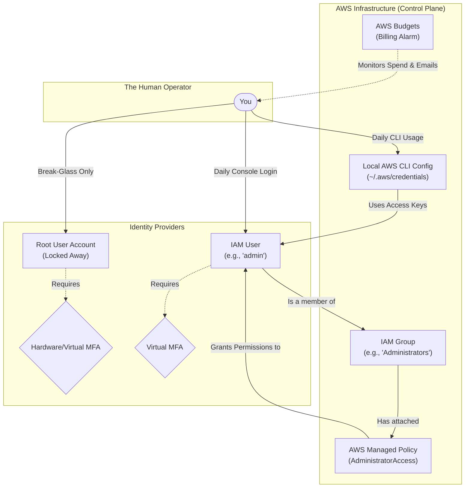

# Architecture Details & System Design

This document outlines the high-level architecture of your foundational AWS identity setup and how administrative access is structured.

## 🏗️ System Overview & Access Flow

---

## 🧩 Architectural Components & Technical Deep Dive

### 1. The Root User
The Root User is created when you first register for AWS. It is authenticated via the email address and password used during registration. 
- **Capabilities:** It has unrestricted access to all resources. It is the only identity that can close an AWS account, change AWS Support plans, or modify root account details.
- **Security Posture:** In our architecture, the Root User is secured with MFA and then deliberately abandoned for daily use. This is known as "Break-Glass" access.

### 2. IAM Groups and Role-Based Access Control (RBAC)
Instead of attaching the `AdministratorAccess` policy directly to the IAM user `admin`, we attach the policy to a Group called `Administrators`, and then place the user in that group.
- **Scalability:** If a new administrator joins the team, we simply add them to the group. If they leave, we remove them. We don't have to manually attach and detach individual JSON policies to every single user. This is a foundational best practice for enterprise architecture.

### 3. Programmatic Access vs. Console Access
IAM Users can be granted two types of access:
- **Management Console Access:** Allows logging into the web interface via a password and MFA.
- **Programmatic Access:** Provides an `Access Key ID` and a `Secret Access Key`. These cryptographic keys are used by the AWS CLI, SDKs (like Boto3 for Python), and infrastructure-as-code tools (like Terraform) to authenticate API requests to AWS. In this architecture, the keys are stored locally on your machine in the `~/.aws/credentials` file.

### 4. AWS Budgets (Financial Architecture)
AWS Budgets monitors your estimated charges dynamically. 
- The budget is set to a specific threshold (e.g., $5.00). 
- If forecasted or actual costs exceed this threshold, the service triggers an Amazon Simple Notification Service (SNS) topic under the hood, which delivers an alert to your registered email address. This ensures continuous financial observability without requiring daily manual checks.