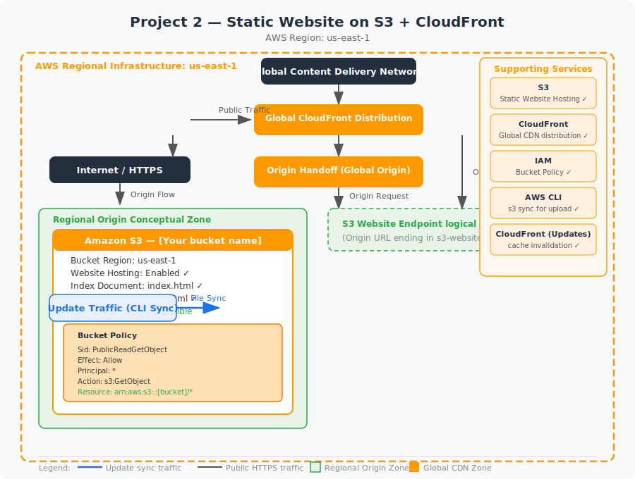

<div align="center">
  <h1> Project 02: Static Website Hosting on S3 + CloudFront CDN</h1>

  <p><i>Deploy a production-grade static website using Amazon S3 for origin storage and CloudFront as a global content delivery network. This project covers bucket policies, Origin Access Control (OAC), cache behaviors, and custom error pages — delivering sub-100ms latency worldwide.</i></p>

  <p>
    
    
    
    
    
  </p>

  <p>
    <b>🌐 Live Demos:</b><br/><br/>
    <a href="https://d2qfvpm2acd8sv.cloudfront.net/">
      
    </a>
    <a href="https://aws-sample-webiste-2026.s3.ap-south-1.amazonaws.com/index.html#projects">
      
    </a>
  </p>

  <p>
    <a href="#-infrastructure-specifications">Infrastructure</a> · 
    <a href="#-key-components">Components</a> · 
    <a href="#-core-features">Features</a> · 
    <a href="#-setup--installation">Setup</a> · 
    <a href="#-documentation-suite">Docs</a>
  </p>

</div>

<br/>

<div align="center">

## 🏗️ Architecture Overview



<p><i>▲ High-level architecture diagram showing the interaction between S3, CloudFront, Route 53, ACM services</i></p>

</div>

## 📐 Infrastructure Specifications

| Resource | Configuration |
|:---------|:--------------|
| **S3 Bucket** | Static website origin bucket with versioning enabled; public access blocked at bucket level |
| **Bucket Policy** | Allows only CloudFront OAC principal (`cloudfront.amazonaws.com`) via `s3:GetObject` |
| **CloudFront Distribution** | HTTPS-only, TLSv1.2_2021, HTTP/2 + HTTP/3, gzip + Brotli compression |
| **Origin Access Control** | Replaces legacy OAI; scoped to the single S3 origin with signing protocol SigV4 |
| **Cache Policy** | CachingOptimized managed policy (TTL 86400s); custom policy for `index.html` (TTL 300s) |
| **Error Pages** | Custom 404.html with 200 response code for SPA client-side routing |
| **Region** | ap-south-1 (S3 bucket); CloudFront edge locations are global |

## 🧩 Key Components

### S3 Static Website Origin
Versioned bucket storing HTML, CSS, JS, and image assets with server-side encryption (SSE-S3)

### CloudFront Distribution
Global edge cache with 450+ Points of Presence; HTTPS termination via ACM certificate

### Origin Access Control (OAC)
SigV4-based authentication replacing legacy OAI; ensures S3 is only accessible via CloudFront

### Cache Behaviors
Path-pattern rules (`/assets/*` → long TTL, `/*.html` → short TTL) for optimal freshness

### Custom Error Responses
Maps S3 403/404 errors to `/index.html` with 200 status for single-page applications

### CloudFront Functions
Lightweight edge compute for URL rewrites, security headers, and A/B testing

## ⚡ Core Features

- **Zero-Downtime Deployment** – Upload new assets to S3, then issue a CloudFront invalidation (`/*`)
- **HTTPS Everywhere** – ACM-issued TLS certificate with automatic renewal; HTTP → HTTPS redirect
- **Sub-100ms Global Latency** – CloudFront edge caching with Brotli compression and HTTP/3 support
- **SPA-Ready Routing** – Custom error responses rewrite all 404s to `index.html` for React/Vue/Angular apps
- **Versioned Rollback** – S3 versioning enables instant rollback to any previous deployment
- **Security Headers** – CloudFront Function injects `Strict-Transport-Security`, `X-Content-Type-Options`, `X-Frame-Options`
- **Cost-Optimized Caching** – Separate cache policies for static assets (24h TTL) and HTML (5min TTL)

## ✅ Free Tier Status

| Resource | Cost |
|:---------|:-----|
| **S3 Storage** (first 5 GB) | Free (12 months) |
| **S3 Requests** (GET: 20,000/mo, PUT: 2,000/mo) | Free (12 months) |
| **CloudFront** (1 TB transfer out/month) | Free (12 months) |
| **Route 53** (hosted zone) | $0.50/month per zone |
| **ACM Certificate** | Always free |

> [!TIP]
> This project is **effectively free** within the AWS Free Tier. CloudFront provides 1 TB of data transfer out per month for the first 12 months — more than sufficient for a personal portfolio site.

## 🛠️ Setup & Installation

### Prerequisites

- AWS CLI v2 configured with IAM credentials (from Project 01)
- A registered domain name (optional, for custom domain setup)
- Static website files (HTML, CSS, JS) ready for deployment
- Node.js 18+ (optional, for building frontend frameworks)

### Pre-flight Checks
Run these commands in PowerShell to confirm your environment is ready:
```powershell
# Confirm CLI is working
aws sts get-caller-identity

# Confirm region
aws configure get region

# Verify S3 access
aws s3 ls
```

### Installation

```bash
# 1. Clone the repository
git clone https://github.com/vinay1515/Vinay_kumar_AWS_Beginner_level_projects.git
cd project-02-s3-static-website

# 2. Configure environment variables
cp .env.example .env
# Edit .env with your specific values (see Environment Variables below)
```

### Environment Variables

Create a `.env` file in the project root:

```bash
export AWS_REGION="ap-south-1"
export BUCKET_NAME="my-static-website-bucket"
export DISTRIBUTION_ID="E1EXAMPLE12345"
export DOMAIN_NAME="example.com"
```

### Run Commands

Choose your platform and execute the scripts in order:

| Step | Bash Script | PowerShell Script | Description |
|------|-------------|-------------------|-------------|
| 01 | `scripts/bash/01-create-bucket.sh` | `scripts/powershell/01-create-bucket.ps1` | Creates the initial S3 bucket |
| 02 | `scripts/bash/02-enable-hosting.sh` | `scripts/powershell/02-enable-hosting.ps1` | Enables static website hosting |
| 03 | `scripts/bash/03-apply-policy.sh` | `scripts/powershell/03-apply-policy.ps1` | Applies public read bucket policy |
| 04 | `scripts/bash/04-deploy-code.sh` | `scripts/powershell/04-deploy-code.ps1` | Uploads HTML/CSS files to S3 |
| 05 | `scripts/bash/invalidate_cache.sh` | `scripts/powershell/invalidate_cache.ps1` | Forces CloudFront to pull new files |

### 📸 Screenshots & Validation
Throughout the documentation and `images/` directory, you will find screenshots captured during the deployment process. These visual artifacts serve as verification that the UI steps were successfully executed and validate the final architecture.

## 📚 Documentation Suite

| Document | Description |
|:---------|:------------|
| 📄 [Project Overview](docs/project-overview.md) | Comprehensive project context, goals, and learning outcomes |
| 🏗️ [Architecture Details](docs/architecture.md) | Deep-dive into system design, data flow, and component interactions |
| 🚀 [Deployment Guide](docs/deployment-guide.md) | Step-by-step deployment procedures for dev, staging, and production |
| 🔐 [Security Protocols](docs/security-protocols.md) | IAM policies, encryption, network security, and compliance controls |
| 🧪 [Testing Procedures](docs/testing-procedures.md) | Validation scripts, smoke tests, and integration test suites |
| 🛠️ [Troubleshooting](docs/troubleshooting.md) | Common issues, error codes, debugging steps, and resolution guides |
| 🧹 [Cleanup Guide](docs/cleanup-guide.md) | Instructions for tearing down AWS resources to avoid charges |
| 📋 [IAM Policy Notes](docs/iam-policy-notes.md) | Detailed notes on IAM policy structure, conditions, and best practices |

## 🤝 Contribution & Maintenance

### Testing

- `curl -I https://<distribution-domain>` – Verify `x-cache: Hit from cloudfront` header
- `aws s3api get-bucket-versioning --bucket $BUCKET_NAME` – Confirm versioning is Enabled
- `curl -o /dev/null -s -w '%{http_code}' https://<domain>/nonexistent` – Expect 200 (SPA routing)
- Open browser DevTools → Network tab → verify Brotli (`content-encoding: br`) on CSS/JS assets
- `aws cloudfront get-distribution --id $DISTRIBUTION_ID` – Validate OAC configuration

### Deployment

For full production deployment procedures, see the [Deployment Guide](docs/deployment-guide.md).

### Contributing

1. **Fork** the repository and create a feature branch (`git checkout -b feature/amazing-feature`)
2. **Commit** your changes (`git commit -m "Add amazing feature"`)
3. **Push** to the branch (`git push origin feature/amazing-feature`)
4. **Open** a Pull Request with a detailed description
5. Ensure all scripts exist in **both** `scripts/powershell/` and `scripts/bash/`

### License

This project is licensed under the **MIT License** — see the [LICENSE](./LICENSE) file for details.

### Contact & Credits

- **Author:** Vinay Kumar Duvva
- **GitHub:** [@vinaykumarduvva]( https://github.com/vinaykumarduvva)
- **Repository:** [aws-hands-on-projects]( https://github.com/vinaykumarduvva/aws-hands-on-projects)
---

<div align="center">
    <b><a href="../project-01-iam-setup">⬅️ Previous: Project 01</a> &nbsp;|&nbsp; <a href="../project-03-Launch-EC2-Connect-via-SSH">Next: Project 03 ➡️</a></b>
</div>