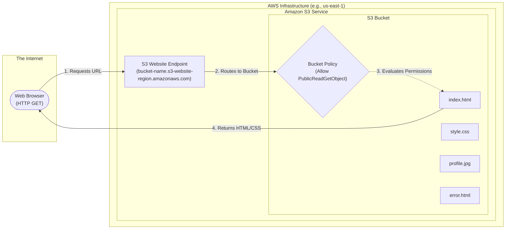

# Architecture Details & System Design

This document outlines the high-level architecture of hosting a serverless static website on Amazon S3 and the request flow from a user's browser to the AWS infrastructure.

## 🏗️ System Overview & Request Flow

---

## 🧩 Architectural Components & Technical Deep Dive

### 1. Amazon S3 (Simple Storage Service)
At its core, S3 is an object storage service designed to store and retrieve any amount of data from anywhere on the web. It uses a flat structure (buckets and objects) rather than a hierarchical file system (directories and folders).

### 2. Static Website Hosting Feature
S3 is not a web server by default. If you simply upload an `index.html` file to a standard S3 bucket and click its Object URL, S3 will prompt you to download the file rather than rendering it in the browser. 
- **The Engine:** When you enable the "Static website hosting" property on the bucket, AWS provisions a dedicated HTTP endpoint (the S3 Website Endpoint) that instructs browsers to render `text/html` content natively.
- **Index Document:** The configuration tells S3 which file to serve by default when a user hits the root domain (e.g., `index.html`).
- **Error Document:** The configuration tells S3 which file to serve if the user requests a page that doesn't exist (e.g., returning a custom 404 page via `error.html`).

### 3. S3 Website Endpoint URLs
The architecture relies on a specific DNS structure provided by AWS.
- Standard Object URL (REST API): `https://<bucket-name>.s3.<region>.amazonaws.com/index.html` (Prompts download; requires authentication by default).
- **Website Endpoint (HTTP):** `http://<bucket-name>.s3-website-<region>.amazonaws.com` (Renders HTML; publicly accessible).
*Note: S3 website endpoints do not support HTTPS natively. To secure the site with SSL/TLS, enterprise architectures place Amazon CloudFront (a CDN) in front of the S3 bucket.*

### 4. Security Architecture (Public Bucket Policy)
To allow anonymous users on the internet to view the website, the bucket must be explicitly made public.
- **Block Public Access (BPA):** S3 accounts have a master kill-switch called BPA that prevents any bucket from being public, regardless of its policy. This must be turned **OFF** for this specific bucket.
- **The Bucket Policy:** We apply a JSON resource-based policy to the bucket. The principal is `*` (Everyone in the world), the action is `s3:GetObject` (Read-only), and the resource is `arn:aws:s3:::<BUCKET_NAME>/*` (All files inside this specific bucket). This precise combination transforms the private storage bucket into a public web server.