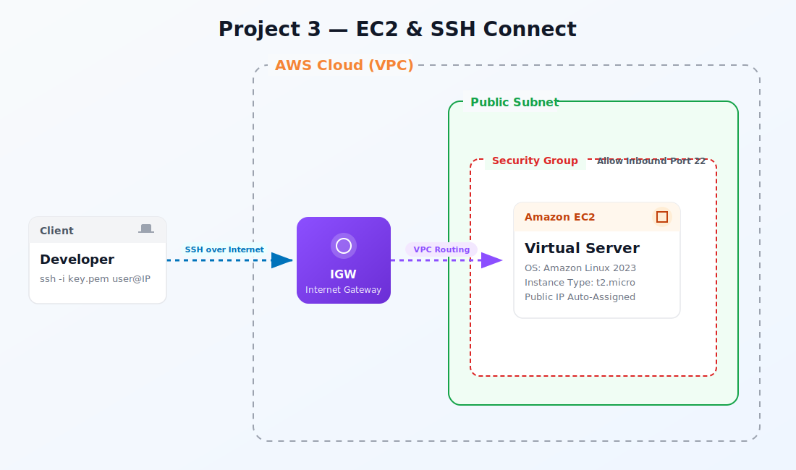

<div align="center">
  <h1> Project 03: Launch EC2 Instances & Secure Connectivity</h1>

  <p><i>Provision Amazon EC2 instances across availability zones with hardened security groups, key-pair-based SSH access, and AWS Systems Manager Session Manager for keyless browser-based shells. This project demonstrates instance lifecycle management, user data bootstrapping, and elastic IP allocation.</i></p>

  <p>
    
    
    
    
    
  </p>

  <p>
    <a href="#-infrastructure-specifications">Infrastructure</a> · 
    <a href="#-key-components">Components</a> · 
    <a href="#-core-features">Features</a> · 
    <a href="#-setup--installation">Setup</a> · 
    <a href="#-documentation-suite">Docs</a>
  </p>

</div>

<br/>

<div align="center">

## 🏗️ Architecture Overview



<p><i>▲ High-level architecture diagram showing the interaction between EC2, VPC, SSM, EBS services</i></p>

</div>

## 📐 Infrastructure Specifications

| Resource | Configuration |
|:---------|:--------------|
| **EC2 Instance** | t2.micro (Free Tier); Amazon Linux 2023 AMI; launched in default VPC public subnet |
| **Security Group** | Inbound: SSH (22) from your IP only; HTTP (80) from 0.0.0.0/0; Outbound: all traffic |
| **Key Pair** | RSA 2048-bit key pair generated via AWS CLI; `.pem` file stored locally with 400 permissions |
| **Elastic IP** | Static IPv4 address associated with the instance to survive stop/start cycles |
| **EBS Volume** | 8 GiB gp3 root volume (3000 IOPS, 125 MB/s throughput); encrypted with default KMS key |
| **User Data** | Bootstrap script installing httpd, PHP, and a sample application on first boot |
| **SSM Agent** | Pre-installed on Amazon Linux 2023; instance profile grants `AmazonSSMManagedInstanceCore` |
| **Region** | ap-south-1a (primary AZ) |

## 🧩 Key Components

### EC2 Instance (t2.micro)
Free-Tier eligible compute with burstable CPU; 1 vCPU, 1 GiB RAM

### Security Group (Firewall)
Stateful L4 firewall with inbound/outbound rules scoped to CIDR and port ranges

### Key Pair (SSH)
Asymmetric RSA key pair for secure, encrypted remote shell access

### Elastic IP
Static public IPv4 that persists across instance stop/start; avoids DNS propagation delays

### User Data (Bootstrap)
Base64-encoded shell script executed once at instance launch for automated setup

### SSM Session Manager
Browser-based or CLI-based shell without opening port 22; fully audited via CloudTrail

### EBS gp3 Volume
General-purpose SSD with baseline 3000 IOPS; encrypted at rest with AWS-managed KMS key

## ⚡ Core Features

- **Dual-Access Model** – SSH via key pair (port 22) + SSM Session Manager (no inbound ports required)
- **Automated Bootstrapping** – User Data script installs Apache, PHP, and deploys sample app on first launch
- **Security-First Configuration** – Security group restricts SSH to operator's IP; SSM eliminates key distribution
- **Persistent Public IP** – Elastic IP survives instance stop/start; avoids DNS re-mapping
- **Encrypted Storage** – EBS gp3 volume with AES-256 encryption via AWS-managed KMS key
- **Instance Metadata v2 (IMDSv2)** – Enforced token-based metadata service; mitigates SSRF attacks
- **Stop/Start Cost Optimization** – Scripts to stop instances during off-hours; EBS charges only ($0.08/GB/mo)

## 🛠️ Setup & Installation

### Prerequisites

- AWS CLI v2 configured with IAM credentials (from Project 01)
- An SSH client (OpenSSH, PuTTY, or VS Code Remote SSH extension)
- Python 3.9+ (for AWS CLI v2 and Session Manager plugin)
- Session Manager Plugin installed (`aws ssm start-session` support)

### Pre-flight Checks
Run these commands in PowerShell to confirm your environment is ready:
```powershell
# Confirm CLI is working
aws sts get-caller-identity

# Confirm region
aws configure get region

# Check your default VPC exists
aws ec2 describe-vpcs --filters "Name=isDefault,Values=true" --query "Vpcs[*].{VpcId:VpcId,CIDR:CidrBlock}" --output table
```

### Installation

```bash
# 1. Clone the repository
git clone https://github.com/vinay1515/Vinay_kumar_AWS_Beginner_level_projects.git
cd project-03-Launch-EC2-Connect-via-SSH

# 2. Configure environment variables
cp .env.example .env
# Edit .env with your specific values (see Environment Variables below)
```

### Environment Variables

Create a `.env` file in the project root:

```bash
export AWS_REGION="ap-south-1"
export KEY_NAME="my-ec2-keypair"
export INSTANCE_TYPE="t2.micro"
export AMI_ID="ami-0c55b159cbfafe1f0"
export MY_IP="$(curl -s ifconfig.me)/32"
```

### Run Commands

Choose your platform and execute the scripts in order:

<table>
<tr><th>Step</th><th>Script</th><th>Description</th></tr>
<tr><td>🐧</td><td><code>scripts/bash/01-create-key-pair.sh</code></td><td>Execute Create key pair</td></tr>
<tr><td>🖥️</td><td><code>scripts/powershell/01-create-key-pair.ps1</code></td><td>Execute Create key pair</td></tr>
<tr><td>🐧</td><td><code>scripts/bash/02-create-security-group.sh</code></td><td>Execute Create security group</td></tr>
<tr><td>🖥️</td><td><code>scripts/powershell/02-create-security-group.ps1</code></td><td>Execute Create security group</td></tr>
<tr><td>🐧</td><td><code>scripts/bash/03-launch-instance.sh</code></td><td>Execute Launch instance</td></tr>
<tr><td>🖥️</td><td><code>scripts/powershell/03-launch-instance.ps1</code></td><td>Execute Launch instance</td></tr>
<tr><td>🐧</td><td><code>scripts/bash/04-connect-ssm.sh</code></td><td>Execute Connect ssm</td></tr>
<tr><td>🖥️</td><td><code>scripts/powershell/04-connect-ssm.ps1</code></td><td>Execute Connect ssm</td></tr>
<tr><td>🐧</td><td><code>scripts/bash/05-cleanup.sh</code></td><td>Execute Cleanup</td></tr>
<tr><td>🖥️</td><td><code>scripts/powershell/05-cleanup.ps1</code></td><td>Execute Cleanup</td></tr>
</table>

## 📚 Documentation Suite

| Document | Description |
|:---------|:------------|
| 📄 [Project Overview](docs/project-overview.md) | Comprehensive project context, goals, and learning outcomes |
| 🏗️ [Architecture Details](docs/architecture.md) | Deep-dive into system design, data flow, and component interactions |
| 🚀 [Deployment Guide](docs/deployment-guide.md) | Step-by-step deployment procedures for dev, staging, and production |
| 🔐 [Security Protocols](docs/security-protocols.md) | IAM policies, encryption, network security, and compliance controls |
| 🧪 [Testing Procedures](docs/testing-procedures.md) | Validation scripts, smoke tests, and integration test suites |
| 🛠️ [Troubleshooting](docs/troubleshooting.md) | Common issues, error codes, debugging steps, and resolution guides |

## 🤝 Contribution & Maintenance

### Testing

- `aws ec2 describe-instances --instance-ids $INSTANCE_ID` – Confirm `running` state
- `ssh -i key.pem ec2-user@<EIP> 'curl localhost'` – Verify httpd is serving the sample page
- `aws ssm start-session --target $INSTANCE_ID` – Confirm Session Manager connectivity
- `curl http://<EIP>` – Verify HTTP access through the security group
- `aws ec2 describe-volumes --filters Name=encrypted,Values=true` – Confirm EBS encryption

### Deployment

For full production deployment procedures, see the [Deployment Guide](docs/deployment-guide.md).

### Contributing

1. **Fork** the repository and create a feature branch (`git checkout -b feature/amazing-feature`)
2. **Commit** your changes (`git commit -m "Add amazing feature"`)
3. **Push** to the branch (`git push origin feature/amazing-feature`)
4. **Open** a Pull Request with a detailed description
5. Ensure all scripts exist in **both** `scripts/powershell/` and `scripts/bash/`

### License

This project is licensed under the **MIT License** — see the [LICENSE](../LICENSE) file for details.

### Contact & Credits

- **Author:** Vinay Kumar
- **GitHub:** [@vinay1515](https://github.com/vinay1515)
- **Repository:** [Vinay_kumar_AWS_Beginner_level_projects](https://github.com/vinay1515/Vinay_kumar_AWS_Beginner_level_projects)

---

<div align="center">
  <b><a href="../project-02-s3-static-website">⬅️ Previous: Project 02</a> &nbsp;|&nbsp; <a href="../project-04-s3-versioning">Next: Project 04 ➡️</a></b>
</div>
