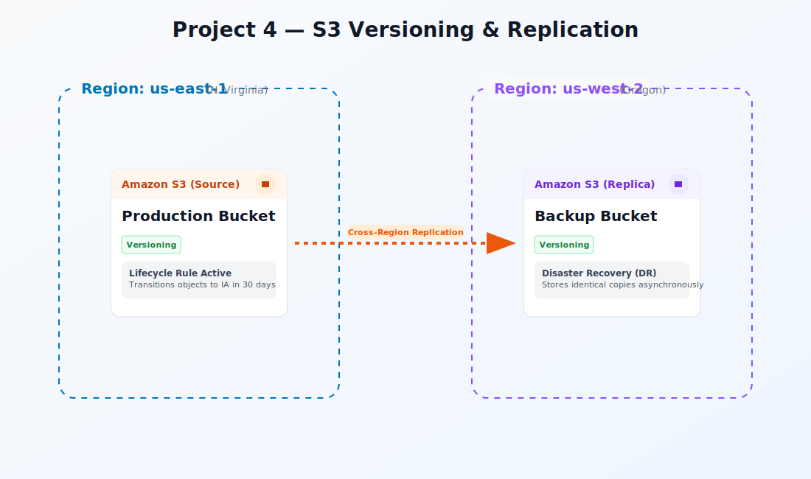

<div align="center">
  <h1> Project 04: S3 Versioning, Lifecycle Rules & Cross-Region Replication</h1>

  <p><i>Master Amazon S3's data durability features by enabling object versioning for point-in-time recovery, configuring intelligent lifecycle policies to transition data across storage classes, and implementing cross-region replication for disaster recovery — all while optimizing costs with storage class analysis.</i></p>

  <p>
    
    
    
    
    
  </p>

  <p>
    <a href="#-infrastructure-specifications">Infrastructure</a> · 
    <a href="#-key-components">Components</a> · 
    <a href="#-core-features">Features</a> · 
    <a href="#-setup--installation">Setup</a> · 
    <a href="#-documentation-suite">Docs</a>
  </p>

</div>

<br/>

<div align="center">

## 🏗️ Architecture Overview



<p><i>▲ High-level architecture diagram showing the interaction between S3, IAM, KMS services</i></p>

</div>

## 📐 Infrastructure Specifications

| Resource | Configuration |
|:---------|:--------------|
| **Source Bucket** | Versioning-enabled bucket in ap-south-1 with SSE-S3 default encryption |
| **Destination Bucket** | Versioning-enabled bucket in us-east-1 for cross-region replication (CRR) |
| **Lifecycle Rule 1** | Transition current versions to S3-IA after 30 days; to Glacier after 90 days |
| **Lifecycle Rule 2** | Expire non-current versions after 60 days; delete incomplete multipart uploads after 7 days |
| **Replication Rule** | Entire bucket scope; replicate delete markers; RTC (15-minute SLA); encrypted objects included |
| **IAM Role** | S3 replication role with `s3:ReplicateObject`, `s3:GetObjectVersionForReplication` permissions |
| **Region** | ap-south-1 (source) → us-east-1 (destination) |

## 🧩 Key Components

### S3 Versioning
Maintains every version of every object; enables undelete and point-in-time recovery

### Lifecycle Policies
Automated rules transitioning objects between Standard → IA → Glacier → Deep Archive

### Cross-Region Replication (CRR)
Asynchronous, automatic replication of objects to a bucket in a different region

### Replication Time Control (RTC)
SLA-backed 15-minute replication guarantee for compliance workloads

### S3 Storage Class Analysis
Data access pattern analysis that recommends when to transition infrequently accessed data

### Delete Marker Replication
Replicates delete markers to destination bucket for consistent soft-delete behavior

## ⚡ Core Features

- **Point-in-Time Recovery** – Retrieve any previous version of any object instantly
- **Cost-Optimized Tiering** – Automated lifecycle rules move cold data to IA (40% savings) and Glacier (68% savings)
- **Disaster Recovery** – Cross-region replication with <15 min RTC SLA ensures RPO compliance
- **Soft-Delete Protection** – Delete markers preserve object history; MFA Delete for permanent deletion
- **Multipart Upload Hygiene** – Auto-abort incomplete multipart uploads after 7 days to avoid hidden costs
- **Encryption at Rest** – SSE-S3 (AES-256) default encryption on both source and destination buckets
- **Storage Analytics** – Storage Class Analysis dashboard to validate lifecycle rule effectiveness

## 🛠️ Setup & Installation

### Prerequisites

- AWS CLI v2 configured with IAM credentials (from Project 01)
- Two AWS regions available (ap-south-1 and us-east-1)
- Sample data files for upload (text, images, or any test objects)

### Pre-flight Checks
Run these commands in PowerShell to confirm your environment is ready:
```powershell
# Confirm CLI working
aws sts get-caller-identity

# Confirm region
aws configure get region

# Check existing buckets
aws s3 ls
```

### Installation

```bash
# 1. Clone the repository
git clone https://github.com/vinay1515/Vinay_kumar_AWS_Beginner_level_projects.git
cd project-04-s3-versioning

# 2. Configure environment variables
cp .env.example .env
# Edit .env with your specific values (see Environment Variables below)
```

### Environment Variables

Create a `.env` file in the project root:

```bash
export AWS_REGION="ap-south-1"
export SOURCE_BUCKET="my-versioned-source-bucket"
export DEST_BUCKET="my-versioned-dest-bucket"
export DEST_REGION="us-east-1"
```

### Run Commands

Choose your platform and execute the scripts in order:

<table>
<tr><th>Step</th><th>Script</th><th>Description</th></tr>
<tr><td>🐧</td><td><code>scripts/bash/01-create-source-bucket.sh</code></td><td>Execute Create source bucket</td></tr>
<tr><td>🖥️</td><td><code>scripts/powershell/01-create-source-bucket.ps1</code></td><td>Execute Create source bucket</td></tr>
<tr><td>🐧</td><td><code>scripts/bash/02-test-versioning.sh</code></td><td>Execute Test versioning</td></tr>
<tr><td>🖥️</td><td><code>scripts/powershell/02-test-versioning.ps1</code></td><td>Execute Test versioning</td></tr>
<tr><td>🐧</td><td><code>scripts/bash/03-create-lifecycle-policy.sh</code></td><td>Execute Create lifecycle policy</td></tr>
<tr><td>🖥️</td><td><code>scripts/powershell/03-create-lifecycle-policy.ps1</code></td><td>Execute Create lifecycle policy</td></tr>
<tr><td>🐧</td><td><code>scripts/bash/04-cross-region-replication.sh</code></td><td>Execute Cross region replication</td></tr>
<tr><td>🖥️</td><td><code>scripts/powershell/04-cross-region-replication.ps1</code></td><td>Execute Cross region replication</td></tr>
<tr><td>🐧</td><td><code>scripts/bash/05-test-replication.sh</code></td><td>Execute Test replication</td></tr>
<tr><td>🖥️</td><td><code>scripts/powershell/05-test-replication.ps1</code></td><td>Execute Test replication</td></tr>
<tr><td>🐧</td><td><code>scripts/bash/06-cleanup.sh</code></td><td>Execute Cleanup</td></tr>
<tr><td>🖥️</td><td><code>scripts/powershell/06-cleanup.ps1</code></td><td>Execute Cleanup</td></tr>
</table>

## 📚 Documentation Suite

| Document | Description |
|:---------|:------------|
| 📄 [Project Overview](docs/project-overview.md) | Comprehensive project context, goals, and learning outcomes |
| 🏗️ [Architecture Details](docs/architecture.md) | Deep-dive into system design, data flow, and component interactions |
| 🚀 [Deployment Guide](docs/deployment-guide.md) | Step-by-step deployment procedures for dev, staging, and production |
| 🔐 [Security Protocols](docs/security-protocols.md) | IAM policies, encryption, network security, and compliance controls |
| 🧪 [Testing Procedures](docs/testing-procedures.md) | Validation scripts, smoke tests, and integration test suites |
| 🛠️ [Troubleshooting](docs/troubleshooting.md) | Common issues, error codes, debugging steps, and resolution guides |

## 🤝 Contribution & Maintenance

### Testing

- `aws s3api list-object-versions --bucket $SOURCE_BUCKET` – Verify multiple versions exist
- `aws s3api get-bucket-lifecycle-configuration --bucket $SOURCE_BUCKET` – Confirm lifecycle rules
- `aws s3api get-bucket-replication --bucket $SOURCE_BUCKET` – Validate CRR configuration
- Delete an object, then restore it: `aws s3api delete-object` → `aws s3api list-object-versions`
- `aws s3api head-object --bucket $DEST_BUCKET --key test.txt` – Confirm replication succeeded

### Deployment

For full production deployment procedures, see the [Deployment Guide](docs/deployment-guide.md).

### Contributing

1. **Fork** the repository and create a feature branch (`git checkout -b feature/amazing-feature`)
2. **Commit** your changes (`git commit -m "Add amazing feature"`)
3. **Push** to the branch (`git push origin feature/amazing-feature`)
4. **Open** a Pull Request with a detailed description
5. Ensure all scripts exist in **both** `scripts/powershell/` and `scripts/bash/`

### License

This project is licensed under the **MIT License** — see the [LICENSE](../LICENSE) file for details.

### Contact & Credits

- **Author:** Vinay Kumar
- **GitHub:** [@vinay1515](https://github.com/vinay1515)
- **Repository:** [Vinay_kumar_AWS_Beginner_level_projects](https://github.com/vinay1515/Vinay_kumar_AWS_Beginner_level_projects)

---

<div align="center">
  <b><a href="../project-03-Launch-EC2-Connect-via-SSH">⬅️ Previous: Project 03</a> &nbsp;|&nbsp; <a href="../project-05-Custom-VPC">Next: Project 05 ➡️</a></b>
</div>
