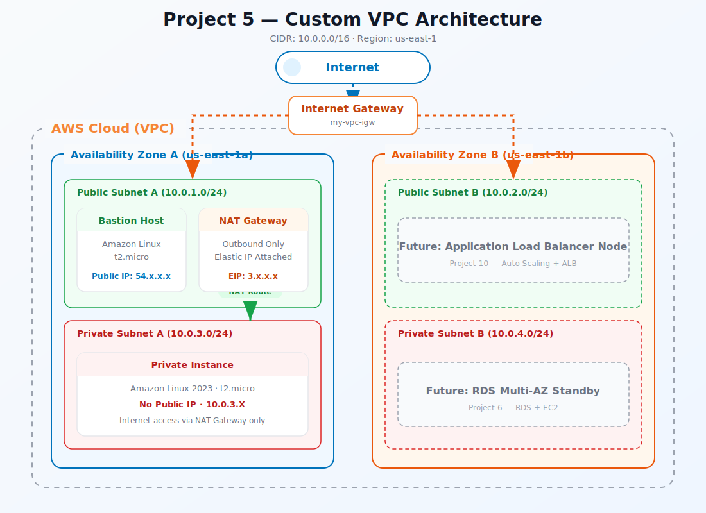

<div align="center">
  <h1> Project 05: Custom VPC with Public & Private Subnets</h1>

  <p><i>Architect a production-grade Virtual Private Cloud (VPC) with multi-AZ public and private subnets, an Internet Gateway for public-facing resources, a NAT Gateway for secure outbound access from private subnets, and custom route tables — implementing the foundational network topology used by Fortune 500 companies.</i></p>

  <p>
    
    
    
    
    
  </p>

  <p>
    <a href="#-infrastructure-specifications">Infrastructure</a> · 
    <a href="#-key-components">Components</a> · 
    <a href="#-core-features">Features</a> · 
    <a href="#-setup--installation">Setup</a> · 
    <a href="#-documentation-suite">Docs</a>
  </p>

</div>

<br/>

<div align="center">

## 🏗️ Architecture Overview



<p><i>▲ High-level architecture diagram showing the interaction between VPC, EC2, NAT Gateway, Internet Gateway services</i></p>

</div>

## 📐 Infrastructure Specifications

| Resource | Configuration |
|:---------|:--------------|
| **VPC** | 10.0.0.0/16 CIDR block (65,536 IPs); DNS hostnames and DNS resolution enabled |
| **Public Subnet A** | 10.0.1.0/24 in us-east-1a; auto-assign public IP enabled; routes to IGW |
| **Public Subnet B** | 10.0.2.0/24 in us-east-1b; auto-assign public IP enabled; routes to IGW |
| **Private Subnet A** | 10.0.3.0/24 in us-east-1a; no public IP; routes to NAT Gateway |
| **Private Subnet B** | 10.0.4.0/24 in us-east-1b; no public IP; routes to NAT Gateway |
| **Internet Gateway** | Attached to VPC; public route table has 0.0.0.0/0 → IGW |
| **NAT Gateway** | Elastic IP-backed; deployed in Public Subnet A; private route table has 0.0.0.0/0 → NAT |
| **NACLs** | Default allow-all NACLs; ephemeral port range (1024-65535) for return traffic |
| **Region** | us-east-1 (multi-AZ: 1a + 1b) |

## 🌐 CIDR Block Plan

| Resource | CIDR | Notes |
|:---------|:-----|:------|
| **VPC** | `10.0.0.0/16` | 65,536 IP addresses total |
| **Public Subnet A** | `10.0.1.0/24` | 256 IPs — us-east-1a |
| **Public Subnet B** | `10.0.2.0/24` | 256 IPs — us-east-1b |
| **Private Subnet A** | `10.0.3.0/24` | 256 IPs — us-east-1a |
| **Private Subnet B** | `10.0.4.0/24` | 256 IPs — us-east-1b |

> 💡 **Note:** AWS reserves 5 IPs per subnet (.0, .1, .2, .3, .255), so each /24 gives you 251 usable addresses.

## 🧩 Key Components

### VPC (10.0.0.0/16)
Isolated virtual network with 65,536 available IP addresses

### Public Subnets (x2)
Multi-AZ subnets with Internet Gateway routing for web servers and bastion hosts

### Private Subnets (x2)
Multi-AZ subnets with NAT Gateway routing for databases and application logic

### Internet Gateway (IGW)
Horizontally-scaled, HA gateway enabling bidirectional internet access for public subnets

### NAT Gateway
Managed, HA network address translator enabling private subnet outbound-only internet access

### Route Tables
Public table (0.0.0.0/0 → IGW) and private table (0.0.0.0/0 → NAT) with explicit subnet associations

### Network ACLs
Stateless subnet-level firewall providing defense-in-depth alongside security groups

## ⚡ Core Features

- **Multi-AZ High Availability** – Subnets span two AZs for fault tolerance against data center failures
- **Defense-in-Depth** – Security groups (stateful L4) + NACLs (stateless L3/L4) provide layered network security
- **NAT Gateway for Private Egress** – Private instances pull updates/packages without exposing inbound ports
- **DNS Resolution** – VPC DNS hostnames enable human-readable internal addressing (`ip-10-0-1-42.ec2.internal`)
- **Elastic IP Persistence** – NAT Gateway's EIP ensures consistent outbound IP for allowlisting
- **CIDR Planning** – /24 subnets (251 usable IPs each) with room for future /24 expansion within the /16 VPC
- **Flow Logs Ready** – VPC architecture supports CloudWatch or S3-based VPC Flow Logs for network monitoring

## ✅ Free Tier Status

| Resource | Cost |
|:---------|:-----|
| **VPC, Subnets, IGW, Route Tables** | Always free |
| **Security Groups, NACLs** | Always free |
| **EC2 t2.micro (test instances)** | Free tier (750 hrs/month) |
| **NAT Gateway** | ⚠️ **NOT free** — ~$0.045/hr + $0.045/GB |
| **Elastic IP (attached)** | Free while attached to running instance |

> [!WARNING]
> **NAT Gateway is the only paid resource in this project.**
> We create it, test it, then delete it immediately. Total exposure is under $0.10 if you follow the cleanup steps. This is worth it — NAT Gateway is in every AWS interview and every real production VPC.

## 🛠️ Setup & Installation

### Prerequisites

- AWS CLI v2 configured with IAM credentials (from Project 01)
- Understanding of CIDR notation and IP addressing
- An SSH key pair (from Project 03) for testing connectivity

### Installation

```bash
# 1. Clone the repository
git clone https://github.com/vinay1515/Vinay_kumar_AWS_Beginner_level_projects.git
cd project-05-Custom-VPC

# 2. Configure environment variables
cp .env.example .env
# Edit .env with your specific values (see Environment Variables below)
```

### Environment Variables

Create a `.env` file in the project root:

```bash
export AWS_REGION="us-east-1"
export VPC_CIDR="10.0.0.0/16"
export PUBLIC_SUBNET_A_CIDR="10.0.1.0/24"
export PUBLIC_SUBNET_B_CIDR="10.0.2.0/24"
export PRIVATE_SUBNET_A_CIDR="10.0.3.0/24"
export PRIVATE_SUBNET_B_CIDR="10.0.4.0/24"
```

### Run Commands

Choose your platform and execute the scripts in order:

<table>
<tr><th>Step</th><th>Script</th><th>Description</th></tr>
<tr><td>🐧</td><td><code>scripts/bash/01-create-vpc.sh</code></td><td>Execute Create vpc</td></tr>
<tr><td>🖥️</td><td><code>scripts/powershell/01-create-vpc.ps1</code></td><td>Execute Create vpc</td></tr>
<tr><td>🐧</td><td><code>scripts/bash/02-create-route-tables.sh</code></td><td>Execute Create route tables</td></tr>
<tr><td>🖥️</td><td><code>scripts/powershell/02-create-route-tables.ps1</code></td><td>Execute Create route tables</td></tr>
<tr><td>🐧</td><td><code>scripts/bash/03-create-nat-gateway.sh</code></td><td>Execute Create nat gateway</td></tr>
<tr><td>🖥️</td><td><code>scripts/powershell/03-create-nat-gateway.ps1</code></td><td>Execute Create nat gateway</td></tr>
<tr><td>🐧</td><td><code>scripts/bash/04-create-security-groups.sh</code></td><td>Execute Create security groups</td></tr>
<tr><td>🖥️</td><td><code>scripts/powershell/04-create-security-groups.ps1</code></td><td>Execute Create security groups</td></tr>
<tr><td>🐧</td><td><code>scripts/bash/05-launch-instances.sh</code></td><td>Execute Launch instances</td></tr>
<tr><td>🖥️</td><td><code>scripts/powershell/05-launch-instances.ps1</code></td><td>Execute Launch instances</td></tr>
<tr><td>🐧</td><td><code>scripts/bash/06-cleanup.sh</code></td><td>Execute Cleanup</td></tr>
<tr><td>🖥️</td><td><code>scripts/powershell/06-cleanup.ps1</code></td><td>Execute Cleanup</td></tr>
</table>

## 📚 Documentation Suite

| Document | Description |
|:---------|:------------|
| 📄 [Project Overview](docs/project-overview.md) | Comprehensive project context, goals, and learning outcomes |
| 🏗️ [Architecture Details](docs/architecture.md) | Deep-dive into system design, data flow, and component interactions |
| 🚀 [Deployment Guide](docs/deployment-guide.md) | Step-by-step deployment procedures for dev, staging, and production |
| 🔐 [Security Protocols](docs/security-protocols.md) | IAM policies, encryption, network security, and compliance controls |
| 🧪 [Testing Procedures](docs/testing-procedures.md) | Validation scripts, smoke tests, and integration test suites |
| 🛠️ [Troubleshooting](docs/troubleshooting.md) | Common issues, error codes, debugging steps, and resolution guides |

## 🤝 Contribution & Maintenance

### Testing

- `aws ec2 describe-vpcs --vpc-ids $VPC_ID` – Verify VPC CIDR and DNS settings
- Launch EC2 in public subnet → `curl ifconfig.me` – Confirm internet access via IGW
- Launch EC2 in private subnet → `curl ifconfig.me` – Confirm outbound-only access via NAT
- `aws ec2 describe-route-tables` – Verify public (→ IGW) and private (→ NAT) route entries
- Attempt inbound SSH to private subnet EC2 from internet – Should be unreachable

### Deployment

For full production deployment procedures, see the [Deployment Guide](docs/deployment-guide.md).

### Contributing

1. **Fork** the repository and create a feature branch (`git checkout -b feature/amazing-feature`)
2. **Commit** your changes (`git commit -m "Add amazing feature"`)
3. **Push** to the branch (`git push origin feature/amazing-feature`)
4. **Open** a Pull Request with a detailed description
5. Ensure all scripts exist in **both** `scripts/powershell/` and `scripts/bash/`

### License

This project is licensed under the **MIT License** — see the [LICENSE](../project-05-Custom-VPC/LICENSE) file for details.

### Contact & Credits

- **Author:** Vinay Kumar
- **GitHub:** [@vinay1515](https://github.com/vinay1515)
- **Repository:** [Vinay_kumar_AWS_Beginner_level_projects](https://github.com/vinay1515/Vinay_kumar_AWS_Beginner_level_projects)

---

<div align="center">
  <b><a href="../project-04-s3-versioning">⬅️ Previous: Project 04</a> &nbsp;|&nbsp; <a href="../project-06-rds-ec2">Next: Project 06 ➡️</a></b>
</div>
