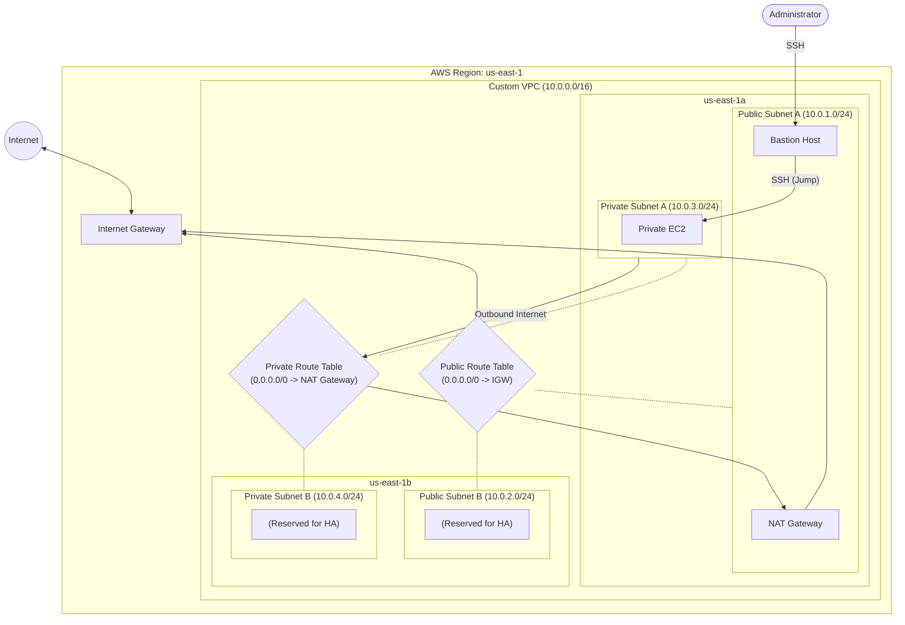

# Architecture Details

This document details the network topology and component interactions of our Custom VPC.

## 🏗️ System Overview & Data Flow

The environment is built within a single AWS Region (`us-east-1`) and spans two Availability Zones (`us-east-1a` and `us-east-1b`) to ensure high availability and fault tolerance. 

The core of the architecture is a Virtual Private Cloud (VPC) allocated with a `/16` CIDR block, providing a massive pool of 65,536 private IP addresses.

## 🧩 Core Components

### 1. The VPC (`10.0.0.0/16`)
The logical boundary of our network. It is completely isolated from other virtual networks in the AWS Cloud. We explicitly enable **DNS hostnames** and **DNS resolution** to ensure AWS services and instances can resolve human-readable internal addresses.

### 2. Subnet Layout
We carve the VPC's `/16` network into four smaller `/24` subnets. A `/24` subnet provides 256 IPs, but AWS reserves 5 IPs per subnet, leaving 251 usable IP addresses per subnet.

- **Public Subnet A (`10.0.1.0/24`)**: Located in AZ `us-east-1a`. Hosts the Bastion EC2 instance, NAT Gateway, and future public-facing Load Balancers.
- **Public Subnet B (`10.0.2.0/24`)**: Located in AZ `us-east-1b`. Reserved for High Availability redundancy (e.g., secondary Load Balancer nodes).
- **Private Subnet A (`10.0.3.0/24`)**: Located in AZ `us-east-1a`. Hosts backend application servers and databases. 
- **Private Subnet B (`10.0.4.0/24`)**: Located in AZ `us-east-1b`. Reserved for redundant backend servers and database standby replicas.

### 3. Gateways
- **Internet Gateway (IGW)**: Attached directly to the VPC. It provides a target in our public VPC route tables for internet-routable traffic, and performs Network Address Translation (NAT) for instances that have been assigned public IPv4 addresses.
- **NAT Gateway**: Deployed into **Public Subnet A** and associated with a static **Elastic IP (EIP)**. It enables instances in our private subnets to initiate outbound IPv4 traffic to the internet (e.g., for software updates) but prevents the internet from initiating connections into those instances.

### 4. Route Tables
Route tables act as the virtual routers for our subnets.
- **Public Route Table**: Associated with both Public Subnets. Contains a route directing all outbound internet traffic (`0.0.0.0/0`) to the **Internet Gateway**.
- **Private Route Table**: Associated with both Private Subnets. Contains a route directing all outbound internet traffic (`0.0.0.0/0`) to the **NAT Gateway**.

## 🚦 Traffic Flow Example

If the **Private App EC2 Instance** (in Private Subnet A) needs to download a software update from the internet:
1. The instance sends the request to the internet (`0.0.0.0/0`).
2. The **Private Route Table** intercepts the request and routes it to the **NAT Gateway** (located in the Public Subnet).
3. The NAT Gateway replaces the instance's private IP with its own **Elastic IP** and forwards the request to the **Internet Gateway** using the Public Route Table.
4. The Internet Gateway sends the request to the public internet.
5. The response returns through the IGW -> NAT Gateway -> Private Instance.