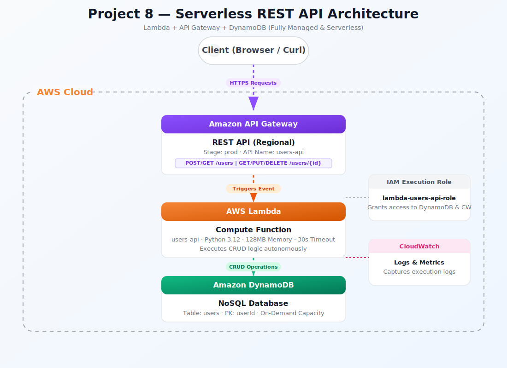

<div align="center">
  <h1> Project 08: Serverless REST API with API Gateway, Lambda & DynamoDB</h1>

  <p><i>Build a fully serverless CRUD REST API using Amazon API Gateway as the HTTP front door, AWS Lambda for compute logic, and DynamoDB as a NoSQL data store. This project implements request validation, Lambda proxy integration, DynamoDB single-table design, and API key-based throttling — achieving zero-server, pay-per-request architecture.</i></p>

  <p>
    
    
    
    
    
  </p>

  <p>
    <a href="#-infrastructure-specifications">Infrastructure</a> · 
    <a href="#-key-components">Components</a> · 
    <a href="#-core-features">Features</a> · 
    <a href="#-setup--installation">Setup</a> · 
    <a href="#-documentation-suite">Docs</a>
  </p>

</div>

<br/>

<div align="center">

## 🏗️ Architecture Overview



<p><i>▲ High-level architecture diagram showing the interaction between API Gateway, Lambda, DynamoDB, IAM, CloudWatch services</i></p>

</div>

## 📐 Infrastructure Specifications

| Resource | Configuration |
|:---------|:--------------|
| **API Gateway** | REST API (regional); stages: `dev`, `prod`; API key + usage plan (1000 req/day, 10 req/sec burst) |
| **Lambda Functions** | Python 3.12 runtime; 128MB memory, 10s timeout; 4 functions (Create, Read, Update, Delete) |
| **DynamoDB Table** | On-demand capacity; partition key `PK` (String), sort key `SK` (String); single-table design |
| **IAM Role (Lambda)** | `lambda-dynamodb-role` with `dynamodb:PutItem/GetItem/UpdateItem/DeleteItem/Query` on table ARN |
| **CloudWatch Logs** | Automatic log groups per Lambda function; 14-day retention; structured JSON logging |
| **API Models** | JSON Schema request validation on POST/PUT endpoints; 400 response on malformed payloads |
| **CORS** | Enabled on all endpoints; `Access-Control-Allow-Origin: *` for development |
| **Region** | ap-south-1 |

## 🧩 Key Components

### API Gateway (REST)
Managed HTTP endpoint with stages, request validation, API keys, and usage plans

### Lambda Functions (x4)
Stateless Python 3.12 handlers for Create, Read, Update, Delete operations

### DynamoDB (Single-Table)
NoSQL database using single-table design with `PK`/`SK` composite key pattern

### Lambda Proxy Integration
API Gateway passes full HTTP request to Lambda; Lambda returns statusCode + body

### API Key & Usage Plan
Rate limiting (10 req/sec) and quota (1000 req/day) to prevent abuse

### Request Validation
JSON Schema models on API Gateway validate request body before invoking Lambda

## ⚡ Core Features

- **Zero-Server Architecture** – No EC2, no containers; pay only for actual API invocations ($0.20/million requests)
- **Single-Table DynamoDB Design** – Partition key (`PK`) + sort key (`SK`) pattern for flexible access patterns
- **Request Validation** – API Gateway JSON Schema models reject malformed requests before Lambda is invoked
- **API Key Throttling** – Usage plans enforce rate limits (10 req/sec) and daily quotas (1000 req/day)
- **Structured Logging** – Lambda functions emit JSON-formatted logs to CloudWatch for easy parsing
- **Stage Deployment** – Separate `dev` and `prod` stages with independent configurations and endpoints
- **CORS Support** – Pre-flight OPTIONS responses enable browser-based frontend integration

## 🛠️ Setup & Installation

### Prerequisites

- AWS CLI v2 configured with IAM credentials (from Project 01)
- Python 3.12+ installed locally for Lambda function development
- `zip` utility for packaging Lambda deployment artifacts
- Postman or `curl` for API testing

### Installation

```bash
# 1. Clone the repository
git clone https://github.com/vinay1515/Vinay_kumar_AWS_Beginner_level_projects.git
cd project-08-serverless-rest-api

# 2. Configure environment variables
cp .env.example .env
# Edit .env with your specific values (see Environment Variables below)
```

### Environment Variables

Create a `.env` file in the project root:

```bash
export AWS_REGION="ap-south-1"
export TABLE_NAME="ServerlessAPI"
export API_NAME="serverless-crud-api"
export STAGE_NAME="dev"
export LAMBDA_ROLE_ARN="arn:aws:iam::ACCOUNT_ID:role/lambda-dynamodb-role"
```

### Run Commands

Choose your platform and execute the scripts in order:

| Step | Bash Script | PowerShell Script | Description |
|:---:|:---|:---|:---|
| 1 | `scripts/bash/01-create-dynamodb.sh` | `scripts/powershell/01-create-dynamodb.ps1` | Create DynamoDB table |
| 2 | `scripts/bash/02-create-lambda-execution-role.sh` | `scripts/powershell/02-create-lambda-execution-role.ps1` | Create IAM role for Lambda |
| 3 | `scripts/bash/03-write-and-deploy-lambda.sh` | `scripts/powershell/03-write-and-deploy-lambda.ps1` | Write, package and deploy Lambda function |
| 4 | `scripts/bash/04-test-lambda-directly.sh` | `scripts/powershell/04-test-lambda-directly.ps1` | Test Lambda execution natively |
| 5 | `scripts/bash/05-create-api-gateway.sh` | `scripts/powershell/05-create-api-gateway.ps1` | Create and configure API Gateway |
| 6 | `scripts/bash/06-test-full-api.sh` | `scripts/powershell/06-test-full-api.ps1` | Test the full API through API Gateway |
| 7 | `scripts/bash/07-verify-in-dynamodb-console.sh` | `scripts/powershell/07-verify-in-dynamodb-console.ps1` | Verify data persistence in DynamoDB |
| 8 | `scripts/bash/08-monitor-with-cloudwatch-logs.sh` | `scripts/powershell/08-monitor-with-cloudwatch-logs.ps1` | Monitor execution logs in CloudWatch |
| 9 | `scripts/bash/09-update-lambda-code.sh` | `scripts/powershell/09-update-lambda-code.ps1` | Update and redeploy Lambda function code |
| 10 | `scripts/bash/10-cleanup.sh` | `scripts/powershell/10-cleanup.ps1` | Clean up all AWS resources |

### 📸 Screenshots & Validation
Throughout the documentation and `images/` directory, you will find screenshots captured during the deployment process. These visual artifacts serve as verification that the UI steps were successfully executed and validate the final architecture.

## 📚 Documentation Suite


| Document | Description |
|:---------|:------------|
| 📄 [Project Overview](docs/project-overview.md) | Comprehensive project context, goals, and learning outcomes |
| 🏗️ [Architecture Details](docs/architecture.md) | Deep-dive into system design, data flow, and component interactions |
| 🚀 [Deployment Guide](docs/deployment-guide.md) | Step-by-step deployment procedures for dev, staging, and production |
| 🔐 [Security Protocols](docs/security-protocols.md) | API security, IAM roles, API keys, and request validation |
| 🧪 [Testing Procedures](docs/testing-procedures.md) | Comprehensive API testing strategies, tools, and example test cases |
| 🛠️ [Troubleshooting](docs/troubleshooting.md) | Common issues, error codes, debugging steps, and resolution guides |
| 🧹 [Cleanup Guide](docs/cleanup-guide.md) | Instructions for tearing down AWS resources to avoid charges |
| 🌐 [API Endpoints](docs/api-endpoints.md) | API route definitions, request/response schemas, and usage examples |
| 🗃️ [DynamoDB Design](docs/dynamodb-design.md) | Single-table design patterns, key schema, and access patterns |
| ⚡ [Lambda Design](docs/lambda-design.md) | Lambda function architecture, handler patterns, and configuration |
## 🤝 Contribution & Maintenance

### Testing

- `curl -X POST https://<api-id>.execute-api.<region>.amazonaws.com/dev/items -d '{...}'` – Create item
- `curl https://<api-id>.execute-api.<region>.amazonaws.com/dev/items/<id>` – Read item
- `aws dynamodb scan --table-name ServerlessAPI` – Verify items stored in DynamoDB
- `aws apigateway get-rest-api --rest-api-id <id>` – Validate API Gateway configuration
- Send malformed JSON body → expect 400 response from request validation

### Deployment

For full production deployment procedures, see the [Deployment Guide](docs/deployment-guide.md).

### Contributing

1. **Fork** the repository and create a feature branch (`git checkout -b feature/amazing-feature`)
2. **Commit** your changes (`git commit -m "Add amazing feature"`)
3. **Push** to the branch (`git push origin feature/amazing-feature`)
4. **Open** a Pull Request with a detailed description
5. Ensure all scripts exist in **both** `scripts/powershell/` and `scripts/bash/`

### License

This project is licensed under the **MIT License** — see the [LICENSE](../LICENSE) file for details.

### Contact & Credits

- **Author:** Vinay Kumar
- **GitHub:** [@vinay1515](https://github.com/vinay1515)
- **Repository:** [Vinay_kumar_AWS_Beginner_level_projects](https://github.com/vinay1515/Vinay_kumar_AWS_Beginner_level_projects)

---

<div align="center">
  <b><a href="../project-07-cloudwatch-monitoring">⬅️ Previous: Project 07</a> &nbsp;|&nbsp; <a href="../project-09-cicd-pipeline">Next: Project 09 ➡️</a></b>
</div>
