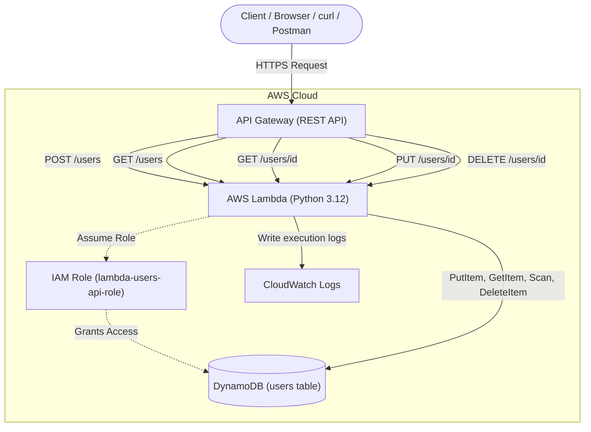

# Architecture Details: Serverless REST API

## 🏗️ System Overview & Data Flow

This project implements a fully serverless backend architecture utilizing Amazon API Gateway, AWS Lambda, and Amazon DynamoDB.

## 🔄 Data Flow Analysis

1. **Client Request:** The client makes an HTTPS request (e.g., `POST /users`) to the regional API Gateway endpoint.
2. **API Gateway Routing:** API Gateway routes the request to the backend integration. In this architecture, it uses **Lambda Proxy Integration**, passing the entire HTTP request payload (headers, path parameters, body) directly to the Lambda function.
3. **Lambda Execution:** The `users-api` Lambda function is invoked. It parses the HTTP method and path to determine which internal function to call (e.g., `create_user()`).
4. **Database Transaction:** The Lambda function utilizes the `boto3` SDK to interact with DynamoDB. Its permissions to do this are strictly governed by its attached IAM execution role (`lambda-users-api-role`).
5. **Response Compilation:** DynamoDB returns the query results to Lambda. Lambda compiles this into a standard HTTP response dictionary containing a `statusCode`, `headers` (including CORS), and a JSON-encoded `body`.
6. **Return to Client:** API Gateway receives this dictionary and translates it back into a standard HTTP response for the client.