<div align="center">
  <h1> Project 09: CI/CD Pipeline with CodeCommit, CodeBuild, CodeDeploy & CodePipeline</h1>

  <p><i>Build a fully automated CI/CD pipeline that detects code changes in CodeCommit, automatically builds and tests the application via CodeBuild, and deploys it to an EC2 instance using CodeDeploy — all orchestrated by CodePipeline. This is the same pipeline pattern used by engineering teams at every scale to ship code reliably and repeatedly.</i></p>

  <p>
    
    
    
    
    
  </p>

  <p>
    <a href="#-infrastructure-specifications">Infrastructure</a> · 
    <a href="#-key-components">Components</a> · 
    <a href="#-core-features">Features</a> · 
    <a href="#-setup--installation">Setup</a> · 
    <a href="#-documentation-suite">Docs</a>
  </p>

</div>

<br/>

<div align="center">

## 🏗️ Architecture Overview



<p><i>▲ High-level architecture diagram showing the interaction between CodeCommit, CodeBuild, CodeDeploy, CodePipeline, EC2, S3, IAM services</i></p>

</div>

## 📐 Infrastructure Specifications

| Resource | Configuration |
|:---------|:--------------|
| **CodeCommit** | Managed Git repository `my-web-app`; `main` branch triggers pipeline via CloudWatch Events |
| **CodeBuild** | `aws/codebuild/standard:7.0` Linux container; Python 3.11 runtime; `buildspec.yml` defines install → pre_build → build → post_build phases |
| **CodeDeploy** | EC2/On-Premises compute platform; `CodeDeployDefault.AllAtOnce` config; auto-rollback on `DEPLOYMENT_FAILURE` |
| **CodePipeline** | 3-stage pipeline: Source (CodeCommit) → Build (CodeBuild) → Deploy (CodeDeploy); `PollForSourceChanges: false` |
| **EC2 Instance** | Amazon Linux 2023, `t2.micro`; CodeDeploy agent installed; Apache httpd web server; tag `Environment=production` |
| **S3 Artifact Bucket** | `codepipeline-artifacts-<ACCOUNT_ID>-ap-south-1`; versioning enabled; all public access blocked |
| **IAM Roles** | 4 separate roles: `codebuild-service-role`, `codedeploy-service-role`, `codepipeline-service-role`, `ec2-codedeploy-role` |
| **Security Group** | `cicd-deploy-sg`: SSH (port 22) restricted to admin IP `/32`, HTTP (port 80) open `0.0.0.0/0` |
| **Region** | ap-south-1 |

## 🧩 Key Components

### CodeCommit Repository
Fully-managed Git repository with IAM-based HTTPS authentication, encryption at rest, and CloudWatch Events for automatic pipeline triggering on push

### CodeBuild Project
Managed build service executing `buildspec.yml` in isolated Docker containers — installs runtimes, validates HTML syntax, packages application files into a `dist/` artifact

### CodeDeploy Application
Deployment orchestrator that reads `appspec.yml` to map files to EC2 destinations, set permissions, and run lifecycle hook scripts (BeforeInstall → AfterInstall → ApplicationStart → ValidateService)

### CodePipeline
Continuous delivery orchestrator connecting Source → Build → Deploy stages with S3 artifact passing between each stage

### buildspec.yml
Build specification defining 4 phases (install, pre_build, build, post_build), artifact output from `dist/`, and pip cache configuration

### appspec.yml
Deployment specification defining file mappings (`index.html` → `/var/www/html/`), Apache file permissions (`644`, owner `apache`), and 4 lifecycle hook scripts

## ⚡ Core Features

- **Fully Automated Pipeline** – Git push triggers build, test, and deploy without manual intervention
- **Buildspec-Driven Builds** – Declarative YAML installs Python 3.11, validates HTML syntax, and packages deployment artifacts
- **AppSpec Lifecycle Hooks** – Custom scripts run at BeforeInstall, AfterInstall, ApplicationStart, and ValidateService stages
- **Automatic Rollback** – Deployment failure triggers CodeDeploy to roll back to the last known-good revision automatically
- **Health Check Validation** – `validate_service.sh` performs HTTP 200 check against localhost before marking deployment successful
- **Artifact Versioning** – S3 stores every build artifact with pipeline execution ID for full traceability
- **Branch-Based Workflow** – Pipeline triggers on `main` branch pushes via CloudWatch Events (not polling)

## ✅ Free Tier Status

| Resource | Cost |
|:---------|:-----|
| **CodeCommit** (5 active users/month) | Always free |
| **CodeBuild** (100 build-min/month) | Free (12 months) |
| **CodeDeploy** (EC2/On-Premises) | Always free |
| **CodePipeline** (1 active pipeline) | Free (12 months) |
| **S3** (artifact storage, first 5 GB) | Free (12 months) |
| **EC2 t2.micro** (deploy target) | Free (12 months) |

> [!TIP]
> This project uses **one pipeline** and stays within the Free Tier limits. CodeDeploy to EC2 is always free. CodeBuild's 100 build-minutes/month is more than sufficient for this project.

## 🛠️ Setup & Installation

### Prerequisites

- AWS CLI v2 configured with IAM credentials (from Project 01)
- Git client installed (`git --version` ≥ 2.x)
- Python 3.x installed locally (for sample app validation)
- An existing EC2 key pair named `aws-ec2-keypair` (from Project 03)

### Pre-flight Checks
Run these commands in PowerShell to confirm your environment is ready:
```powershell
# Confirm CLI working
aws sts get-caller-identity

# Confirm region
aws configure get region
```

### Installation

```bash
# 1. Clone the repository
git clone https://github.com/vinay1515/Vinay_kumar_AWS_Beginner_level_projects.git
cd project-09-cicd-pipeline

# 2. Configure environment variables
cp .env.example .env
# Edit .env with your specific values (see Environment Variables below)
```

### Environment Variables

Create a `.env` file in the project root:

```bash
export AWS_REGION="ap-south-1"
export REPO_NAME="my-web-app"
export BUILD_PROJECT="my-web-app-build"
export DEPLOY_APP="my-web-app"
export DEPLOY_GROUP="production"
export PIPELINE_NAME="my-web-app-pipeline"
export KEY_PAIR_NAME="aws-ec2-keypair"
```

### Run Commands

Choose your platform and execute the scripts in order:

| Step | Bash Script | PowerShell Script | Description |
| :---: | :--- | :--- | :--- |
| 01 | `scripts/bash/01-create-iam-roles.sh` | `scripts/powershell/01-create-iam-roles.ps1` | Create IAM roles for CodeBuild, CodeDeploy, CodePipeline, EC2 |
| 02 | `scripts/bash/02-create-s3-bucket.sh` | `scripts/powershell/02-create-s3-bucket.ps1` | Create S3 artifact bucket with versioning enabled |
| 03 | `scripts/bash/03-create-codecommit.sh` | `scripts/powershell/03-create-codecommit.ps1` | Create CodeCommit repository and push application code |
| 04 | `scripts/bash/04-launch-ec2.sh` | `scripts/powershell/04-launch-ec2.ps1` | Launch EC2 with CodeDeploy agent and Apache httpd |
| 05 | `scripts/bash/05-create-codedeploy.sh` | `scripts/powershell/05-create-codedeploy.ps1` | Create CodeDeploy application and deployment group |
| 06 | `scripts/bash/06-create-codebuild.sh` | `scripts/powershell/06-create-codebuild.ps1` | Create CodeBuild project linked to CodeCommit |
| 07 | `scripts/bash/07-create-codepipeline.sh` | `scripts/powershell/07-create-codepipeline.ps1` | Create CodePipeline (Source → Build → Deploy) |
| 08 | `scripts/bash/08-monitor-pipeline.sh` | `scripts/powershell/08-monitor-pipeline.ps1` | Monitor pipeline execution and verify all stages green |
| 09 | `scripts/bash/09-trigger-deployment.sh` | `scripts/powershell/09-trigger-deployment.ps1` | Update app to Version 2.0, push, watch auto-deploy |
| 10 | `scripts/bash/10-cleanup.sh` | `scripts/powershell/10-cleanup.ps1` | Delete all AWS resources created by this project |

### 📸 Screenshots & Validation
Throughout the documentation and `images/` directory, you will find screenshots captured during the deployment process. These visual artifacts serve as verification that the UI steps were successfully executed and validate the final architecture.

## 📚 Documentation Suite

| Document | Description |
|:---------|:------------|
| 📄 [Project Overview](docs/project-overview.md) | Comprehensive project context, goals, and learning outcomes |
| 🏗️ [Architecture Details](docs/architecture.md) | Deep-dive into system design, data flow, and component interactions |
| 🚀 [Deployment Guide](docs/deployment-guide.md) | Step-by-step deployment procedures for dev, staging, and production |
| 🔐 [Security Protocols](docs/security-protocols.md) | IAM policies, encryption, network security, and compliance controls |
| 🧪 [Testing Procedures](docs/testing-procedures.md) | Validation scripts, smoke tests, and integration test suites |
| 🛠️ [Troubleshooting](docs/troubleshooting.md) | Common issues, error codes, debugging steps, and resolution guides |
| 🧹 [Cleanup Guide](docs/cleanup-guide.md) | Instructions for tearing down AWS resources to avoid charges |
| 📋 [Pipeline Stages](docs/pipeline-stages.md) | Detailed breakdown of Source, Build, and Deploy stage configurations |
| 📦 [BuildSpec Explained](docs/buildspec-explained.md) | Line-by-line annotation of buildspec.yml phases and artifacts |
| 📜 [AppSpec Explained](docs/appspec-explained.md) | Line-by-line annotation of appspec.yml file mappings and hooks |

## 🤝 Contribution & Maintenance

### Testing

- `git push` to CodeCommit → verify pipeline starts within 30 seconds
- `aws codebuild batch-get-builds` → confirm build status is SUCCEEDED
- `aws deploy get-deployment` → verify deployment status is Succeeded
- `curl http://<EC2-IP>` → confirm updated application is live
- Push broken code → verify automatic rollback triggers and previous version is restored

### Deployment

For full production deployment procedures, see the [Deployment Guide](docs/deployment-guide.md).

### Contributing

1. **Fork** the repository and create a feature branch (`git checkout -b feature/amazing-feature`)
2. **Commit** your changes (`git commit -m "Add amazing feature"`)
3. **Push** to the branch (`git push origin feature/amazing-feature`)
4. **Open** a Pull Request with a detailed description
5. Ensure all scripts exist in **both** `scripts/powershell/` and `scripts/bash/`

### License

This project is licensed under the **MIT License** — see the [LICENSE](./LICENSE) file for details.

### Contact & Credits

- **Author:** Vinay Kumar Duvva
- **GitHub:** [@vinaykumarduvva]( https://github.com/vinaykumarduvva)
- **Repository:** [aws-hands-on-projects]( https://github.com/vinaykumarduvva/aws-hands-on-projects)
---

<div align="center">
  <b><a href="../project-08-serverless-rest-api">⬅️ Previous: Project 08</a> &nbsp;|&nbsp; <a href="../project-10-auto-scaling-alb">Next: Project 10 ➡️</a></b>
</div>
