<div align="center">
  
  <br/><br/>
  <h1> Project 09: CI/CD Pipeline with CodeCommit, CodeBuild & CodeDeploy</h1>

  <p><i>Construct an end-to-end Continuous Integration and Continuous Deployment pipeline using AWS-native developer tools. Code pushed to CodeCommit triggers CodeBuild for compilation and testing, then CodeDeploy performs rolling deployments to EC2 instances — enabling automated, repeatable, and auditable software delivery.</i></p>

  <p>
    
    
    
    
    
  </p>

  <p>
    <a href="#-infrastructure-specifications">Infrastructure</a> · 
    <a href="#-key-components">Components</a> · 
    <a href="#-core-features">Features</a> · 
    <a href="#-setup--installation">Setup</a> · 
    <a href="#-documentation-suite">Docs</a>
  </p>

</div>

<br/>

<div align="center">

## 🏗️ Architecture Overview


<p><i>▲ High-level architecture diagram showing the interaction between CodeCommit, CodeBuild, CodeDeploy, CodePipeline, S3, IAM services</i></p>

</div>

## 📐 Infrastructure Specifications

| Resource | Configuration |
|:---------|:--------------|
| **CodeCommit Repository** | Git repository hosting application source code with branch-based workflow |
| **CodeBuild Project** | Ubuntu Standard 7.0 image; buildspec.yml defines install → build → test → artifact phases |
| **CodeDeploy Application** | EC2/On-Premises compute platform; `CodeDeployDefault.OneAtATime` deployment config |
| **CodePipeline** | 3-stage pipeline: Source (CodeCommit) → Build (CodeBuild) → Deploy (CodeDeploy) |
| **S3 Artifact Bucket** | Pipeline artifact store for build outputs and deployment packages |
| **IAM Roles** | Separate roles for CodePipeline, CodeBuild, and CodeDeploy with least-privilege policies |
| **AppSpec** | YAML deployment specification defining lifecycle hooks: BeforeInstall, AfterInstall, ApplicationStart |
| **Region** | ap-south-1 |

## 🧩 Key Components

### CodeCommit Repository
Fully-managed Git repository with IAM-based authentication and encryption at rest

### CodeBuild Project
Managed build service executing buildspec.yml in isolated Docker containers

### CodeDeploy Application
Deployment orchestrator managing rollouts with lifecycle hooks and rollback triggers

### CodePipeline
Continuous delivery orchestrator connecting Source → Build → Deploy stages

### buildspec.yml
Build specification defining phases (install, pre_build, build, post_build) and artifact outputs

### appspec.yml
Deployment specification defining file mappings, permissions, and lifecycle hook scripts

## ⚡ Core Features

- **Fully Automated Pipeline** – Git push triggers build, test, and deploy without manual intervention
- **Buildspec-Driven Builds** – Declarative YAML defines install dependencies, run tests, and package artifacts
- **Rolling Deployments** – CodeDeploy updates instances one-at-a-time to maintain availability during deploy
- **Automatic Rollback** – Deployment fails → CodeDeploy rolls back to last known-good revision automatically
- **Lifecycle Hooks** – Custom scripts run at BeforeInstall, AfterInstall, and ApplicationStart stages
- **Artifact Versioning** – S3 stores every build artifact with pipeline execution ID for full traceability
- **Branch-Based Workflow** – Pipeline triggers on `main` branch pushes; feature branches build independently

## 🛠️ Setup & Installation

### Prerequisites

- AWS CLI v2 configured with IAM credentials (from Project 01)
- Git client installed (`git --version` ≥ 2.x)
- At least one EC2 instance with CodeDeploy agent installed (from Project 03)
- HTTPS Git credentials configured for CodeCommit access

### Installation

```bash
# 1. Clone the repository
git clone https://github.com/vinay1515/Vinay_kumar_AWS_Beginner_level_projects.git
cd project-09-cicd-pipeline

# 2. Configure environment variables
cp .env.example .env
# Edit .env with your specific values (see Environment Variables below)
```

### Environment Variables

Create a `.env` file in the project root:

```bash
export AWS_REGION="ap-south-1"
export REPO_NAME="my-app-repo"
export BUILD_PROJECT="my-app-build"
export DEPLOY_APP="my-app-deploy"
export DEPLOY_GROUP="my-app-deploy-group"
export PIPELINE_NAME="my-app-pipeline"
```

### Run Commands

Choose your platform and execute the scripts in order:

<table>
<tr><th>Step</th><th>Script</th><th>Description</th></tr>
<tr><td>🐧</td><td><code>scripts/bash/01-create-codecommit.sh</code></td><td>Creates CodeCommit repository and pushes initial application code</td></tr>
<tr><td>🖥️</td><td><code>scripts/powershell/01-create-codecommit.ps1</code></td><td>Creates CodeCommit repository and pushes initial application code</td></tr>
<tr><td>🐧</td><td><code>scripts/bash/02-create-codebuild.sh</code></td><td>Creates CodeBuild project with buildspec.yml and IAM service role</td></tr>
<tr><td>🖥️</td><td><code>scripts/powershell/02-create-codebuild.ps1</code></td><td>Creates CodeBuild project with buildspec.yml and IAM service role</td></tr>
<tr><td>🐧</td><td><code>scripts/bash/03-create-codedeploy.sh</code></td><td>Creates CodeDeploy application, deployment group, and appspec.yml</td></tr>
<tr><td>🖥️</td><td><code>scripts/powershell/03-create-codedeploy.ps1</code></td><td>Creates CodeDeploy application, deployment group, and appspec.yml</td></tr>
<tr><td>🐧</td><td><code>scripts/bash/04-create-pipeline.sh</code></td><td>Creates CodePipeline connecting all three stages with artifact store</td></tr>
<tr><td>🖥️</td><td><code>scripts/powershell/04-create-pipeline.ps1</code></td><td>Creates CodePipeline connecting all three stages with artifact store</td></tr>
<tr><td>🐧</td><td><code>scripts/bash/05-trigger-deploy.sh</code></td><td>Commits a code change to trigger the full pipeline end-to-end</td></tr>
<tr><td>🖥️</td><td><code>scripts/powershell/05-trigger-deploy.ps1</code></td><td>Commits a code change to trigger the full pipeline end-to-end</td></tr>
</table>

## 📚 Documentation Suite

| Document | Description |
|:---------|:------------|
| 📄 [Project Overview](docs/project-overview.md) | Comprehensive project context, goals, and learning outcomes |
| 🏗️ [Architecture Details](docs/architecture.md) | Deep-dive into system design, data flow, and component interactions |
| 🚀 [Deployment Guide](docs/deployment-guide.md) | Step-by-step deployment procedures for dev, staging, and production |
| 🔐 [Security Protocols](docs/security-protocols.md) | IAM policies, encryption, network security, and compliance controls |
| 🧪 [Testing Procedures](docs/testing-procedures.md) | Validation scripts, smoke tests, and integration test suites |
| 🛠️ [Troubleshooting](docs/troubleshooting.md) | Common issues, error codes, debugging steps, and resolution guides |

## 🤝 Contribution & Maintenance

### Testing

- `git push` to CodeCommit → verify pipeline starts within 30 seconds
- `aws codebuild batch-get-builds` → confirm build status is SUCCEEDED
- `aws deploy get-deployment` → verify deployment status is Succeeded
- `curl http://<EC2-IP>` → confirm updated application is live
- Push broken code → verify automatic rollback triggers and previous version is restored

### Deployment

For full production deployment procedures, see the [Deployment Guide](docs/deployment-guide.md).

### Contributing

1. **Fork** the repository and create a feature branch (`git checkout -b feature/amazing-feature`)
2. **Commit** your changes (`git commit -m "Add amazing feature"`)
3. **Push** to the branch (`git push origin feature/amazing-feature`)
4. **Open** a Pull Request with a detailed description
5. Ensure all scripts exist in **both** `scripts/powershell/` and `scripts/bash/`

### License

This project is licensed under the **MIT License** — see the [LICENSE](../LICENSE) file for details.

### Contact & Credits

- **Author:** Vinay Kumar
- **GitHub:** [@vinay1515](https://github.com/vinay1515)
- **Repository:** [Vinay_kumar_AWS_Beginner_level_projects](https://github.com/vinay1515/Vinay_kumar_AWS_Beginner_level_projects)

---

<div align="center">
  <b>[⬅️ Previous: Project 08](../project-08-serverless-rest-api) &nbsp;|&nbsp; [Next: Project 10 ➡️](../project-10-auto-scaling-alb)</b>
</div>
