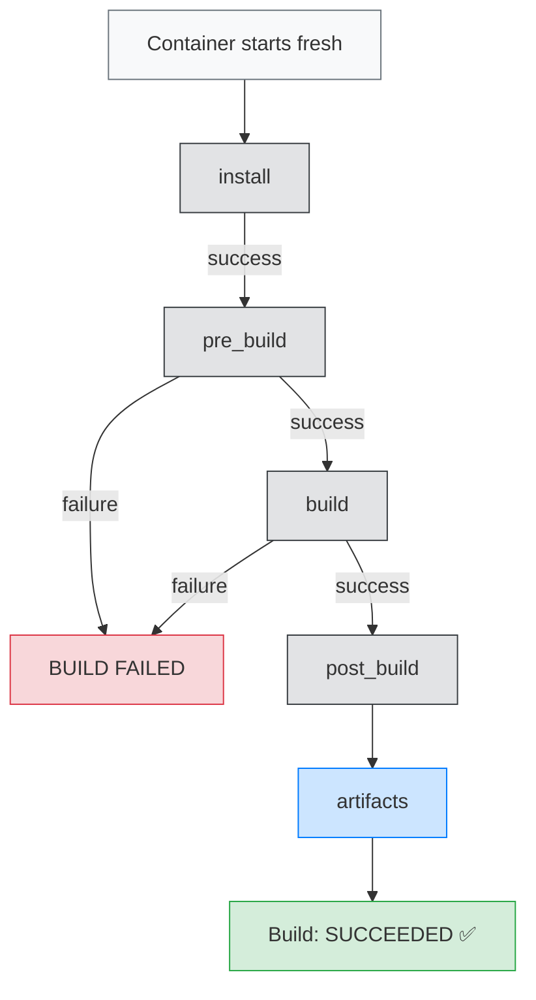

# buildspec.yml Explained

`buildspec.yml` is a YAML file that tells CodeBuild exactly what to do during a build. It lives in the root of your repository and is automatically picked up by CodeBuild.

Think of it as a recipe — CodeBuild follows it step by step inside a fresh Linux container for every build.

---

## 📂 File Location

```text
my-web-app/              ← repository root
├── index.html
├── buildspec.yml        ← CodeBuild reads this
├── appspec.yml
└── scripts/
```

---

## 📝 Full buildspec.yml with Annotations

```yaml
# buildspec version — always 0.2 for current CodeBuild
version: 0.2

# ── PHASES ────────────────────────────────────────────────────────
# Phases run in order: install → pre_build → build → post_build
# If any command returns non-zero exit code:
#   → That phase FAILS
#   → Build marked FAILED
#   → Pipeline stops

phases:

  # ── INSTALL PHASE ───────────────────────────────────────────────
  # Purpose: Set up the build environment
  # Runs:    Once at the start
  # Use for: Installing runtimes, system packages
  install:
    runtime-versions:
      python: 3.11    # Installs Python 3.11 in the container
                      # Available: python 3.9, 3.10, 3.11, 3.12
                      # nodejs, java, ruby, golang also available

    commands:
      - echo "Install phase started"
      - echo "Region ap-south-1 — Project 9 CI/CD Pipeline"
      # These echo commands appear in CloudWatch build logs
      # Useful for debugging — you can see exactly when each phase runs

  # ── PRE_BUILD PHASE ─────────────────────────────────────────────
  # Purpose: Validate inputs before starting the real build
  # Runs:    After install, before build
  # Use for: Auth, validation, environment checks
  pre_build:
    commands:
      - echo "Pre-build phase — running validations"

      # Validate HTML structure using inline Python script
      # The 'python -c' runs Python code directly in the shell
      - echo "Validating HTML syntax..."
      - python -c "
import re, sys
with open('index.html') as f:
    content = f.read()
assert '<html' in content, 'Missing html tag'
assert '<head>' in content, 'Missing head tag'
assert '<body>' in content, 'Missing body tag'
print('HTML validation passed')
"
      # assert raises AssertionError if condition is False
      # AssertionError exits Python with code 1
      # Exit code 1 = phase FAILS = build stops

      # Check required files exist using bash test command
      # test -f FILE returns 0 (success) if FILE exists
      # || exit 1 means "if test fails, exit with code 1"
      - echo "Checking required files exist..."
      - test -f index.html && echo "index.html found" || exit 1
      - test -f appspec.yml && echo "appspec.yml found" || exit 1

      - echo "All validations passed"

  # ── BUILD PHASE ─────────────────────────────────────────────────
  # Purpose: Compile, build, and package your application
  # Runs:    After pre_build
  # Use for: npm build, pip install, compile, package
  build:
    commands:
      - echo "Build phase started on $(date)"
      # $(date) is shell command substitution — inserts current date

      - echo "Build number $CODEBUILD_BUILD_NUMBER"
      # $CODEBUILD_BUILD_NUMBER is a built-in env variable
      # Auto-increments with each build: 1, 2, 3...

      - echo "Preparing deployment package..."

      # Create output directory
      - mkdir -p dist
      # mkdir -p creates directory and all parent directories
      # -p flag means "no error if directory already exists"

      # Copy application files to dist/
      - cp index.html dist/
      - cp appspec.yml dist/
      # appspec.yml must be in the artifact root for CodeDeploy

      # Copy scripts if they exist
      # 2>/dev/null suppresses error output if scripts/ doesn't exist
      # || true means "don't fail if cp fails"
      - cp -r scripts/ dist/ 2>/dev/null || true

      # Generate build metadata file
      # This file is deployed alongside the app for traceability
      - echo "BUILD_VERSION=1.0.$CODEBUILD_BUILD_NUMBER" > dist/build-info.txt
      - echo "BUILD_TIME=$(date)" >> dist/build-info.txt
      # >> appends to file (> overwrites)
      - echo "BUILD_ID=$CODEBUILD_BUILD_ID" >> dist/build-info.txt
      - echo "REGION=ap-south-1" >> dist/build-info.txt

      # Display what we built (visible in CloudWatch logs)
      - cat dist/build-info.txt

      - echo "Build complete"

  # ── POST_BUILD PHASE ────────────────────────────────────────────
  # Purpose: Cleanup, notifications, final packaging
  # Runs:    After build (runs even if build phase failed!)
  # Use for: Send notifications, tag Docker images, cleanup
  post_build:
    commands:
      - echo "Post-build phase"
      - echo "Packaging artifacts..."
      - echo "Deployment package ready"

# ── ARTIFACTS ───────────────────────────────────────────────────────
# Defines what gets stored in S3 after the build
# CodePipeline passes this to the Deploy stage as BuildOutput
artifacts:
  files:
    - '**/*'
    # ** matches any directory depth
    # * matches any filename
    # Combined: matches ALL files in all subdirectories

  base-directory: dist
  # Only include files from the dist/ directory
  # NOT the whole project — just what we built

  discard-paths: no
  # no = preserve directory structure in the artifact
  # yes = flatten all files into root (loses folder structure)

# ── CACHE ────────────────────────────────────────────────────────────
# Speeds up subsequent builds by caching downloaded packages
# Stored in S3, restored at the start of each build
cache:
  paths:
    - '/root/.cache/pip/**/*'
    # Caches Python pip downloads between builds
    # npm: '/root/.npm/**/*'
    # maven: '/root/.m2/**/*'
```

---

## 🔄 buildspec.yml Phase Flow



---

## 🌐 Environment Variables Available in buildspec.yml

| Variable | Example Value | Description |
|---|---|---|
| `CODEBUILD_BUILD_ID` | `my-web-app-build:abc123` | Unique build identifier |
| `CODEBUILD_BUILD_NUMBER` | `5` | Auto-incrementing build count |
| `CODEBUILD_BUILD_ARN` | `arn:aws:codebuild:...` | Full ARN of this build |
| `CODEBUILD_INITIATOR` | `codepipeline/my-web-app-pipeline` | What started the build |
| `CODEBUILD_SOURCE_VERSION` | `refs/heads/main` | Branch or commit reference |
| `CODEBUILD_SRC_DIR` | `/codebuild/output/src` | Where source code lives |
| `AWS_DEFAULT_REGION` | `ap-south-1` | Current AWS region |
| `AWS_ACCOUNT_ID` | `123456789012` | Your AWS account ID |

---

## 📋 Common buildspec.yml Patterns

### Node.js application
```yaml
version: 0.2
phases:
  install:
    runtime-versions:
      nodejs: 18
    commands:
      - npm ci
  build:
    commands:
      - npm test
      - npm run build
artifacts:
  files:
    - '**/*'
  base-directory: build
```

### Python Flask application
```yaml
version: 0.2
phases:
  install:
    runtime-versions:
      python: 3.11
    commands:
      - pip install -r requirements.txt
  pre_build:
    commands:
      - python -m pytest tests/
  build:
    commands:
      - zip -r app.zip . -x "*.pyc" -x "__pycache__/*"
artifacts:
  files:
    - app.zip
```

### Docker image build
```yaml
version: 0.2
phases:
  pre_build:
    commands:
      - aws ecr get-login-password | docker login --username AWS --password-stdin $ECR_URI
  build:
    commands:
      - docker build -t $IMAGE_NAME:$CODEBUILD_BUILD_NUMBER .
      - docker push $IMAGE_NAME:$CODEBUILD_BUILD_NUMBER
```

---

## 🐛 Debugging Failed Builds

```bash
# Get build ID from latest execution
BUILD_ID=$(aws codebuild list-builds-for-project \
  --project-name my-web-app-build \
  --query "ids[0]" --output text)

# Get build details including failure reason
aws codebuild batch-get-builds \
  --ids $BUILD_ID \
  --query "builds[0].{Status:buildStatus,Phase:currentPhase,Reason:phases[?phaseStatus=='FAILED'].phaseType}" \
  --output table

# Read CloudWatch logs for the failed build
LOG_STREAM=$(aws logs describe-log-streams \
  --log-group-name /aws/codebuild/my-web-app-build \
  --order-by LastEventTime --descending \
  --query "logStreams[0].logStreamName" --output text 2>/dev/null)

aws logs get-log-events \
  --log-group-name /aws/codebuild/my-web-app-build \
  --log-stream-name $LOG_STREAM \
  --query "events[*].message" --output text
```
