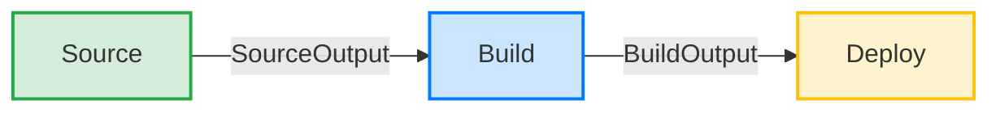

# Pipeline Stages Explained

CodePipeline orchestrates three sequential stages in this project. Each stage must succeed before the next begins. Any stage failure stops the pipeline and can trigger a rollback.



---

## 📦 Stage 1 — Source

### What Happens
CodePipeline detects a new commit on the `main` branch, fetches the repository contents, and stores them as a ZIP file in the S3 artifact bucket.

### Trigger Mechanism
1. Developer runs `git push origin main`.
2. CodeCommit stores the commit.
3. A CloudWatch Events rule fires (within seconds).
4. CodePipeline execution starts.

### Configuration
- **Provider:** AWS CodeCommit
- **Repository:** `my-web-app`
- **Branch:** `main`
- **Detection:** Amazon CloudWatch Events (recommended)
- **Output:** `SourceOutput` artifact (ZIP in S3)

### What is in SourceOutput
The zip contains the raw source code exactly as it is in the repository:
```
SourceOutput.zip
├── index.html
├── buildspec.yml
├── appspec.yml
└── scripts/
    ├── before_install.sh
    ├── after_install.sh
    ├── start_application.sh
    └── validate_service.sh
```

---

## 🏗️ Stage 2 — Build

### What Happens
CodeBuild downloads the `SourceOutput` ZIP from S3, extracts it, and runs the instructions in `buildspec.yml` inside a fresh Linux container.

### Environment
- **Image:** `aws/codebuild/standard:7.0` (Ubuntu 22.04)
- **Compute type:** `BUILD_GENERAL1_SMALL` (3 GB RAM, 2 vCPU)
- **Runtime:** Python 3.11 (specified in buildspec)

### Build Phases Executed
1. **Install Phase (~10 sec):** Sets up the Python 3.11 runtime.
2. **Pre-build Phase (~5 sec):** Validates `index.html` structure. Fails fast if required HTML tags are missing.
3. **Build Phase (~5 sec):** Creates a `dist/` directory, copies files, and generates `build-info.txt` with metadata.
4. **Post-build Phase (~2 sec):** Confirms the package is ready and logs completion.

### Build Artifact
The output of the build stage is packaged and sent back to S3:
```
BuildOutput.zip
├── index.html
├── appspec.yml
├── build-info.txt (generated during build)
└── scripts/
    ├── before_install.sh
    ├── after_install.sh
    ├── start_application.sh
    └── validate_service.sh
```

---

## 🚀 Stage 3 — Deploy

### What Happens
CodeDeploy downloads the `BuildOutput` ZIP from S3, finds EC2 instances matching the target tag filter, and instructs the CodeDeploy agent on each instance to run the deployment lifecycle hooks.

### How CodeDeploy Finds Instances
- **Tag Filter:** `Key=Environment, Value=production, Type=KEY_AND_VALUE`
- CodeDeploy scans all EC2 instances in `ap-south-1`.
- Finds instances with the `Environment=production` tag and sends deployment instructions to their local agents.

### Lifecycle Hook Execution Order
The CodeDeploy agent extracts the `BuildOutput.zip` to `/opt/codedeploy-agent/deployment-root/` and runs the hooks defined in `appspec.yml`:

1. **BeforeInstall** (`scripts/before_install.sh`)
   - Stops the old app, installs Apache, and cleans old files.
2. **[CodeDeploy copies files]**
   - Copies `index.html` and `build-info.txt` to `/var/www/html/`.
3. **AfterInstall** (`scripts/after_install.sh`)
   - Sets file permissions and displays build info.
4. **ApplicationStart** (`scripts/start_application.sh`)
   - Starts `httpd` and enables it on boot.
5. **ValidateService** (`scripts/validate_service.sh`)
   - Runs `curl http://localhost/` expecting HTTP 200.
   - If 200: Deployment succeeds.
   - If not: Deployment FAILS and auto-rollback fires.

### Auto-Rollback Behavior
If a deployment fails at any hook (e.g., ValidateService returns a non-200 code), the auto-rollback configuration triggers CodeDeploy to automatically re-deploy the last known successful revision, restoring the previous working version.

---

## ⏱️ Stage Timing Reference

| Stage | Typical Time | What Drives Duration |
|---|---|---|
| Source | 10–15 sec | Repo size, S3 upload speed |
| Build | 60–120 sec | Build commands, container startup, dependency downloads |
| Deploy | 30–90 sec | Hook execution duration, app startup time |
| **Total** | **~3–4 min** | |
