# Project 11 — Infrastructure as Code with CloudFormation

Level: Intermediate | Estimated Time: 5–6 hours
Region: ap-south-1 (Mumbai) ✅

## 🎯 Purpose
Convert everything built manually so far into version-controlled, repeatable Infrastructure as Code using AWS CloudFormation. This project demonstrates how to provision, update, and tear down an entire VPC, ALB, and Auto Scaling Group stack identically every time using a single command.

## 🧠 Learning Objectives
- Understand CloudFormation templates, stacks, and change sets
- Write YAML templates with Parameters, Resources, and Outputs
- Use Intrinsic Functions (`!Ref`, `!GetAtt`, `!Sub`, `!FindInMap`, `!Select`)
- Deploy a complete VPC + EC2 + ALB + ASG stack from one template
- Update a running stack safely using change sets
- Understand stack rollback behavior on failure
- Tear down entire environments with one command

## 🏗️ Architecture
CloudFormation provisions all resources in dependency order based on `main-stack.yaml`.


### AWS Services Used
- **CloudFormation**: Defines and provisions all infrastructure as code
- **VPC, Subnets, IGW**: Networking layer
- **EC2, Launch Template**: Compute layer
- **ALB, Target Group, ASG**: Load balancing and scaling
- **IAM**: CloudFormation execution role

## 💰 Free Tier Status
CloudFormation itself is always free. This project recreates the architecture from Project 10, meaning costs are identical:
- EC2 t2.micro × 2: 750 hrs/month free
- ALB: 750 hrs + 15 LCU free
- Everything else: Always free
- **Estimated Cost: $0.00**

## 🚀 Deployment Instructions

### 1. Validate the Template
Ensure your CloudFormation template syntax is correct before deploying:
```bash
aws cloudformation validate-template --template-body file://templates/main-stack.yaml
```

### 2. Create the Stack
Deploy the entire infrastructure using the `01-create-stack.sh` script (or `.ps1` for PowerShell):
```bash
./scripts/01-create-stack.sh
```

### 3. Apply a Change Set
Change sets allow you to preview modifications before applying them safely.
```bash
# Preview changes
./scripts/02-create-changeset.sh

# Apply changes
./scripts/03-execute-changeset.sh
```

### 4. Test Rollback
Experience automated rollback by attempting a deployment with an invalid configuration. CloudFormation will safely revert to the last known good state.
```bash
./scripts/04-test-rollback.sh
```

### 5. Detect Drift
Discover if resources have been manually modified outside of CloudFormation:
```bash
./scripts/05-detect-drift.sh
```

## 🧹 Cleanup
Tear down the entire infrastructure with a single command:
```bash
./scripts/06-cleanup.sh
```
*(Verify deletion with `aws cloudformation describe-stacks --stack-name my-app-stack`)*
