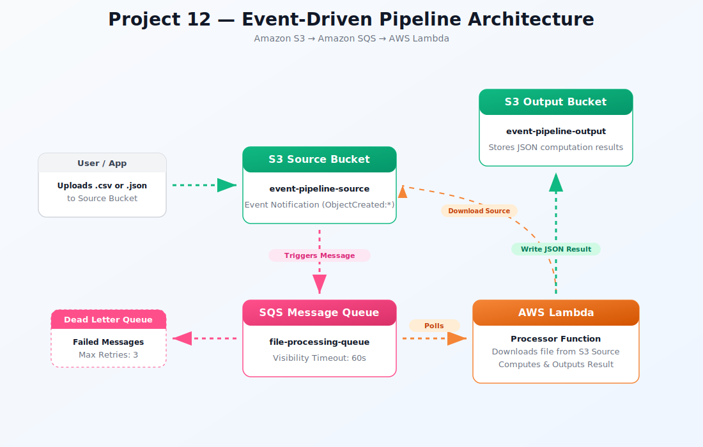

<div align="center">
  <h1> Project 12: Event-Driven Pipeline: S3 → SQS → Lambda</h1>

  <p><i>Build a fully decoupled, event-driven data processing pipeline where uploading a file to S3 automatically triggers an SQS message, which Lambda processes asynchronously — the same pattern used in production for file processing, ETL pipelines, image resizing, log analysis, and data ingestion at any scale.</i></p>

  <p>
    
    
    
    
    
  </p>

  <p>
    <a href="#-architecture-overview">Architecture</a> · 
    <a href="#-infrastructure-specifications">Infrastructure</a> · 
    <a href="#-key-components">Components</a> · 
    <a href="#-core-features">Features</a> · 
    <a href="#-setup--installation">Setup</a> · 
    <a href="#-documentation-suite">Docs</a>
  </p>
</div>

<br/>

## 🏗 Architecture Overview

<div align="center">



<p><i>▲ High-level architecture diagram showing the event-driven data processing pipeline from S3 to SQS to Lambda</i></p>

</div>

## 📋 Infrastructure Specifications

| Resource | Configuration |
|:---------|:--------------|
| **Region** | ap-south-1 (Mumbai) |
| **S3 Buckets** | 1 Source Bucket, 1 Output Bucket (Private, Versioning enabled) |
| **SQS Queues** | 1 Standard Queue (file-processing-queue), 1 Dead Letter Queue (file-processing-dlq) |
| **Lambda Function** | file-processor (Python 3.12, 256 MB memory, 60s timeout) |
| **IAM Roles** | lambda-file-processor-role (Access to S3, SQS, CloudWatch Logs) |
| **Event Source Mapping** | SQS to Lambda with a batch size of 1 |
| **S3 Event Notifications** | Filter on `uploads/` prefix and `.csv`/`.json` suffixes |

## 🧩 Key Components

### Amazon S3 (Source)
Acts as the entry point for the pipeline. Users or applications upload files here, which automatically trigger the downstream process through configured S3 Event Notifications.

### Amazon SQS (Message Queue)
Provides loose coupling between S3 and Lambda. Ensures messages persist until successfully processed, prevents Lambda from being overwhelmed by burst uploads, and routes permanently failed messages to a Dead Letter Queue (DLQ).

### AWS Lambda (Consumer)
Processes each message asynchronously. It downloads the file from S3, processes its content based on the file type (CSV or JSON), writes the result to the output S3 bucket, and logs the execution summary to CloudWatch.

### Dead Letter Queue (DLQ)
A secondary SQS queue designated to catch failed messages after a configured number of retries (`maxReceiveCount`), enabling easy debugging of persistent errors without breaking the pipeline.

### CloudWatch Logs
Stores execution logs emitted by the Lambda function, providing full visibility and auditability of the processing steps and any errors encountered.

## ⚡ Core Features

- **Event-Driven Architecture** – Fully decoupled pipeline allowing each component to scale independently and fail gracefully.
- **Asynchronous Processing** – "Fire and forget" model where the caller doesn't wait for the processing to finish, optimizing cost and performance.
- **Built-in Resilience** – Automatic retries via SQS up to `maxReceiveCount` ensure transient errors are automatically resolved.
- **Dead Letter Routing** – Permanent failures are isolated in a DLQ for review, preventing poison pill messages from stalling the queue.
- **Granular Event Filtering** – S3 events are filtered by prefix (`uploads/`) and suffix (`.csv` / `.json`), triggering the pipeline only for relevant files.
- **Least Privilege Access** – IAM roles restrict Lambda to read only from the source bucket and write only to the output bucket.

## 💰 Free Tier Status

| Resource | Free Tier | Notes |
|:---------|:----------|:------|
| **S3** | 5 GB free (12 months) | Tiny test files — $0.00 |
| **SQS** | 1M requests free forever | Way under limit |
| **Lambda** | 1M requests free forever | $0.00 |
| **CloudWatch Logs** | 5 GB free | $0.00 |

*Cost estimate: $0.00 — entirely within permanent free tier.*

## 🛠️ Setup & Installation

### Prerequisites

- AWS CLI v2 configured with IAM credentials
- AWS Account with appropriate permissions
- PowerShell 7+ or Bash terminal
- Git installed locally

### Pre-flight Checks (PowerShell)

```powershell
# Confirm region ap-south-1
aws configure get region
# Expected: ap-south-1

# Get account ID
$ACCOUNT_ID = aws sts get-caller-identity --query "Account" --output text
Write-Host "Account ID: $ACCOUNT_ID"

# Set bucket names (must be globally unique)
$SOURCE_BUCKET  = "event-pipeline-source-$ACCOUNT_ID"
$OUTPUT_BUCKET  = "event-pipeline-output-$ACCOUNT_ID"
```

### Installation

```bash
# 1. Clone the repository
git clone https://github.com/vinay1515/Vinay_kumar_AWS_Beginner_level_projects.git
cd project-12-event-driven-pipeline

# 2. Configure environment variables
cp .env.example .env
# Edit .env with your specific values (e.g., region, bucket prefixes)

# 3. Create required local directories
mkdir -p lambda scripts docs screenshots diagrams
```

### Run Commands

Choose your platform and execute the deployment scripts in order:

| Step | Bash Script | PowerShell Script | Description |
| :---: | :--- | :--- | :--- |
| 01 | `scripts/bash/01-create-buckets.sh` | `scripts/powershell/01-create-buckets.ps1` | Execute S3 bucket creation and configuration |
| 02 | `scripts/bash/02-create-queues.sh` | `scripts/powershell/02-create-queues.ps1` | Execute SQS queues creation and DLQ setup |
| 03 | `scripts/bash/03-configure-events.sh` | `scripts/powershell/03-configure-events.ps1` | Execute S3 event notification to SQS wiring |
| 04 | `scripts/bash/04-deploy-lambda.sh` | `scripts/powershell/04-deploy-lambda.ps1` | Execute IAM role creation, packaging, and Lambda deployment |
| 05 | `scripts/bash/05-connect-sqs-lambda.sh` | `scripts/powershell/05-connect-sqs-lambda.ps1` | Execute Event source mapping from SQS to Lambda |
| 06 | `scripts/bash/06-cleanup.sh` | `scripts/powershell/06-cleanup.ps1` | Execute complete teardown of all resources |

### 📸 Screenshots & Validation
Throughout the documentation and `images/` directory, you will find screenshots captured during the deployment process. These visual artifacts serve as verification that the UI steps were successfully executed and validate the final architecture.

## 📚 Documentation Suite

| Document　　　　　　　　　　　　　　　　　　　　　　| Description                                                              |
| :----------------------------------------------------| :-------------------------------------------------------------------------|
| 📄 [Project Overview](docs/project-overview.md)　　 | Comprehensive project context, goals, and learning outcomes              |
| 🏗️ [Architecture Details](docs/architecture.md)　　 | Deep-dive into the event-driven system design and component interactions |
| 🚀 [Deployment Guide](docs/deployment-guide.md)　　　| Step-by-step procedures for deploying and testing the pipeline           |
| 🔐 [Security Protocols](docs/security-protocols.md) | IAM policies, least-privilege roles, and resource access controls        |
| 🧪 [Testing Procedures](docs/testing-procedures.md) | Pipeline validation scripts, DLQ simulation, and end-to-end testing      |
| 🛠️ [Troubleshooting](docs/troubleshooting.md)　　　　| Common issues, DLQ debugging steps, and resolution guides                |
| 🧹 [Cleanup Guide](docs/cleanup-guide.md)　　　　　 | How to safely and completely destroy the pipeline resources              |

## 🤝 Contribution & Maintenance

### Testing
- Upload `.csv` and `.json` files to the `uploads/` prefix in the source bucket.
- Verify that SQS messages are received and processed by tracking CloudWatch Logs.
- Verify that processed output appears in the output bucket.
- Intentionally deploy a broken Lambda handler to simulate a failure and confirm the message routes to the DLQ after 3 retries.

### Deployment
For full deployment procedures across dev, staging, and production environments, see the [Deployment Guide](docs/deployment-guide.md).

### Contributing
1. **Fork** the repository and create a feature branch (`git checkout -b feature/event-pipeline-updates`)
2. **Commit** your changes (`git commit -m 'Add SNS alert for DLQ'`)
3. **Push** to the branch (`git push origin feature/event-pipeline-updates`)
4. **Open** a Pull Request with a detailed description

## 📜 License

This project is licensed under the MIT License - see the [LICENSE](./LICENSE) file for details.

### Contact & Credits

- **Author:** Vinay Kumar Duvva
- **GitHub:** [@vinaykumarduvva]( https://github.com/vinaykumarduvva)
- **Repository:** [aws-hands-on-projects]( https://github.com/vinaykumarduvva/aws-hands-on-projects)

---

<div align="center">
  <b><a href="../project-11-infrastructure-as-code">⬅️ Previous: Project 11</a> &nbsp;|&nbsp; <a href="../project-13-serverless-api">Next: Project 13 ➡️</a></b>
</div>
