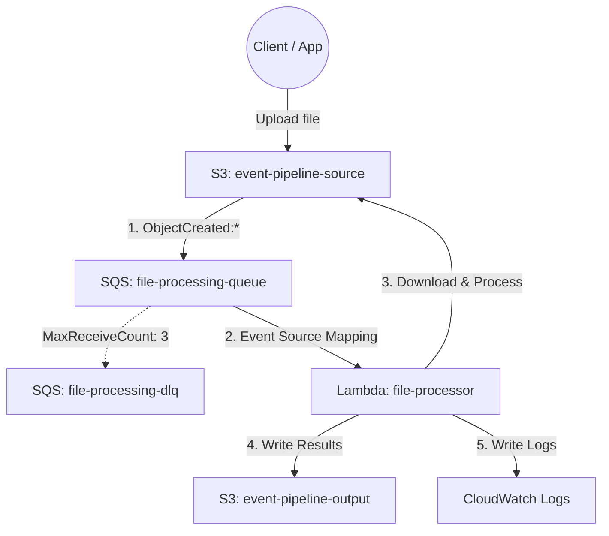

# Architecture Details: Event-Driven Pipeline

## 🏗️ System Diagram

The architecture follows a strict decoupled pattern to ensure maximum resiliency and scalability.

## 🔄 Data Flow

The lifecycle of an uploaded file operates as follows:

1. **Upload Trigger:** A user or application uploads a file (e.g., `test-employees.csv`) to the source S3 bucket under the `uploads/` prefix.
2. **Event Generation:** S3 detects the `ObjectCreated` event. Because the object matches the configured prefix (`uploads/`) and suffix (`.csv` or `.json`), S3 generates an event payload containing the bucket name and object key.
3. **Queueing:** S3 pushes this event payload as a message into the standard SQS queue (`file-processing-queue`).
4. **Polling:** The Lambda service continuously polls the SQS queue via the Event Source Mapping.
5. **Execution:** Lambda invokes the `file-processor` function, passing the SQS message as the `event` payload. 
6. **Processing:** The Lambda function:
   - Parses the SQS message to extract the S3 bucket and key.
   - Downloads the actual file content from S3 into memory.
   - Parses the content (calculating stats for CSV or mapping keys for JSON).
7. **Persistence & Logging:** The function writes a new `{filename}-result.json` to the output S3 bucket and logs a summary to CloudWatch Logs. 
8. **Completion:** Upon a successful return from Lambda (HTTP 200), the SQS message is automatically deleted from the queue.

## 🛡️ Security Architecture

This pipeline is built entirely on the principle of **Least Privilege**.

### Resource-Based Policies (SQS)
The SQS queue uses a resource policy that explicitly allows the `s3.amazonaws.com` service principal to perform the `sqs:SendMessage` action, but *only* if the `aws:SourceArn` matches the exact ARN of the source S3 bucket. This prevents unauthorized resources from injecting messages into the pipeline.

### IAM Execution Role (Lambda)
The Lambda function is granted a highly restrictive IAM execution role (`lambda-file-processor-role`) with the following permissions:
- `AWSLambdaBasicExecutionRole`: Allows writing execution logs to CloudWatch.
- `AWSLambdaSQSQueueExecutionRole`: Allows reading (`sqs:ReceiveMessage`, `sqs:DeleteMessage`, `sqs:GetQueueAttributes`) from SQS.
- **Inline S3 Policy**: 
  - `s3:GetObject` restricted strictly to the `arn:aws:s3:::event-pipeline-source-ACCOUNT/*`.
  - `s3:PutObject` restricted strictly to the `arn:aws:s3:::event-pipeline-output-ACCOUNT/*`.

By siloing read and write access to specific buckets, we prevent the Lambda function from accidentally deleting or overwriting source files, or exposing data outside of the pipeline scope.

