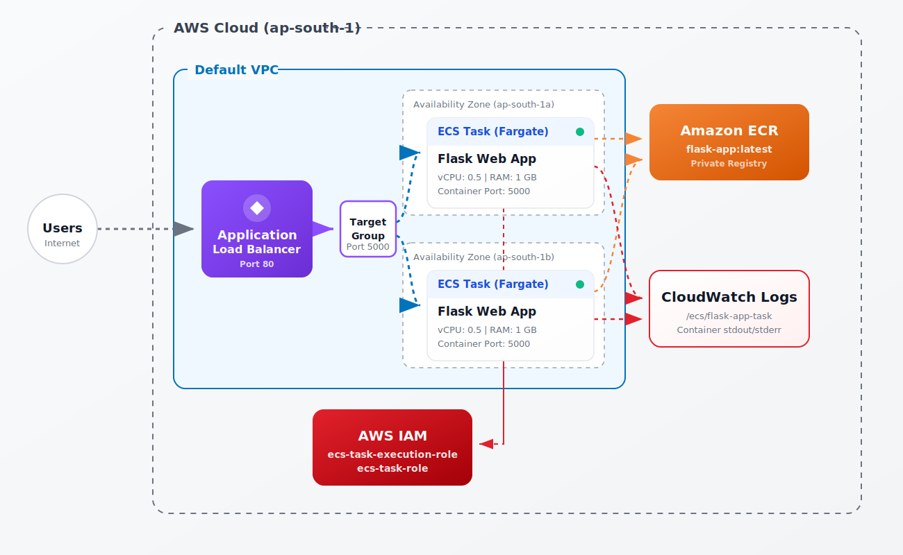

<div align="center">
  <h1> Project 13: Containerized App on ECS Fargate + ECR + ALB</h1>

  <p><i>Containerize a Flask web application using Docker, push the image to Amazon ECR, and deploy it on ECS Fargate — a fully serverless container platform where AWS manages the underlying infrastructure. Add an Application Load Balancer for production-grade traffic distribution.</i></p>

  <p>
    
    
    
    
    
  </p>

  <p>
    <a href="#-architecture-overview">Architecture</a> · 
    <a href="#-infrastructure-specifications">Infrastructure</a> · 
    <a href="#-key-components">Components</a> · 
    <a href="#-core-features">Features</a> · 
    <a href="#-setup--installation">Setup</a> · 
    <a href="#-documentation-suite">Docs</a>
  </p>
</div>

<br/>

## 🏗 Architecture Overview

<div align="center">



<p><i>▲ High-level architecture diagram showing the Flask container running on ECS Fargate behind an ALB</i></p>

</div>

## 📋 Infrastructure Specifications

| Resource | Configuration |
|:---------|:--------------|
| **Region** | ap-south-1 (Mumbai) |
| **Amazon ECR** | 1 Private Repository (flask-app) |
| **Amazon ECS** | 1 Fargate Cluster, 1 Task Definition, 1 Service |
| **Application Load Balancer** | Internet-facing ALB with 1 Listener (Port 80) and 1 Target Group |
| **Compute** | AWS Fargate (0.5 vCPU, 1 GB RAM per task) |
| **Networking** | Default VPC, 2 Subnets, ALB SG (HTTP), ECS Tasks SG (Port 5000 from ALB) |
| **IAM Roles** | ecs-task-execution-role, ecs-task-role |

## 🧩 Key Components

### Amazon ECR (Elastic Container Registry)
A fully managed container registry that makes it easy to store, manage, share, and deploy container images and artifacts anywhere.

### Amazon ECS (Elastic Container Service)
A highly secure, reliable, and scalable container orchestration service that helps you run, stop, and manage containers on a cluster.

### AWS Fargate
A serverless compute engine for containers that works with both ECS and EKS. It eliminates the need to provision and manage servers, lets you specify and pay for resources per application, and improves security through application isolation by design.

### Application Load Balancer
Operates at the request level (Layer 7), routing traffic to targets (ECS tasks) based on the content of the request. Ideal for advanced load balancing of HTTP and HTTPS traffic.

## ⚡ Core Features

- **Serverless Containers** – No EC2 instances to manage or patch. Fargate handles the underlying infrastructure.
- **Zero-Downtime Deployments** – ECS performs rolling updates when deploying new container versions.
- **Load Balancing** – ALB automatically distributes incoming traffic across multiple container instances in different Availability Zones.
- **Health Checks** – ALB continuously monitors container health and only routes traffic to healthy containers.
- **Centralized Logging** – Container stdout/stderr is automatically captured and shipped to CloudWatch Logs.
- **Security Groups** – Container ports are completely isolated and only accessible via the Load Balancer.

## 💰 Free Tier Status

| Resource | Free Tier | Notes |
|:---------|:----------|:------|
| **ECR** | 500 MB/month free (12 months) | Flask image ~50 MB |
| **ECS** | Always free | Only pay for compute |
| **Fargate** | No free tier ⚠️ | ~$0.01/hr for 0.5vCPU+1GB |
| **ALB** | 750 hrs + 15 LCU free (12 months) | Covered |

*Cost estimate: ~$0.02–0.05 for 1-2 hours of testing. Fargate is the only paid resource here. **Ensure you delete the ECS service and ALB immediately after testing to avoid ongoing charges.***

## 🛠️ Setup & Installation

### Prerequisites

- AWS CLI v2 configured with IAM credentials
- Docker Desktop installed and running
- PowerShell 7+ or Bash terminal
- Git installed locally

### Installation

```bash
# 1. Clone the repository
git clone https://github.com/vinay1515/Vinay_kumar_AWS_Beginner_level_projects.git
cd project-13-ecs-fargate-container

# 2. Create required local directories
mkdir -p flask-app scripts docs architecture images
```

### Run Commands

Choose your platform and execute the deployment scripts in order:

| Step | Bash Script | PowerShell Script | Description |
| :---: | :--- | :--- | :--- |
| 01 | `scripts/bash/01-build-push.sh` | `scripts/powershell/01-build-push.ps1` | Build Docker image and push to ECR |
| 02 | `scripts/bash/02-networking-iam.sh` | `scripts/powershell/02-networking-iam.ps1` | Configure Security Groups and IAM roles |
| 03 | `scripts/bash/03-create-cluster-alb.sh` | `scripts/powershell/03-create-cluster-alb.ps1` | Create ECS cluster, Log Groups, and Application Load Balancer |
| 04 | `scripts/bash/04-deploy-ecs-service.sh` | `scripts/powershell/04-deploy-ecs-service.ps1` | Launch Fargate tasks via ECS Service and route ALB traffic |
| 05 | `scripts/bash/05-update-service.sh` | `scripts/powershell/05-update-service.ps1` | Perform a zero-downtime rolling update |
| 06 | `scripts/bash/06-cleanup.sh` | `scripts/powershell/06-cleanup.ps1` | Execute complete teardown of all resources |

### 📸 Screenshots & Validation
Throughout the documentation and `images/` directory, you will find screenshots captured during the deployment process. These visual artifacts serve as verification that the UI steps were successfully executed and validate the final architecture.

## 📚 Documentation Suite

| Document　　　　　　　　　　　　　　　　　　　　　　| Description                                                              |
| :----------------------------------------------------| :-------------------------------------------------------------------------|
| 📄 [Project Overview](docs/project-overview.md)　　 | Comprehensive project context, goals, and learning outcomes              |
| 🏗️ [Architecture Details](docs/architecture.md)　　 | Deep-dive into the Fargate and ALB system design                         |
| 🚀 [Deployment Guide](docs/deployment-guide.md)　　　| Step-by-step procedures for building and deploying the container         |
| 🔐 [Security Protocols](docs/security-protocols.md) | Network isolation via Security Groups and IAM Least Privilege boundaries |
| 🧪 [Testing Procedures](docs/testing-procedures.md) | Validation of local containers, ALB routing, and rolling updates         |
| 🛠️ [Troubleshooting](docs/troubleshooting.md)　　　　| Common issues, ECS health check debugging, and resolution guides         |
| 🧹 [Cleanup Guide](docs/cleanup-guide.md)　　　　　 | How to safely and completely destroy the ECS and ALB resources           |

## 🤝 Contribution & Maintenance

### Contributing
1. **Fork** the repository and create a feature branch (`git checkout -b feature/ecs-fargate-updates`)
2. **Commit** your changes (`git commit -m 'Add Auto Scaling to ECS service'`)
3. **Push** to the branch (`git push origin feature/ecs-fargate-updates`)
4. **Open** a Pull Request with a detailed description

## 📜 License

This project is licensed under the MIT License - see the [LICENSE](./LICENSE) file for details.

### Contact & Credits

- **Author:** Vinay Kumar Duvva
- **GitHub:** [@vinaykumarduvva]( https://github.com/vinaykumarduvva)
- **Repository:** [aws-hands-on-projects]( https://github.com/vinaykumarduvva/aws-hands-on-projects)

---

<div align="center">
  <b><a href="../project-12-event-driven-pipeline">⬅️ Previous: Project 12</a> &nbsp;|&nbsp; <a href="../project-14-capstone-3-tier">Next: Project 14 ➡️</a></b>
</div>
