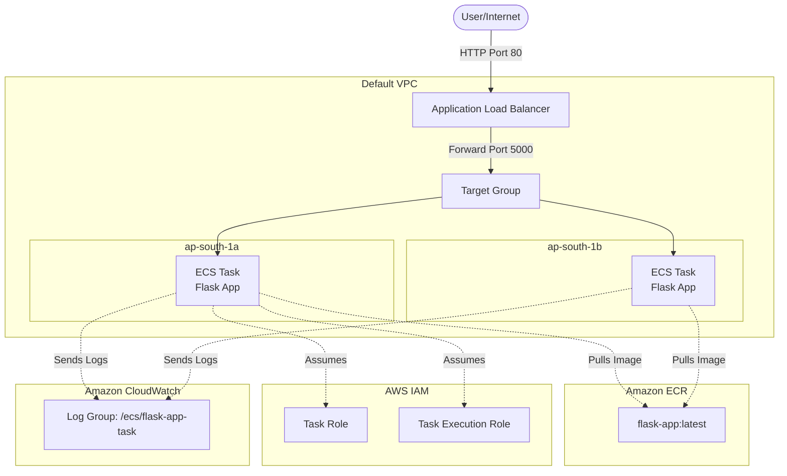

# Architecture Details

This document provides a deep dive into the architecture of the Containerized App on ECS Fargate.

## 🏗️ System Architecture Diagram

The application follows a standard containerized microservices architecture deployed on AWS Fargate. It is engineered to be highly available and securely isolated.

## 🔄 Component Interaction Flow

The lifecycle of the architecture involves build-time and run-time interactions:

### 1. Build and Push Lifecycle
- **Local Build**: The developer builds a Docker image locally containing the Flask application, using the `Dockerfile` to install dependencies and configure the runtime environment.
- **Image Push**: The Docker CLI authenticates with **Amazon ECR** (Elastic Container Registry) and pushes the built image securely to the private repository in AWS.

### 2. Orchestration and Provisioning
- **ECS Cluster & Service**: An ECS Service is instantiated within an ECS Cluster. The service acts as a supervisor, ensuring that the desired number of tasks (e.g., 2) are always running.
- **Task Definition**: The ECS Service uses a JSON-based Task Definition as a blueprint. It specifies the container image URI, CPU/memory limits, environment variables, port mappings, and logging configurations.
- **AWS Fargate Launch**: Instead of provisioning EC2 instances, the service launches tasks on **AWS Fargate**. Fargate abstracts the underlying hardware, dynamically provisioning secure compute resources for each individual task based strictly on the Task Definition.

### 3. Traffic Routing and Load Balancing
- **Application Load Balancer (ALB)**: The internet-facing ALB receives external HTTP traffic on port 80.
- **Target Group**: The ALB forwards traffic to a Target Group. Because Fargate tasks are ephemeral and their IP addresses change, ECS automatically registers and deregisters task IP addresses with the Target Group.
- **Cross-AZ Distribution**: The ALB evenly distributes the load across tasks running in multiple Availability Zones (e.g., `ap-south-1a` and `ap-south-1b`), ensuring high availability.

### 4. Security and Isolation
- **Security Groups**: 
  - The **ALB Security Group** permits inbound traffic from the public internet (0.0.0.0/0) on HTTP Port 80.
  - The **ECS Tasks Security Group** restricts inbound traffic so that the tasks can *only* receive requests originating from the ALB Security Group on Port 5000. Direct access to the tasks is completely blocked.
- **IAM Roles**: 
  - **Task Execution Role**: Grants the ECS agent permissions to pull images from ECR and stream container logs to CloudWatch.
  - **Task Role**: Granted directly to the running container, allowing the application code itself to make API calls to other AWS services (e.g., S3, DynamoDB) if necessary.

### 5. Monitoring and Observability
- **CloudWatch Logs**: The Task Definition specifies the `awslogs` log driver, which automatically intercepts standard output (stdout) and standard error (stderr) from the Flask app and sends them to a dedicated CloudWatch Log Group.
- **Container Insights**: Enabled on the ECS cluster, providing granular metrics regarding CPU, memory, and network utilization per task and per service.
