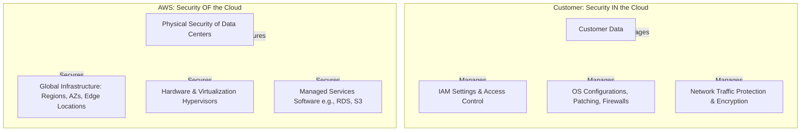
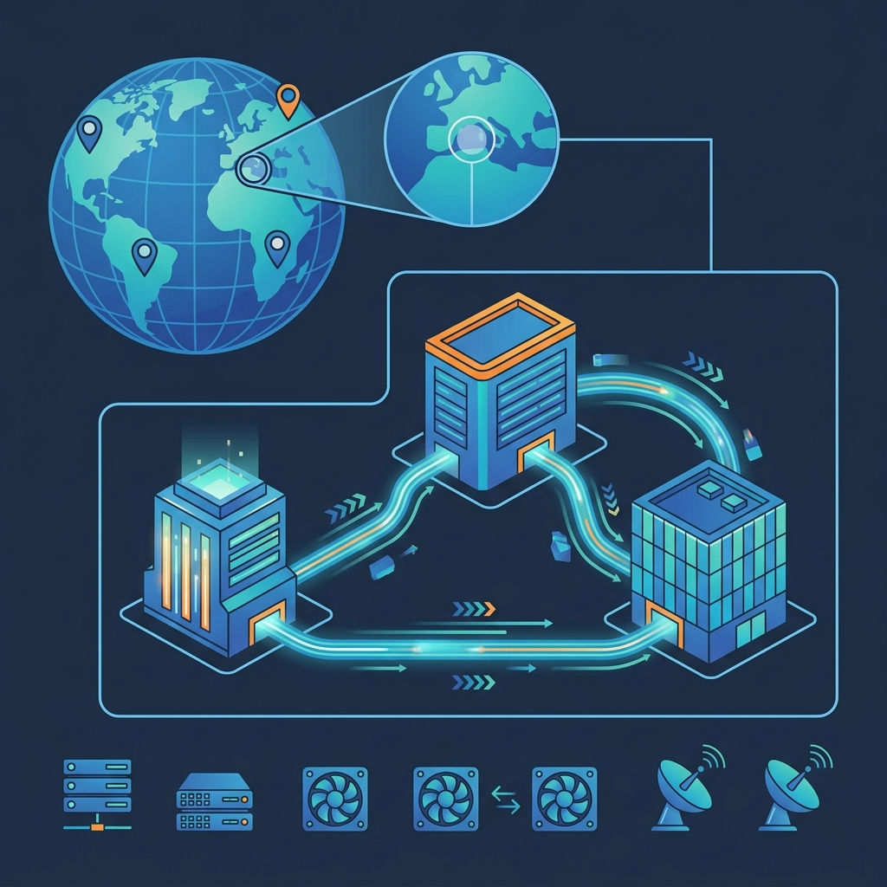
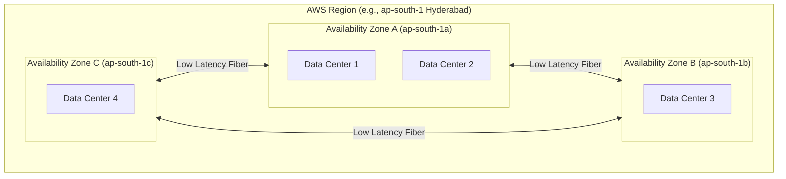

# ☁️ AWS Handy Notes: Cloud Foundations

Welcome to the **AWS Cloud Foundations Reference Guide**! This document serves as a handy cheat sheet and learning resource covering the core concepts of Amazon Web Services (AWS), its global infrastructure, and foundational architecture.

---

## 🚀 Live Websites

- **[AWS Handy Book - Interactive Reference Guide](https://aws-handy-book-reference-website.s3.ap-south-1.amazonaws.com/index.html)**
- **[AWS CloudShell Commands - Interactive Explorer](https://aws-cloudshell-commands-website.s3.ap-south-1.amazonaws.com/index.html)**

---
## 🧭 Directory Map
- [📖 Curated Service Reference Book (Compute & Storage)](REFERENCE_BOOK.md)
- [1. What is AWS?](#1-what-is-aws-)
  - [🛡️ The Shared Responsibility Model](#️-the-shared-responsibility-model)
  - [🗂️ AWS Core Service Categories](#️-aws-core-service-categories) (Complete list in [SERVICES_OVERVIEW.md](SERVICES_OVERVIEW.md))
  - [🕹️ How to Access AWS](#️-how-to-access-aws)
- [2. AWS Regions & Availability Zones](#2-aws-regions--availability-zones-)
  - [📐 Hierarchy & Relationship](#-hierarchy--relationship)
  - [🌐 Global Infrastructure Extensions](#-global-infrastructure-extensions)
  - [🛡️ Designing for Resilience: HA vs. DR](#️-designing-for-resilience-ha-vs-dr)
  - [💰 Data Transfer Costs and Rules](#-data-transfer-costs-and-rules)

---

## 1. What is AWS? 🌐

> **Definition:** **Amazon Web Services (AWS)** is a secure, cloud computing platform providing on-demand access to computing power, database storage, content delivery, and other IT infrastructure services over the internet, billed on a flexible pay-as-you-go basis.

### 💡 Core Cloud Concepts
*   **On-Demand Self-Service:** Provision resources programmatically without manual intervention or waiting for hardware procurement.
*   **Pay-as-you-go Pricing:** Pay only for what you consume, with no large upfront capital expenditure (CapEx) shifted to operational expenditure (OpEx).
*   **Rapid Elasticity:** Scale resources up/down (vertical scaling) or out/in (horizontal scaling) dynamically to meet application demand.

 

---

### 🛡️ The Shared Responsibility Model

Security is a joint effort between AWS and the Customer. The boundary changes depending on the service tier (IaaS, PaaS, SaaS).

| Responsibility | 🔒 AWS (Security **OF** the Cloud) | 👤 Customer (Security **IN** the Cloud) |
| :--- | :--- | :--- |
| **Physical Assets** | Security of hardware, servers, cables, and data centers. | N/A (Abstracted away) |
| **Infrastructure** | Virtualization hypervisor, network hardware, underlying OS. | Virtual private network (VPC) design, firewall rules (Security Groups). |
| **Data Protection** | Service durability, replication (e.g., S3's 11 9s). | Data encryption (in transit/at rest), S3 Bucket Policies, KMS Keys. |
| **Access Control** | Physical access control to facilities, IAM system uptime. | Setting up IAM Users, Groups, Roles, Policies, MFA, and access keys. |
| **Operating System**| Hypervisor OS patching. | Guest OS configuration (patching EC2 Windows/Linux, software updates). |

---

### 🗂️ AWS Core Service Categories

AWS groups its services into logical pillars. Below are the key ones you must know (for a complete category-by-category map of all service families, see [SERVICES_OVERVIEW.md](SERVICES_OVERVIEW.md)):

| Category | Icon | Key Services | Primary Purpose |
| :--- | :---: | :--- | :--- |
| **Compute** | 💻 | `EC2`, `Lambda`, `ECS`, `Fargate` | Virtual servers, serverless code runtimes, container orchestration. |
| **Storage** | 💾 | `S3`, `EBS`, `EFS`, `Glacier` | Object storage, block storage for EC2, shared network storage, archiving. |
| **Databases**| 🗄️ | `RDS`, `DynamoDB`, `Aurora`, `ElastiCache` | Managed SQL/NoSQL databases, in-memory caching. |
| **Networking**| 🌐 | `VPC`, `Route 53`, `CloudFront`, `ALB` | Isolated virtual networks, DNS routing, Content Delivery Networks (CDN). |
| **Security** | 🔐 | `IAM`, `KMS`, `Cognito`, `WAF`, `Secrets Manager` | Identity management, encryption keys, user authentication, web firewall. |
| **Monitoring** | 📊 | `CloudWatch`, `CloudTrail`, `SNS`, `EventBridge` | Resource metrics/logging, API call auditing, notification alerts. |

---

### 🕹️ How to Access AWS

Automation is a first-class citizen in AWS. You can interact with your resources in four ways:

1.  **AWS Management Console (GUI):** A web-based graphical interface. Great for beginners, visual explorers, and quick configuration changes.
2.  **AWS CLI (Command Line Interface):** A tool to manage AWS services from your terminal. Supports shell scripting for automation.
3.  **AWS SDKs (Software Development Kits):** APIs for programming languages (Python `boto3`, Node.js, Java, Go) to build applications that interact with AWS.
4.  **Infrastructure as Code (IaC):** Declarative template-based deployment (using `AWS CloudFormation` or `Terraform`) to provision infrastructure safely, repeatably, and version-controlled.

> [!NOTE]
> **AWS Account Container:** An AWS Account is the primary security boundary and container for resources. Billing is managed at the account level. For enterprise structures, use **AWS Organizations** to group multiple accounts under Service Control Policies (SCPs) and consolidate billing.

### 🚀 Next Step: Hands-on Foundations
1. Go to the [AWS Free Tier Portal](https://aws.amazon.com/free/).
2. Create an account (you get 12 months of free tier access, plus always-free services).
3. Log in as the **Root User**, immediately configure **Multi-Factor Authentication (MFA)**, and create a standard **IAM Administrator User** for daily operations. *Never use the Root User for routine tasks!*

---

## 2. AWS Regions & Availability Zones 🗺️

> **Definition:** A **Region** is a separate, physical geographic area containing multiple isolated data centers. An **Availability Zone (AZ)** consists of one or more discrete data centers within a Region, equipped with independent redundant power, cooling, and network connectivity.

 

### 📐 Hierarchy & Relationship

A Region is not a single data center; it is a cluster of independent AZs.

*   **AZ Isolation:** AZs are physically separated (typically miles apart, on different flood plains and power grids) to limit the blast radius of local disasters.
*   **Interconnectivity:** All AZs in a Region are connected through low-latency, high-bandwidth redundant fiber-optic links.
*   **Resource Scope:**
    *   **Global Scope:** IAM, Route 53, CloudFront (accessible everywhere, not tied to a single region).
    *   **Regional Scope:** S3 Buckets, VPCs, ALB, DynamoDB Tables (live in a specific region).
    *   **Zonal Scope:** EC2 Instances, EBS Volumes, Subnets (tied to a specific Availability Zone).

---

### 🌐 Global Infrastructure Extensions

Beyond Regions and AZs, AWS extends its network closer to users:

*   **Edge Locations:** Points of Presence (PoPs) used by **Amazon CloudFront** (CDN) and **Amazon Route 53** (DNS) to cache content close to end-users globally, reducing latency.
*   **Regional Edge Caches:** Larger caching facilities located between Edge Locations and your origin servers to cache content that is not accessed frequently enough to stay at Edge Locations.
*   **Local Zones:** Extensions of an AWS Region that place compute, storage, database, and other select services close to large population, industry, and IT centers.
*   **Wavelength Zones:** Embeds AWS compute and storage services within 5G networks, enabling ultra-low-latency applications for mobile devices.
*   **Outposts:** Hybrid cloud solutions that run native AWS infrastructure on-premises in your own data center.

---

### 🛡️ Designing for Resilience: HA vs. DR

Understanding the difference between high availability (HA) and disaster recovery (DR) is crucial for cloud architects.

| Aspect | ⚡ High Availability (HA) | 🌪️ Disaster Recovery (DR) |
| :--- | :--- | :--- |
| **Strategy** | Spanning workloads across **Multiple AZs** within a single Region. | Replicating resources across **Multiple Regions** globally. |
| **Failure Target**| Protects against localized data center power/hardware failures. | Protects against a massive full-region natural disaster or fiber outage. |
| **Complexity** | Low-to-moderate. Most AWS services have built-in Multi-AZ options. | High. Requires asynchronous cross-region replication and DNS failover. |
| **Latency** | Low latency (sub-millisecond synchronous communication). | Higher latency (asynchronous replication across continents). |
| **AWS Examples** | RDS Multi-AZ, Auto Scaling Groups running in multiple subnets. | S3 Cross-Region Replication (CRR), Route 53 Active-Passive routing. |

---

### 💰 Data Transfer Costs and Rules

Data transfer charges can easily blow up your AWS bill if not designed carefully. Use this simple cheat sheet:

> [!IMPORTANT]
> **Data Transfer Rules of Thumb:**
> 1. **Inbound Data** is always **FREE** (data coming into AWS from the internet or other services).
> 2. **Intra-AZ Data** is **FREE** when using private IP addresses (e.g., two EC2 instances in the same AZ communicating).
> 3. **Inter-AZ Data** is **CHARGED** ($0.01 per GB in each direction) if instances are in different AZs within the same Region.
> 4. **Outbound Data** (data leaving AWS to the internet) is the most expensive charge.

---

### 🚀 Next Step: Console Exploration
1. Log into your AWS Console.
2. Look at the top-right corner to see your current **Region** (e.g., N. Virginia `us-east-1` or Mumbai `ap-south-1`).
3. Search for **EC2** in the search bar.
4. On the EC2 Dashboard, scroll down to the **Availability Zones** widget to see which AZs are operational in your current Region (e.g., `us-east-1a`, `us-east-1b`, etc.).
5. Check if all services you need are available in that Region before launching resources.
