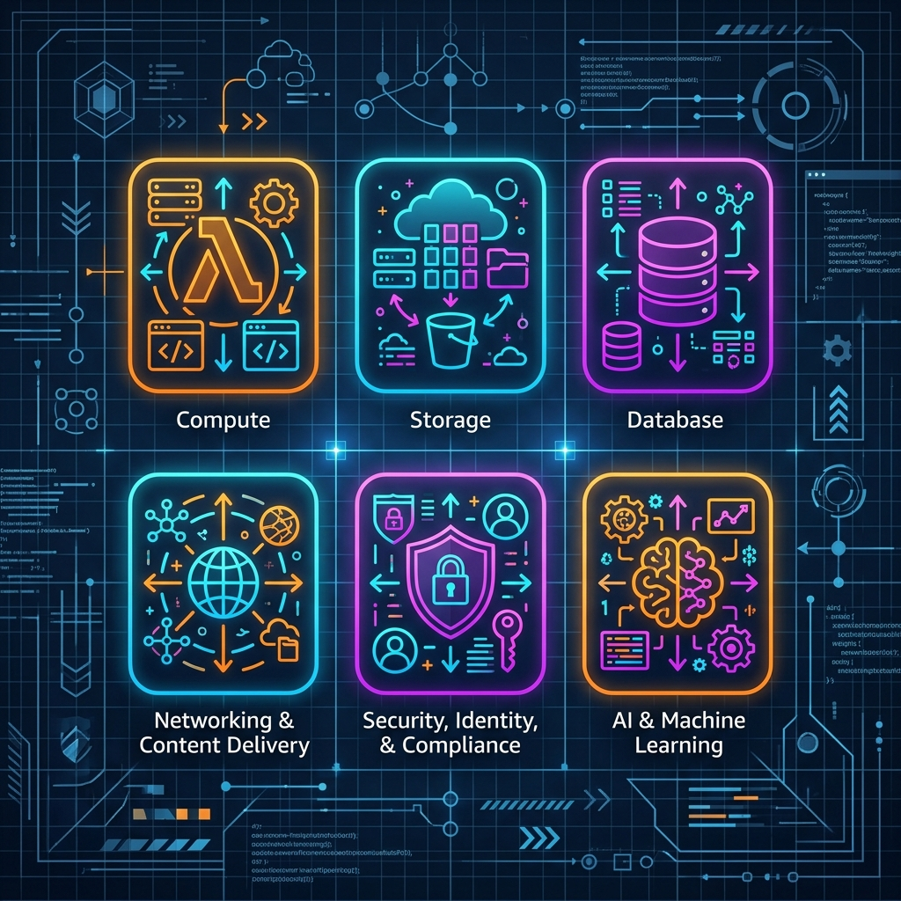

# 🗂️ AWS Services: Category Overview

This document provides a comprehensive, category-by-category map of the Amazon Web Services (AWS) ecosystem. Use this as a navigational reference to understand the core purpose of each service family and identify which service fits your architecture.

> [!NOTE]
> This is a high-level navigational catalog. Individual services will have detailed, deep-dive project folders with configuration instructions, templates, and CLI guides as you work through the bootcamp.

 

---

## 🧭 Service Category Quick Links

| | | |
| :--- | :--- | :--- |
| [💻 Compute](#-compute) | [💾 Storage](#-storage) | [🗄️ Database](#️-database) |
| [🌐 Networking & Content Delivery](#-networking--content-delivery) | [🔐 Security, Identity & Compliance](#-security-identity--compliance) | [📊 Management & Governance](#-management--governance) |
| [🛠️ Developer Tools](#️-developer-tools) | [📦 Containers](#-containers) | [📈 Analytics](#-analytics) |
| [🧠 Machine Learning & AI](#-machine-learning--ai) | [🔌 Application Integration](#-application-integration) | [🚚 Migration & Transfer](#-migration--transfer) |
| [💰 Cost Management](#-cost-management) | | |

---

## 💻 Compute

Compute services provide the raw processing power (CPU, memory) required to run applications.

*   **EC2** (`Elastic Compute Cloud`) — On-demand virtual servers (instances) with full operating system control, customizable CPU/RAM, and flexible storage.
*   **Lambda** — Serverless, event-driven functions that execute code in response to events; no server provisioning or management required.
*   **ECS / EKS** (`Elastic Container Service` / `Elastic Kubernetes Service`) — Highly scalable container orchestration platforms running AWS-native container engines or Kubernetes respectively.
*   **Fargate** — Serverless compute engine for containers; runs containers directly without needing to provision or manage underlying EC2 instances.
*   **Elastic Beanstalk** — Platform-as-a-Service (PaaS) to deploy and scale web applications automatically (handles provisioning, load balancing, and scaling) without micro-managing resources.
*   **Lightsail** — Simplified, low-cost virtual private server (VPS) bundles, ideal for small web apps, blogs, or testing environments.
*   **Batch** — Run large-scale batch computing workloads dynamically across clusters of compute resources.
*   **Outposts** — Fully managed service that extends AWS infrastructure, APIs, and tools to virtually any on-premises data center or co-location space.

---

## 💾 Storage

Storage services hold your files, database backups, application binaries, and system volumes.

*   **S3** (`Simple Storage Service`) — Highly durable object storage designed for files, backups, static websites, and data lakes.
*   **EBS** (`Elastic Block Store`) — High-performance block storage volumes designed for attaching directly to virtual servers (EC2).
*   **EFS** (`Elastic File System`) — Fully managed, serverless, elastic network file system (NFS) shareable concurrently across hundreds of EC2 instances.
*   **FSx** — Fully managed third-party file systems (Windows File Server, Lustre, NetApp ONTAP, OpenZFS) tailored for specific application storage requirements.
*   **Storage Gateway** — Hybrid cloud storage service that bridges on-premises environments and AWS cloud storage (S3).
*   **S3 Glacier** — Ultra-low-cost S3 storage classes optimized for secure long-term data archiving and backups.

---

## 🗄️ Database

Database services provide managed structured and unstructured data persistence.

*   **RDS** (`Relational Database Service`) — Managed SQL database engines (MySQL, PostgreSQL, Oracle, SQL Server, MariaDB) with automated patching and backups.
*   **Aurora** — Enterprise-grade, AWS-proprietary relational database engine compatible with MySQL and PostgreSQL, featuring up to 5x throughput of standard database engines.
*   **DynamoDB** — Fully managed, serverless NoSQL database providing single-digit millisecond latency at any scale.
*   **ElastiCache** — Managed, in-memory caching service compatible with Redis and Memcached, used to speed up application read performance.
*   **Redshift** — Serverless or provisioned petabyte-scale data warehouse service for large-scale analytical reporting and querying.
*   **DocumentDB** — Fully managed MongoDB-compatible document database designed to handle JSON workloads.
*   **Neptune** — Fast, reliable, fully managed graph database engine optimized for storing and navigating highly connected datasets (e.g., social networks, fraud detection).

---

## 🌐 Networking & Content Delivery

Networking services isolate your cloud resources, distribute traffic, and route traffic to users globally.

*   **VPC** (`Virtual Private Cloud`) — Provision a logically isolated section of the AWS cloud where you can launch resources in a virtual network you define.
*   **Route 53** — Highly available and scalable Cloud Domain Name System (DNS) web service and domain registration provider.
*   **CloudFront** — Low-latency Content Delivery Network (CDN) that securely delivers data, videos, and APIs to users globally via edge caching.
*   **API Gateway** — Fully managed service to create, publish, maintain, monitor, and secure REST and WebSocket APIs at scale.
*   **Direct Connect** — Dedicated physical network connection bypassing the public internet from an on-premises data center to AWS.
*   **Elastic Load Balancing (ELB)** — Automatically distributes incoming application traffic across multiple targets (EC2 instances, containers, IP addresses).
*   **Transit Gateway** — Network transit hub that connects multiple VPCs, AWS accounts, and on-premises networks through a central gateway.

---

## 🔐 Security, Identity & Compliance

Security services control authentication, govern policies, scan for threats, and manage keys.

*   **IAM** (`Identity and Access Management`) — Securely control access to AWS services and resources by creating users, groups, roles, and granular permission policies.
*   **AWS Organizations** — Account management service that enables you to consolidate multiple AWS accounts into an organization you create and centrally manage (consolidated billing + SCP governance).
*   **KMS** (`Key Management Service`) — Managed service that makes it easy to create and control cryptographic keys used to encrypt data across AWS services.
*   **Secrets Manager** — Protect credentials, API keys, and database passwords by securing, rotating, and retrieving them programmatically.
*   **GuardDuty** — Continuous security monitoring and threat detection service that analyzes logs to detect malicious or unauthorized activity.
*   **Security Hub** — Unified security posture management service that aggregates, organizes, and prioritizes security alerts and compliance checks.
*   **WAF & Shield** — Web Application Firewall to block common web exploits, combined with AWS Shield for managed DDoS protection.
*   **Cognito** — Quick user sign-up, sign-in, and access control for web and mobile applications.

---

## 📊 Management & Governance

Management services track configuration changes, monitor performance, and enforce structural compliance.

*   **CloudWatch** — Monitoring and observability service providing data and actionable insights to monitor applications, respond to system-wide performance changes, and optimize resource utilization.
*   **CloudTrail** — Audit service that tracks and logs user activity and API calls across your AWS account infrastructure.
*   **CloudFormation** — Infrastructure as Code (IaC) tool that allows you to model, provision, and update AWS resources repeatably using JSON or YAML templates.
*   **Config** — Continually assess, audit, and evaluate the configurations of your AWS resources to ensure compliance with internal guidelines.
*   **Systems Manager (SSM)** — Operational center to view data and automate operational tasks (patching, run commands, view software inventory) across AWS resources and hybrid environments.
*   **Trusted Advisor** — Cloud optimization tool that inspects your AWS environment and provides real-time recommendations across Cost, Performance, Security, Fault Tolerance, and Service Limits.
*   **Control Tower** — Setup and govern a secure, multi-account AWS environment (landing zone) based on best practices.

---

## 🛠️ Developer Tools

Developer tools coordinate builds, automate deployments, and host private code repositories.

*   **CodeCommit** — Managed private Git repository hosting service (largely legacy; modern pipelines often integrate with GitHub/GitLab).
*   **CodeBuild** — Fully managed continuous integration service that compiles source code, runs tests, and produces software packages ready to deploy.
*   **CodeDeploy** — Fully managed deployment service that automates software deployments to compute services (EC2, ECS, Lambda, or on-premises servers).
*   **CodePipeline** — Continuous delivery service that helps model, visualize, and automate the steps required to release your software.
*   **Cloud9** — Cloud-based integrated development environment (IDE) that lets you write, run, and debug code with just a browser.

---

## 📦 Containers

Container services manage image registries and coordinate application microservices.

*   **ECR** (`Elastic Container Registry`) — Fully managed Docker container registry that makes it easy to store, manage, share, and deploy container images.
*   **ECS / EKS / Fargate** — *(See [Compute](#-compute) section for details on container orchestration).*

---

## 📈 Analytics

Analytics services query data lakes, clean data streams, and visualize trends.

*   **Athena** — Interactive query service that makes it easy to analyze data directly in Amazon S3 using standard SQL.
*   **EMR** (`Elastic MapReduce`) — Managed cluster platform that simplifies running big data frameworks, such as Apache Hadoop and Apache Spark, to process vast amounts of data.
*   **Kinesis** — Easily collect, process, and analyze real-time, streaming data (video, audio, application logs, website clickstreams) at scale.
*   **Glue** — Serverless data integration service that makes it easy to discover, prepare, and combine data for analytics, machine learning, and application development (ETL).
*   **QuickSight** — Cloud-powered business intelligence (BI) service that delivers easy-to-understand dashboards and visualizations.

---

## 🧠 Machine Learning & AI

AI/ML services provision sandboxes for modeling and deliver pre-trained AI APIs.

*   **SageMaker** — Comprehensive machine learning platform to build, train, test, and deploy ML models quickly.
*   **Comprehend** — Natural Language Processing (NLP) service that uses machine learning to find insights and relationships in text.
*   **Rekognition** — Computer vision service to analyze images and videos for object, face, text, and scene detection.
*   **Polly** — Text-to-speech service that turns written text into lifelike speech in multiple languages.
*   **Transcribe** — Speech-to-text service that uses automatic speech recognition to convert speech to text.
*   **Bedrock** — Fully managed service that makes foundation models (FMs) from leading AI startups and Amazon available via an API for generative AI development.

---

## 🔌 Application Integration

Integration services decouple microservices using queues, push alerts, and workflows.

*   **SQS** (`Simple Queue Service`) — Fully managed message queuing service that enables you to decouple and scale microservices, distributed systems, and serverless applications.
*   **SNS** (`Simple Notification Service`) — Fully managed pub/sub messaging and notification service for both microservices (decoupling) and end-users (SMS, email, mobile push).
*   **EventBridge** — Serverless event bus that makes it easy to connect applications together using data from your own applications, SaaS applications, and AWS services.
*   **Step Functions** — Serverless visual workflow orchestrator used to sequence Lambda functions and other AWS services into business-critical applications.

---

## 🚚 Migration & Transfer

Migration services sync databases and lift physical or virtual server states.

*   **DMS** (`Database Migration Service`) — Managed migration service that helps you migrate databases to AWS quickly and securely while the source database remains operational.
*   **Snowball / Snowmobile** — Physical rugged data transport devices (Snowball Edge) and semi-trailer truck shipping containers (Snowmobile) used to migrate petabytes/exabytes of data physically to AWS.
*   **Application Migration Service (MGN)** — Automated lift-and-shift service that simplifies and speeds up migrating physical, virtual, or cloud servers to AWS.

---

## 💰 Cost Management

Cost tools forecast budgets, generate spending graphs, and identify waste.

*   **Cost Explorer** — Interface that lets you visualize, understand, and manage your AWS costs and usage over time.
*   **Budgets** — Set custom budgets that alert you when your cost or usage exceeds (or is forecasted to exceed) your budgeted amount.
*   **Compute Optimizer** — Recommends optimal AWS resources (like EC2 instance types, EBS volume sizes, or Lambda memory sizes) for your workloads to reduce costs and improve performance using machine learning metrics.
